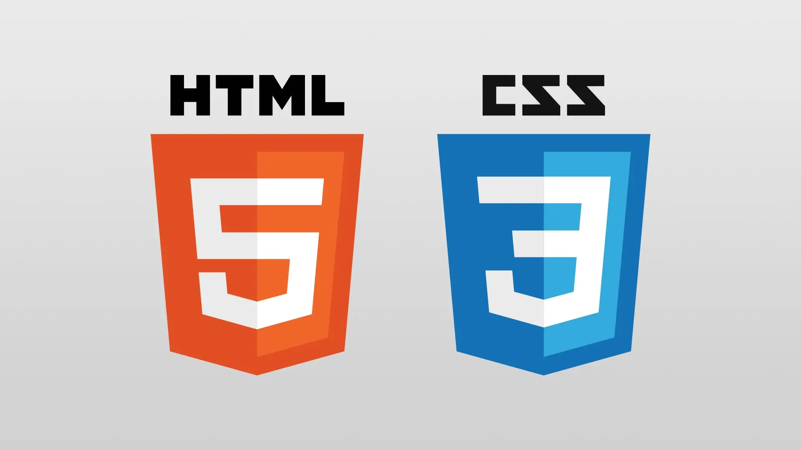
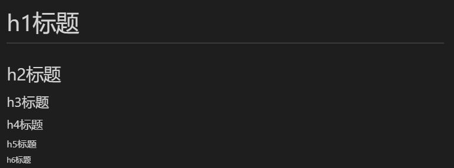
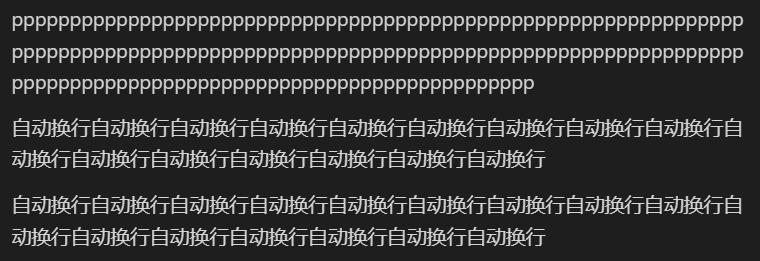
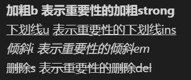
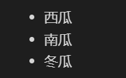
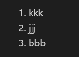

# HTML5重学笔记



## 说明

- 重学HTML5时顺便做的笔记，查缺补漏。
- 受本网页内css样式的影响，展示的效果会与默认样式有所不同
- `2022.06.12`：增添标签结构说明、SEO、ICO相关笔记

## 目录

- [HTML5重学笔记](#html5重学笔记)
  - [说明](#说明)
  - [目录](#目录)
  - [基本结构](#基本结构)
  - [标题h](#标题h)
  - [段落p](#段落p)
  - [换行和分割线](#换行和分割线)
  - [文本格式化标签](#文本格式化标签)
  - [链接标签a](#链接标签a)
  - [图片](#图片)
    - [媒体标签-图片](#媒体标签-图片)
    - [媒体标签-音频](#媒体标签-音频)
    - [媒体标签-视频](#媒体标签-视频)
  - [列表标签](#列表标签)
    - [列表标签-无序表](#列表标签-无序表)
    - [列表标签-有序表](#列表标签-有序表)
    - [列表标签-自定义列表](#列表标签-自定义列表)
  - [表单](#表单)
    - [表单-input输入标签](#表单-input输入标签)
    - [表单-button标签](#表单-button标签)
    - [表单-select标签下拉菜单](#表单-select标签下拉菜单)
    - [表单-textaera文本域](#表单-textaera文本域)
    - [实现点击文字也能选中单选按钮](#实现点击文字也能选中单选按钮)
  - [table 表格](#table-表格)
  - [语义化标签](#语义化标签)
  - [字符实体标签](#字符实体标签)
  - [seo搜索引擎优化](#seo搜索引擎优化)
  - [ico浏览器标题栏图标](#ico浏览器标题栏图标)

## 基本结构

- `<!DOCTYPE html>` 说明是html5版本
- `<html lang="en">`
  - **标识网页使用的语言**
  - 作用： **搜索引擎归类** + **浏览器翻译**
  - 常见语言：`zh-CN`简体中文 `en`英文
- `<meta charset="UTF-8">` 标识网页使用的字符编码
  - `UTF-8` 万国码
  - `GB3212` 6000+汉子
  - `GBK` 20000+汉子
- `<meta http-equiv="X-UA-Compatible" content="IE=edge">`
  - 用于解决IE浏览器兼容性问题
- `<meta name="viewport" content="width=device-width, initial-scale=1.0">`
  - `宽度=设备宽度`使得宽度等于设备宽度，用于移动端开发

```html
<!DOCTYPE html>
<html lang="en">
<head>
    <meta charset="UTF-8">
    <title>Document</title>
</head>
<body>
    
</body>
</html>
```

## 标题h

- h标签会自动换行
- 共6级

```html
<h1>h1标题</h1> 
<h2>h2标题</h2> 
<h3>h3标题</h3> 
<h4>h4标题</h4> 
<h5>h5标题</h5> 
<h6>h6标题</h6>
```

效果：



<hr>

<!-- <hr style="border-color:red;"> -->

## 段落p

- 段落之间有缝隙
- 会自动换行
- 但是连续的纯英文被认为是一个单词 不换行

```html
<p>ppppppppppppppppppppppppppppppppppppppppppppppppppppppppppppppppppppppppppppppppppppppppppppppppppppppppppppppppppppppppppppppppppppppppppppppppppppppppppppppppppppppppppp</p>
<p>自动换行自动换行自动换行自动换行自动换行自动换行自动换行自动换行自动换行自动换行自动换行自动换行自动换行自动换行自动换行自动换行</p>
<p>自动换行自动换行自动换行自动换行自动换行自动换行自动换行自动换行自动换行自动换行自动换行自动换行自动换行自动换行自动换行自动换行</p>
```

效果：


<!-- <hr style="border-color:red;"> -->

## 换行和分割线

```html
123<br>456<hr>
```

效果：


<!-- <hr style="border-color:red;"> -->

## 文本格式化标签

```html
<b>加粗b</b>    <strong>表示重要性的加粗strong</strong> <br>
<u>下划线u</u>  <ins>表示重要性的下划线ins</ins> <br>
<i>倾斜i</i>  <em>表示重要性的倾斜em</em> <br>
<s>删除s</s>  <del>表示重要性的删除del</del> <br>

```

效果：



<!-- <hr style="border-color:red;"> -->

## 链接标签a

- href 跳转地址
- #空链接
- target 目标网页的打开形式
  - _self（默认）在当前窗口打开
  - _blank打开一个新窗口跳转

```html

<a href="baidu.com">会出错 必须加协议</a>
<br>
<a href="http://baidu.com">正常http://baidu.com</a>
<br>
<a href="./pathTofileName.html">pathTofileName.html</a>
<br>
<a href="#">空链接</a> 
<br>
<a href="http://baidu.com" target="_blank">在新窗口打开百度</a>

```

效果：<br>
<a href="baidu.com">会出错 必须加协议</a>
<br>
<a href="http://baidu.com">正常http://baidu.com</a>
<br>
<a href="./pathTofileName.html">pathTofileName.html</a>
<br>
<a href="#">空链接</a>
<br>
<a href="http://baidu.com" target="_blank">在新窗口打开百度</a>

## 图片

- [媒体标签-图片](#媒体标签-图片)

- [媒体标签-音频](#媒体标签-音频)
- [媒体标签-视频](#媒体标签-视频)

### 媒体标签-图片

- 概念
  - img 是标签
  - src="" 是标签的属性
  - src是属性名
  - ""是属性值
- 标签和属性之间必须以空格隔开
- 属性之间没有顺序
- src 资源路径
- alt 图片加载失败时的替换文本
- title 鼠标悬停时的显示文本
- width height 写一个就好 另一个会自动确定 写两个容易造成图片畸变，除非你非要这么做

```html

```

效果：<br>


<!-- <hr style="border-color:red;"> -->

### 媒体标签-音频

- controls 显示控制面板 默认不显示
- autoplay 自动播放（好像基本上浏览器都不支持音频自动播放）
- loop 循环

```html
<audio src="piano.mp3" controls autoplay loop></audio>
```

### 媒体标签-视频

- controls 添加播放控制面板
- autoplay 自动播放 谷歌不支持(静音才能自动播放)
- muted 静音
- loop

```html
<video src="./00.mp4" controls muted autoplay></video>
```

<!-- <hr style="border-color:red;"> -->

## 列表标签

- [列表标签-无序表](#列表标签-无序表)

- [列表标签-有序表](#列表标签-有序表)
- [列表标签-自定义列表](#列表标签-自定义列表)
  
### 列表标签-无序表

- 无序列表
- ul只能包含li标签
- li标签可以包含任意标签

```html
<ul>
    <li>西瓜</li>
    <li>南瓜</li>
    <li>冬瓜</li>
</ul>
```

效果：



<!-- <hr style="border-color:red;"> -->

### 列表标签-有序表

- 有序列表
- 默认有数字序号
- ol中只能包含li
- li中可以包含任意标签

```html
<ol>
    <li>kkk</li>
    <li>jjj</li>
    <li>bbb</li>
</ol>
```

效果：<br>


<!-- <hr style="border-color:red;"> -->

### 列表标签-自定义列表

- 自定义列表
- dl只能包含dt和dd
- dt和dt可以包含任意标签

```html
<dl>
    <dt>列标题</dt>
    <dd>列项</dd>
    <dd>列项</dd>
    <dd>列项</dd>
    <dd>列项</dd>
</dl>
```

效果：<br>
<dl>
    <dt>列标题</dt>
    <dd>列项</dd>
    <dd>列项</dd>
    <dd>列项</dd>
    <dd>列项</dd>
</dl>

<!-- <hr style="border-color:red;"> -->

## 表单

- [input输入标签](#表单-input输入标签)

- [button标签](#表单-button标签)
- [select标签下拉菜单](#表单-select标签下拉菜单)
- [textaera文本域](#表单-textaera文本域)
- [实现点击文字也能选中单选按钮](#实现点击文字也能选中单选按钮)

### 表单-input输入标签

```html
text:<input type="text" placeholder="请输入用户名"> <!--占位符placeholder-->
<br><br>
password:<input type="password" placeholder="请输入密码"> <!--占位符placeholder-->
<br><br>
radio:<input type="radio" name="性别">男 <input type="radio" name="性别" checked>女  <!-- 单选框需要有同样的name --> <!--checked表示默认选中 -->
<br><br>
checkbox:<input type="checkbox" checked> <!--checked表示默认选中 -->
<br><br>
file:<input type="file" multiple>  <!-- multiple表示可以选中多个文件 -->
<br><br>
submit:<input type="submit"> <!-- 提交按钮点击提交数据          要让其能够使用 需要一个表单域标签  value="显示的内容" value默认为submit -->
<br><br>
reset:<input type="reset"> <!-- 重置按钮 点击恢复表单默认值      要让其能够使用 需要一个表单域标签  value="显示的内容" value默认为reset  -->
<br><br>
button:<input type="button" value="这是一个按钮"><!-- 普通按钮默认无功能要配合js  value="显示的内容" value默认为空  -->

<br><br>
<hr>
<form action="#提交地址">
    用户名：<input type="text" name="" id=""><br>
    密码：<input type="password" name="" id=""><br>
    <input type="submit" name="" id=""><!--submit需要一个表单域标签-->
    <input type="reset"><!--reset需要一个表单域标签-->
</form>

```

效果：<br>
text:<input type="text" placeholder="请输入用户名"> <!--占位符placeholder-->
<br><br>
password:<input type="password" placeholder="请输入密码"> <!--占位符placeholder-->
<br><br>
radio:<input type="radio" name="性别">男 <input type="radio" name="性别" checked>女  <!-- 单选框需要有同样的name --> <!--checked表示默认选中 -->
<br><br>
checkbox:<input type="checkbox" checked> <!--checked表示默认选中 -->
<br><br>
file:<input type="file" multiple>  <!-- multiple表示可以选中多个文件 -->
<br><br>
submit:<input type="submit"> <!-- 提交按钮点击提交数据          要让其能够使用 需要一个表单域标签  value="显示的内容" value默认为submit -->
<br><br>
reset:<input type="reset"> <!-- 重置按钮 点击恢复表单默认值      要让其能够使用 需要一个表单域标签  value="显示的内容" value默认为reset  -->
<br><br>
button:<input type="button" value="这是一个按钮"><!-- 普通按钮默认无功能要配合js  value="显示的内容" value默认为空  -->

<br><br>
<hr>
<form action="#提交地址">
    用户名：<input type="text" name="" id=""><br>
    密码：<input type="password" name="" id=""><br>
    <input type="submit" name="" id=""><!--submit需要一个表单域标签-->
    <input type="reset"><!--reset需要一个表单域标签-->
</form>

<!-- <hr style="border-color:red;"> -->

### 表单-button标签

- button 谷歌中默认type是submit  
- button type可选值为submit reset button
- value属性似乎没什么用

```html
<button>提交</button>
<button type="submit" value="submit">提交</button>
<button type="reset">重置</button>
<button type="button">普通按钮</button>
```

效果：<br>
<button>提交</button>
<button type="submit" value="submit">提交</button>
<button type="reset">重置</button>
<button type="button">普通按钮</button>

<!-- <hr style="border-color:red;"> -->

### 表单-select标签下拉菜单

- select
  - option
    - selected

```html
<select name="" id="">
    <option value="">北京</option>
    <option value="">上海</option>
    <option value="">深证</option>
    <option value="" selected>广东</option>     <!--selected 属性表示默认被选中-->
</select>
```

效果：<br>
<select name="" id="">
    <option value="">北京</option>
    <option value="">上海</option>
    <option value="">深证</option>
    <option value="" selected>广东</option>     <!--selected 属性表示默认被选中-->
</select>

<!-- <hr style="border-color:red;"> -->

### 表单-textaera文本域

- cols是控制列数
- rows是控制行数
- 但真正控制这个一般用css

```html
<textarea name="" id="" cols="30" rows="10"></textarea>
```

效果：<br>
<textarea name="" id="" cols="30" rows="10"></textarea>

<!-- <hr style="border-color:red;"> -->

### 实现点击文字也能选中单选按钮

- 方法1
  - 将选项内容用lable扩起来
  - 将lable的for属性设为radio的id
- 方法2
  - 直接用lable把input包裹起来
需要删除lable的for属性

```html
<!-- 方法1 -->
<input id="id_1" type="radio" name="sex"> <label for="id_1">男</label>
<input id="id_2" type="radio" name="sex"> <label for="id_2">女</label>
<!-- 方法2 -->
<label  > <input  type="radio" name="sex"> 男    </label>
<label > <input  type="radio" name="sex"> 女    </label>
```

效果：<br>
<!-- 方法1 -->
<input id="id_1" type="radio" name="sex"> <label for="id_1">男</label>
<input id="id_2" type="radio" name="sex"> <label for="id_2">女</label>
<!-- 方法2 -->
<label  > <input  type="radio" name="sex"> 男    </label>
<label > <input  type="radio" name="sex"> 女    </label>

## table 表格

- table 表格
  - caption是表的标题
  - tr是行
    - th是表头单元格
    - td是普通单元格
- 表格也有结构(可省略)
  - thead
  - tbody
  - tfoot
- 表格跨行合并 表格跨列合并
  - 原则 保留左上的并删除其他的，然后为保留的单元格设置属性
  - 跨列rowspan="合并了几列?"
  - 跨行colspan
  - 不能跨结构合并
- 表格默认没有边框线,要border="1"
- 实际的样式应该在写在css中

```html
<table border="1" width="500" height="200" >
    <caption>标题</caption>
    <tr> <th>姓名</th>  <th>性别</th>    <th>年龄</th> </tr>
    <tr> <td>DYG</td>   <td>男</td>     <td>18</td> </tr>
    <tr> <td>DYG</td>   <td>男</td>     <td>18</td> </tr>
    <tr> <td>总结</td>   <td>男</td>     <td>18</td> </tr>
</table>

<table border="1" width="500" height="200" >
    <caption>标题</caption>
    <tr> <th>姓名</th>   <td>DYG</td>    <td>HHH</td>   <td>KKK</td> </tr>
    <tr> <th>性别</th>   <td>男</td>     <td>男</td>    <td>男</td>  </tr>
    <tr> <th>年龄</th>   <td>18</td>     <td>18</td>    <td>18</td> </tr>
</table>

<!-- 表格也有结构(可省略) -->
<table border="1" width="500" height="200" >
    <caption>表格也有结构(可省略)</caption>
    <thead>
        <tr> <th>姓名</th>  <th>性别</th>    <th>年龄</th> </tr>
    </thead>
    <tbody>
        <tr> <td>DYG</td>   <td>男</td>     <td>18</td> </tr>
        <tr> <td>DYG</td>   <td>男</td>     <td>18</td> </tr>
    </tbody>
    <tfoot>
        <tr> <td>总结:</td>   <td>XXX</td>     <td>XXX</td> </tr>
    </tfoot>
</table>

<!-- 表格跨列合并 -->
<table border="1" width="500" height="200" >
    <caption>表格跨列合并</caption>
    <thead>
        <tr> <th>姓名</th>  <th>性别</th>    <th>年龄</th> </tr>
    </thead>
    <tbody>
        <tr> <td>DYG</td>   <td>男</td>     <td>18</td> </tr>
        <tr> <td>DYG</td>   <td>男</td>     <td>18</td> </tr>
    </tbody>
    <tfoot>
        <tr> <td>总结:</td>   <td colspan="2">XXX</td>      </tr>
    </tfoot>
</table>

<!-- 表格跨行合并 -->
<table border="1" width="500" height="200" >
    <caption>表格跨行合并</caption>
    <thead>
        <tr> <th>姓名</th>  <th>性别</th>    <th>年龄</th> </tr>
    </thead>
    <tbody>
        <tr> <td>DYG</td>       <td rowspan="2">男</td>     <td>18</td> </tr>
        <tr> <td>DYG</td>                                   <td>18</td> </tr>
    </tbody>
    <tfoot>
        <tr> <td>总结:</td>     <td>XXX</td>               <td>XXX</td>       </tr>
    </tfoot>
</table>

<!-- 表格跨行又跨列 -->
<table border="1" width="500" height="200" >
    <caption>表格跨行又跨列</caption>
    <thead>
        <tr> <th>姓名</th>  <th>性别</th>    <th>年龄</th> </tr>
    </thead>
    <tbody>
        <tr> <td>DYG</td>       <td rowspan="2" colspan="2">男</td>                      </tr>
        <tr> <td>DYG</td>                                                               </tr>
    </tbody>
    <tfoot>
        <tr> <td>总结:</td>     <td>XXX</td>               <td>XXX</td>                 </tr>
    </tfoot>
</table>

```

效果：<br>
<table border="1" width="500" height="200" >
    <caption>标题</caption>
    <tr> <th>姓名</th>  <th>性别</th>    <th>年龄</th> </tr>
    <tr> <td>DYG</td>   <td>男</td>     <td>18</td> </tr>
    <tr> <td>DYG</td>   <td>男</td>     <td>18</td> </tr>
    <tr> <td>总结</td>   <td>男</td>     <td>18</td> </tr>
</table>

<table border="1" width="500" height="200" >
    <caption>标题</caption>
    <tr> <th>姓名</th>   <td>DYG</td>    <td>HHH</td>   <td>KKK</td> </tr>
    <tr> <th>性别</th>   <td>男</td>     <td>男</td>    <td>男</td>  </tr>
    <tr> <th>年龄</th>   <td>18</td>     <td>18</td>    <td>18</td> </tr>
</table>

<!-- 表格也有结构(可省略) -->
<table border="1" width="500" height="200" >
    <caption>表格也有结构(可省略)</caption>
    <thead>
        <tr> <th>姓名</th>  <th>性别</th>    <th>年龄</th> </tr>
    </thead>
    <tbody>
        <tr> <td>DYG</td>   <td>男</td>     <td>18</td> </tr>
        <tr> <td>DYG</td>   <td>男</td>     <td>18</td> </tr>
    </tbody>
    <tfoot>
        <tr> <td>总结:</td>   <td>XXX</td>     <td>XXX</td> </tr>
    </tfoot>
</table>

<!-- 表格跨列合并 -->
<table border="1" width="500" height="200" >
    <caption>表格跨列合并</caption>
    <thead>
        <tr> <th>姓名</th>  <th>性别</th>    <th>年龄</th> </tr>
    </thead>
    <tbody>
        <tr> <td>DYG</td>   <td>男</td>     <td>18</td> </tr>
        <tr> <td>DYG</td>   <td>男</td>     <td>18</td> </tr>
    </tbody>
    <tfoot>
        <tr> <td>总结:</td>   <td colspan="2">XXX</td>      </tr>
    </tfoot>
</table>

<!-- 表格跨行合并 -->
<table border="1" width="500" height="200" >
    <caption>表格跨行合并</caption>
    <thead>
        <tr> <th>姓名</th>  <th>性别</th>    <th>年龄</th> </tr>
    </thead>
    <tbody>
        <tr> <td>DYG</td>       <td rowspan="2">男</td>     <td>18</td> </tr>
        <tr> <td>DYG</td>                                   <td>18</td> </tr>
    </tbody>
    <tfoot>
        <tr> <td>总结:</td>     <td>XXX</td>               <td>XXX</td>       </tr>
    </tfoot>
</table>

<!-- 表格跨行又跨列 -->
<table border="1" width="500" height="200" >
    <caption>表格跨行又跨列</caption>
    <thead>
        <tr> <th>姓名</th>  <th>性别</th>    <th>年龄</th> </tr>
    </thead>
    <tbody>
        <tr> <td>DYG</td>       <td rowspan="2" colspan="2">男</td>                      </tr>
        <tr> <td>DYG</td>                                                               </tr>
    </tbody>
    <tfoot>
        <tr> <td>总结:</td>     <td>XXX</td>               <td>XXX</td>                 </tr>
    </tfoot>
</table>

<!-- <hr style="border-color:red;"> -->

<!-- <hr style="border-color:red;"> -->

## 语义化标签

- 没有语义的标签div span
  - div span是布局标签
  - div独占一行
  - span一行可以显示多个
- 有语义的标签
  - 这些标签是HTML5中的 主要用于移动端
  - 这些标签特点和div一致，只是多了语义

```html
<!-- 没有语义的标签div span -->
<div>div独占一行</div>
<div>div独占一行</div>
<span>span一行显示多个</span>
<span>span一行显示多个</span>
<br><hr>
<!-- 有语义的标签 -->
<header>网页头部</header>
<nav>网页导航条</nav>
<footer>网页底部</footer>
<aside>网页侧边栏</aside>
<section>网页区块</section>
<article>网页文章article</article>
```

效果：<br>
<!-- 没有语义的标签div span -->
<div>div独占一行</div>
<div>div独占一行</div>
<span>span一行显示多个</span>
<span>span一行显示多个</span>
<br><hr>
<!-- 有语义的标签 -->
<header>网页头部</header>
<nav>网页导航条</nav>
<footer>网页底部</footer>
<aside>网页侧边栏</aside>
<section>网页区块</section>
<article>网页文章article</article>

<!-- <hr style="border-color:red;"> -->

## 字符实体标签

- 只要记住一个，空格\&nbsp;

```html
<p>这里有很多空格（                         ）但却只显示一个</p>
<p>这里有很多空格（&nbsp;&nbsp;&nbsp;&nbsp;&nbsp;&nbsp;&nbsp;&nbsp; ）能显示多个</p>
```

效果：<br>
<p>这里有很多空格（                         ）但却只显示一个</p>
<p>这里有很多空格（&nbsp;&nbsp;&nbsp;&nbsp;&nbsp;&nbsp;&nbsp;&nbsp; ）能显示多个</p>

<!-- <hr style="border-color:red;"> -->

## seo搜索引擎优化

- SEO(Search Engine Optimization)搜索引擎优化
- 作用，让网站在搜索引擎中排名靠前
- 提升排名的方法
  - 竞价排名
  - 将网页制作成.html后缀
  - 标签语义化（在合适的地方使用合适的标签，如H1 p strong）
  - 等...
- 搜索引擎优化三大标签，

    ```html
    <title>文章标题</title>
    <meta name="description" content="描述">
    <meta name="keywords" content="关键词1,关键词2">
    ```


## ico浏览器标题栏图标

- 文件名一般为`favicon.ico`
- 一般放在根目录

```html
<!-- 图片一般放根目录 -->
<link rel="shortcut icon" href="favicon.ico" type="image/x-icon">
```


