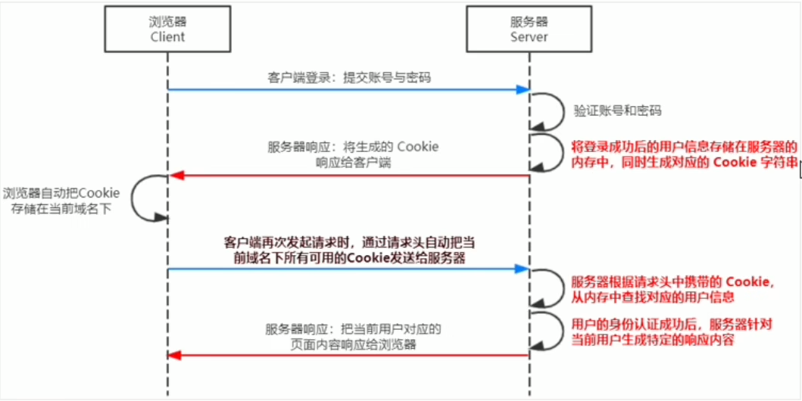
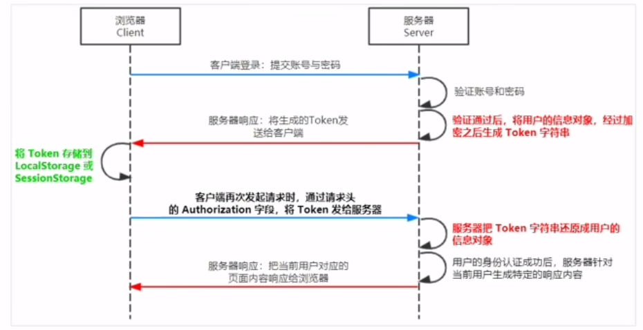

# WEB开发模式和身份认证的概念

## 目录

- [WEB开发模式和身份认证的概念](#web开发模式和身份认证的概念)
  - [目录](#目录)
  - [WEB开发模式](#web开发模式)
    - [服务端渲染开发模式](#服务端渲染开发模式)
    - [前后端分离开发模式](#前后端分离开发模式)
    - [WEB开发模式的选择](#web开发模式的选择)
  - [身份认证](#身份认证)
    - [session认证机制](#session认证机制)
    - [JWT认证机制](#jwt认证机制)

## WEB开发模式

### 服务端渲染开发模式

**页面由服务端拼接动态生成后发送给客户端**

- 缺点
  - 开发效率低
  - 耗费服务端资源
- 优点
  - 有利于SEO
  - 节省客户端资源

### 前后端分离开发模式

**前端用AJAX调接口,后端负责提供接口**

- 优点
  - 开发效率高,
    - 前端专注于UI界面,
    - 后端专注于API开发,
    - 前端开发时有多种选择,Jquery+模板引擎 或 Vue 或 React 等的框架
  - 用户体验好,容易实现局部刷新
  - 减轻了服务器渲染压力
- 缺点
  - 不利于SEO,
    - 完整的页面内容是通过AJAX获取API接口得到的,
    - 该问题可用VUE React前端框架的SSR(server Side render)解决

### WEB开发模式的选择

**WEB开发模式的选择需要考虑业务场景**

- 企业网站,主要为展示产品,**没有复杂的交互**,**需要良好的SEO**,则一般使用**服务端渲染**的开发模式
- 后台管理网站,**交互性强**,**不需要考虑SEO**,则一般使用**前后端分离**的开发模式
- 若需**同时考虑首页渲染速度**和**开发效率**,则采用**首页服务器渲染** **其他页面采用前后端分离**的开发模式

## 身份认证

身份认证(Authentication),身份验证,鉴权;指**通过一定手段完成对用户身份的确认**  
身份认证的目的是为了**确认当前所声称为某身份的用户,确实是所声称的用户**

- 手机验证码登陆
- 邮箱验证登陆
- 二维码登陆
- 密码登陆

不同WEB开发模式采用不同的身份认证机制

- **服务端渲染**的开发模式一般使用**session认证机制**
- **前后端分离**的开发模式一般使用**JWT认证机制**

Session认证机制需要配合Cookie才能实现,由于Cookie默认不支持跨域,所以但涉及到前端跨域访问后端接口时,需要做很多额外的配置,才能实现跨域Session认证

- 前端不存在跨域访问后端接口,应使用**Session认证机制**
- 前端跨域访问后端接口时应该使用**JWT认证机制**

### session认证机制

**HTTP协议的无状态性**  
无状态性是指客户端**每次发送的http请求都是独立的**,多个请求之间没有直接的关系,**服务端也不会保留每次http的请求状态**. 解决该问题需使用`Cookie`,用于确认前后两个请求是同一个用户

**Cookie**  

- **4KB限制** 是存储在浏览器中一段**不超过4kB的字符串**
- **由键值对组成**,有名称Name,值Value和其他几个可选属性组成(有效期,安全性,使用范围)
- **会过期**
- **按域名独立** **不同域名下的cookie各自独立**
- **自动发送** 客户端发送请求时,**会自动把该域名下所有未过期的cookie发送给服务端**
- **容易被伪造** 浏览器提供了读写cookie的API
- **本身不具有安全性** 不建议存放隐私数据,
  

**获取;存储;发送cookie过程**

- 客户端第一次向服务端发送请求时,服务端会通过响应头向客户端发送一个cookie  
- 客户端收到该cookie后会**自动保存**到浏览器中  
- 客户端后续的请求头将会**自动携带cookie**
  

**session认证原理**  
session认证使用**cookie+身份认证**的方式实现;提高了cookie本身的安全性
  

**express中的session认证**
express中可使用`express-session`的**第三方中间件**来实现  
<red>详细笔记:[express学习笔记]()</red>  

### JWT认证机制

**概念**  

- **JWT(Json Web Token)**,是目前最流行的跨域认证解决方案
- JWT组成: `header头部.Payload有效载荷.Signature签名`
  - `Payload有效载荷` 是用户信息经过加密后的字符串
  - `header头部` 和 `Signature签名` 是安全性相关的内容

**工作原理**

- 客户端发送登陆请求,提交用户名和密码
- 服务端验证用户名和密码的真实性,将用户信息加密生成`token`发送给客户端
- 客户端收到token后手动保存到`LocalStorage`或`SessionStorage`中
- 客户端后续发送请求时,需携带名为`Authorization`的请求头,格式为`Authorization: Bearer Token字符串;`
- 服务端收到请求后从请求头中提取出`Token`字段,并**解密出用户信息**,身份认证成功后,再根据客户端的请求的内容响应给客户端相应的数据
  

**express中的sJWT认证机制机制**
<red>详细笔记:[express学习笔记]()</red>  

