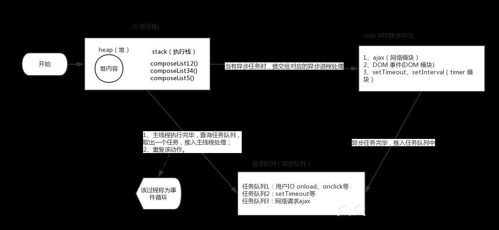
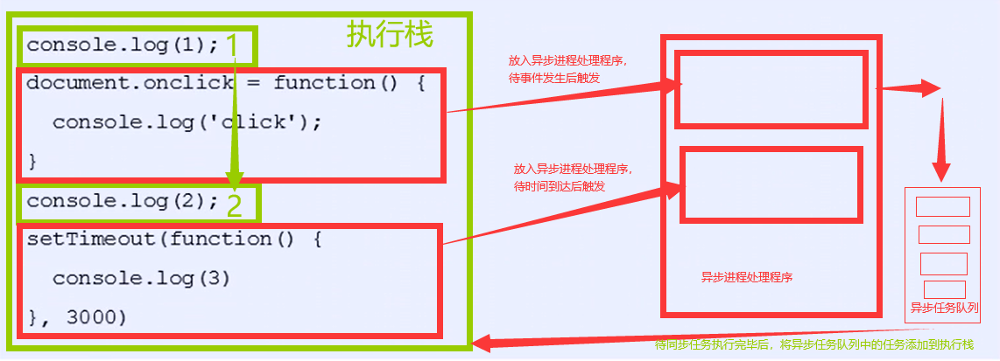

# jsWebApis学习笔记之BOM

## 目录

- [jsWebApis学习笔记之BOM](#jswebapis学习笔记之bom)
  - [目录](#目录)
  - [概述](#概述)
  - [window对象构成](#window对象构成)
  - [window对象事件](#window对象事件)
  - [定时器](#定时器)
    - [倒计时案例](#倒计时案例)
    - [发送短信按钮案例](#发送短信按钮案例)
  - [this指向问题](#this指向问题)
  - [js执行机制](#js执行机制)
    - [原来存在的问题](#原来存在的问题)
    - [新标准](#新标准)
  - [window的location对象](#window的location对象)
    - [URL](#url)
  - [window.navigator对象](#windownavigator对象)
  - [window.history对象](#windowhistory对象)

## 概述

- BOM(Browser Object Model浏览器对象模型)

- 提供了**与浏览器窗口进行交互的对象**，
- 核心对象是`window`
- **BOM最初是Netscape浏览器标准的一部分**
- BOM是浏览器厂商在各自浏览器上定义的，兼容性差
  - alert() 在不同的浏览器有不同的外观

## window对象构成

- **DOM是BOM的一部分**
  

- window对象是浏览器**顶级对象**，有双重角色
  - 它是**js访问浏览器窗口的API**
  - 它是全局对象，**定义在全局作用域的变量函数都会变成window对象的属性和方法**
  - **在调用时可以省略`window.`**
    - `window.alert()` 和 `alert()`
    - `window.prompt()` 和 `prompt()`

## window对象事件

- `window.onload`是窗口（页面）加载事件，**当文档内容（图像，脚本，CSS等）完全加载完毕后触发**

::: normal-demo window.onload事件

```html
<button id="demoButtonwoefjwe93">测试</button>
```

```js
//通过window.onload事件，可以把js代码写在元素代码之前
window.addEventListener("load", function () {
  var demoButtonwoefjwe93 = document.querySelector("#demoButtonwoefjwe93");
  demoButtonwoefjwe93.addEventListener("click", function () {
    window.alert("页面加载完毕：点击了按钮");
  });
});
```

:::

- `window.onDOMContentLiaded` **DOM内容（html元素）加载完毕后触发的事件**，在CSS、图片 flash加载前触发，如果页面中图片很多，那么onload事件触发就要等很久，而该事件就不用

- `window.onresize` 浏览器窗口调整后触发的事件，常配合`window.innerWidth`属性来做响应式布局

## 定时器

- `window.setTimeout(回调函数,[延迟毫秒数])` 用来延迟执行某个函数 **先延迟后执行**

  - 回调函数的几种写法
    - 匿名函数
    - 函数名
    - '函数名()'
  - 延迟毫秒数不填默认为0
  - 返回值，定时器ID
  - `window.clearTimeout(定时器ID)`清除定时器

- `window.setInterval(回调函数,[延迟毫秒数])` 用来**循环**延迟执行某个函数 **先延迟后执行**
  - `window.clearInterval(定时器ID)`清除定时器

### 倒计时案例

::: normal-demo 倒计时案例

```html
<div id="demoJOIJE123">
  <span id="hh">00</span>
  <span id="mm">00</span>
  <span id="ss">00</span>
</div>
<style>
  #demoJOIJE123 span {
    display: inline-block;
    margin: 0 5px;
    width: 50px;
    height: 50px;
    background-color: black;
    color: white;
    font-size: 40px;
    line-height: 50px;
    text-align: center;
  }
</style>
<script>
  var hh = document.querySelector("#hh");
  var mm = document.querySelector("#mm");
  var ss = document.querySelector("#ss");
  var targetTime = +new Date("9922-07-04T04:45:00"); //设置目标时间
  updateTime(); //防止刷新页面后要等1秒才更新倒计时
  var timeDown = setInterval(updateTime, 1000);
  function updateTime() {
    var now = +new Date();
    var gap = targetTime - now;
    if (gap < 0) {
      gap = 0; //防止出现负号
      clearInterval(timeDown);
    }
    var h = parseInt((gap / 1000 / 60 / 60) % 24);
    var m = parseInt((gap / 1000 / 60) % 60);
    var s = parseInt((gap / 1000) % 60);
    h = h < 10 ? "0" + h : h;
    m = m < 10 ? "0" + m : m;
    s = s < 10 ? "0" + s : s;
    hh.innerText = h;
    mm.innerText = m;
    ss.innerText = s;
  }
</script>
```

:::

### 发送短信按钮案例

::: normal-demo 发送短信按钮案例

```html
<div id="demoInput12381039">
  <input type="text" name="" id="" /><button>发送</button>
</div>
<style>
  #demoInput12381039 * {
    box-sizing: border-box;
    padding: 0;
    margin: 0;
    height: 25px;
    padding: 0 5px;
    vertical-align: middle;
  }
</style>
<script>
  var btn = document.querySelector("#demoInput12381039>button");
  var ipt = document.querySelector("#demoInput12381039>input");
  btn.addEventListener("click", function () {
    if (ipt.value) {
      //检查输入框是否满足要求
      btn.disabled = true; //禁用
      var ss = 5; //倒计时
      callback(); //先显示一次
      var timmer = setInterval(callback, 1000);
      function callback() {
        //回调函数
        btn.innerText = "再次发送需等待" + ss + "秒";
        if (ss-- < 0) {
          clearInterval(timmer);
          btn.innerText = "发送";
          btn.disabled = false;
        }
      }
    }
  });
</script>
```

:::

## this指向问题

全局作用域或普通函数中的this指向window对象

```js
console.log(this); //输出window
//----------------------------------------------------//
function test1() {
  console.log(this); //输出window
}
test1(); //相当于是window.test1();
//----------------------------------------------------//
window.setInterval(function () {
  console.log(this); //输出window
}, 1000);
```

对象的方法中的this指向调用者，也就是这个对象本身

```js
var obj = {
  test2: function () {
    console.log(this); //输出obj
  },
};
obj.test2();
//----------------------------------------------------//
var btn = document.querySelector("bhtton");
btn.onclick = function () {
  console.log(this); //输出btn对象 ,相当于在触发click事件后会自动调用btn.onclick();函数
};
btn.addEventListener("click", function () {
  console.log(this); //输出btn对象
});
//----------------------------------------------------//
```

构造函数中的this指向返回的实例化后的对象

```js
function Obj() {
  console.log(this);
}
var obj1 = new Obj(); //控制台打印输出obj1
var obj2 = new Obj(); //控制台打印输出obj2
```

this的指向是可以更改的

## js执行机制

### 原来存在的问题

- js语言的特点是单线程，同时只能做一件事
- 单线程的特点由js诞生的使命造成，js是为了处理页面交互，DOM的增删改。
- 单线程意味着所有任务需要排队，前一个执行完毕才能执行下一个
- 单线程的问题是，当单个任务耗费时间较长时会造成任务队列的堵塞

### 新标准

为了解决这样的问题，HTML5提出了Web Worker标准，允许js创建多个线程，利用多核cpu的计算能力，于是js中出现了同步和异步的概念

- 同步任务: 同步任务都在主线程上执行，形成一个**执行栈**

- 异步任务

  - js异步是通过回调函数实现
  - 回调函数会被添加到**任务队列**（消息队列）
  - 异步任务一般分三类
    - 普通事件：click resize 等
    - 资源加载：load error 等
    - 定时器： setInterval() setTimeout() 等

- 执行机制
  - 0.先执行**执行栈**中的同步任务
  - 1.碰到异步任务则将其提交给对应的**异步进程处理程序**
    - **异步进程处理程序**在事件触发、定时器等到、ajax返回后，将相应的异步任务放入**任务队列**中
  - 3.等到同步任务执行完毕后，再到**任务队列**中查询是否有任务，如果有，就取出一个放入**执行栈**处理
  - 1->2->3 称之为**事件循环**
    

案例

- 输出顺序为`1`->`2` 但`3`和`click`的顺序不定，主要看回调函数被添加到任务队列的顺序，该顺序由延迟时间，click时间发生的时间共同觉得
- 

## window的location对象

location对象**属性**

- `location.href` **获取或设置整个url**
- `location.host` 返回域名 `www.baidu.com`
- `location.hostname` 返回域名 `www.baidu.com`
- `location.port` 返回端口号，默认为空字符串 `""`
- `location.pathname` 路径 `/index.html`
- `location.search` **参数** `?name=andy&age=18`
- `location.hash` #片段 `#锚点名`

location对象**方法**

- location.assign() 和herf一样可以跳转页面，也称重定向页面 ，记录历史记录
- location.replace() 替换当前页面，不记录历史记录，不能后退页面
- location.reload() 重新加载页面，
  - 参数为空或false时，相当于刷新或f5（使用缓存）
  - 参数为true则相当于ctrl+f5强制刷新页面（不使用缓存，而直接从服务器重新获取数据）

### URL

- 格式：`传输协议://域名或ip[:端口][/地址][?查询键值对][#片段]`

- 示例：`https://www.baidu.com:80/index.html?wd=搜索内容`
  - protocol 通信协议，http ftp maito
  - host 主机，域名或ip地址
  - port 端口，省略时使用协议的默认端口，如http是80端口
  - path 路径，表示一个目录或文件
  - query 参数,以键值对形式，通过&符号分隔，如`?name=andy&age=18`
  - fragment 片段 `#锚点名` 常见于链接、锚点

::: normal-demo URL

```html
<button id="demoOHf9we8">点击跳转到百度</button>
<script>
  var demoOHf9we8 = document.querySelector("#demoOHf9we8");
  demoOHf9we8.addEventListener("click", function () {
    var ss = 5;
    reflash();
    var timer = setInterval(reflash, 1000);
    function reflash() {
      if (ss > 0) {
        demoOHf9we8.innerText = "即将在" + ss + "秒后跳转到百度";
        ss--;
      } else {
        clearInterval(timer);
        location.href = "https://baidu.com";
      }
    }
  });
</script>
```

:::

将一个页面的数据送到另一个页面

```html
//login.html //form默认get
<form action="index.html">
  用户名：<input type="text" name="username" /><input
    type="submit"
    value="登录"
  />
</form>
```

```html
//index.html

<p id="demowenwfj9230"></p>
<script>
  var demowenwfj9230 = document.querySelector("#demowenwfj9230");
  var list = location.search.substr(1).split("="); //去除？后再根据=分隔为数组
  var uname = list[1];
  demowenwfj9230.innerHTML = "欢迎你，" + uname;
</script>
```

## window.navigator对象

常用属性

- `navigator.userAgent` 可获取客户端发送给服务端的user-agent头部值，用来判断是移动端还是pc端

**判断是移动端还是pc端**

```js
function isPhone() {
  if (
    window.navigator.userAgent.match(
      /(phone|pad|pod|iPhone|iPod|ios|iPad|Android|Mobile|BlackBerry|IEMobile|MQQBrowser|JUC|Fennec|wOSBrowser|BrowserNG|WebOS|Symbian|Windows Phone)/i
    )
  ) {
    return true;
  }
  return false;
}
```

## window.history对象

- 该对象允许用户于浏览器历史记录进行交互

- 该对象包含用户（在浏览器窗口中）访问过的URL

常用方法

- history.back() 后退一个页面
- history.forward() 前进一个页面
- history.go(参数) 参数是1前进一个页面，-1后退一个页面

使用场景：

