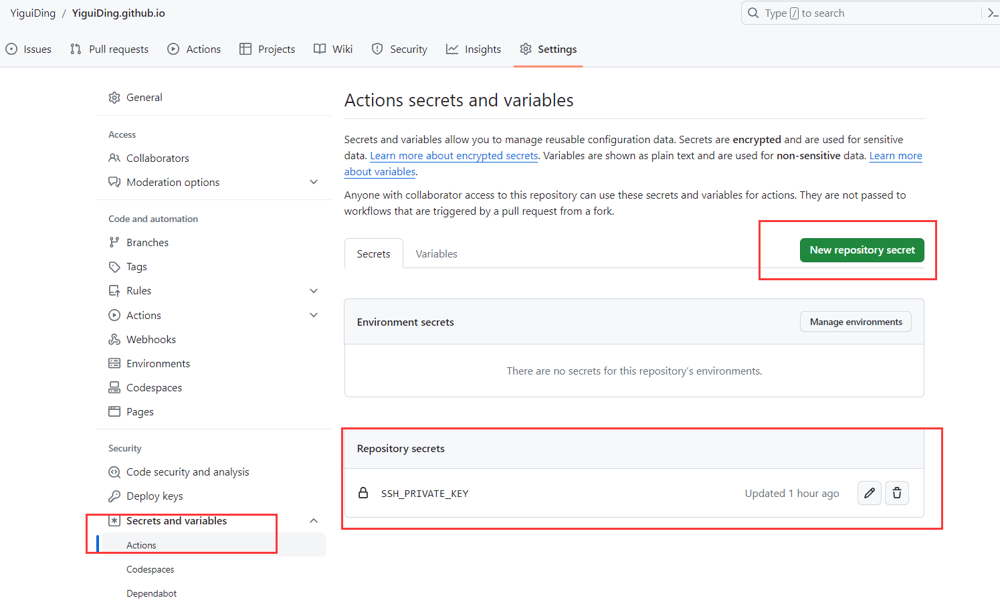

# 使用workflows实现对vuepress的一键部署

**服务端配置记录**

**创建git用户**

```bash
# 创建一个用户
adduser git
# 切换到git用户
su git

# 初始化仓库
cd /var/www/vuepress2-blog-root/
git init
# 创建分支
git branch static-pages
# 允许提交代码到该目录
git config --global --add safe.directory /var/www/vuepress2-blog-root/
# 允许提交代码到当前分支
git config --global --add receive.denyCurrentBranch ignore
```

**为github的主机生成私钥和公钥**

```bash
# 为github的主机生成私钥
ssh-keygen -t rsa
# Generating public/private rsa key pair.
# Enter file in which to save the key (/home/git/.ssh/id_rsa): ./github-action
# Enter passphrase (empty for no passphrase): 
# Enter same passphrase again: 
# Your identification has been saved in ./github-action
# Your public key has been saved in ./github-action.pub
ls
# github-action  github-action.pub
# 查看私钥
cat github-action

# 查看公钥
cat github-action.pub

# 将公钥内容附加到已授权的主机列表
cat github-action.pub >> ~/.ssh/authorized_keys

```

**在github的仓库创建私钥变量**

变量 名为 `SSH_PRIVATE_KEY` 值为 刚刚生成的私钥内容



**编写workflows配置文件**

> - 此时在该配置文件中就能通过，`${{ secrets.SSH_PRIVATE_KEY }}` 获取到配置的私钥地址，
> - 然后由于已经将其公钥添加到了自己的服务器中，所以github的服务器就能和自己的服务器建立免密链接

```yml
name: Deploy blog

on:
  push:
    branches:
      - master

jobs:
  deploy-static-pages:
    runs-on: ubuntu-latest
    steps:
      - name: Checkout
        uses: actions/checkout@v4
        with:
          submodules: true
          fetch-depth: 0

      - name: Install pnpm
        uses: pnpm/action-setup@v2
        with:
          run_install: true

      - name: Setup Node.js
        uses: actions/setup-node@v4
        with:
          node-version: 18
          cache: pnpm

      - name: Build Blog
        env:
          NODE_OPTIONS: --max_old_space_size=4096
        run: pnpm run build

      - name: Deploy
        uses: JamesIves/github-pages-deploy-action@v4
        with:
          branch: static-pages
          folder: src/.vuepress/dist

  deploy-server:
    runs-on: ubuntu-latest
    needs: deploy-static-pages
    steps:
      - name: Checkout
        uses: actions/checkout@v4
        with:
          ref: static-pages
          fetch-depth: 0

      - name: Configuration environment
        uses: webfactory/ssh-agent@v0.8.0
        with:
          ssh-private-key: ${{ secrets.SSH_PRIVATE_KEY }}

      - name: Deploy
        run: |
          ssh-keyscan dingdingdang.online >> ~/.ssh/known_hosts
          git config --global user.name 'YiguiDing'
          git config --global user.email '2449695354@qq.com'
          ssh git@dingdingdang.online "git config --global --add safe.directory /var/www/vuepress2-blog-root/"
          ssh git@dingdingdang.online "git config --global --add receive.denyCurrentBranch ignore"
          git push -f git@dingdingdang.online:/var/www/vuepress2-blog-root/ static-pages
          ssh git@dingdingdang.online "cd /var/www/vuepress2-blog-root/  && git reset --hard HEAD"
```

**将本地分支提交到github仓库**

```bash
# 添加远程地址
git remote add --master master origin git@github.com:YiguiDing/YiguiDing.github.io.git
git add . && git commit -m "update"
# 强制推送
git push --force origin master 
```
