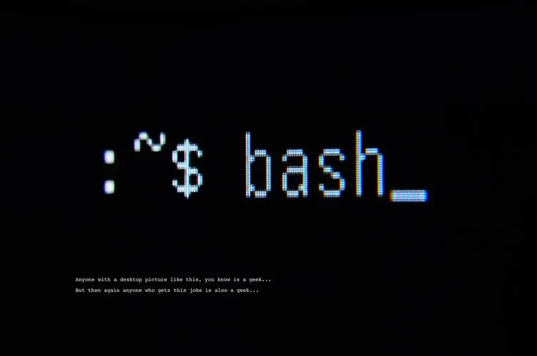

# linux备忘笔记



## 删除已设置生效的root密码

```bash
# 删除root:x: 中的x密码占位符号
vim /etc/passwd
# 删除root:xxxxxxxxxx: 中的xxxxxxxxxxxxxxxxxx加密后的密码，改为*
vim /etc/shadow

# 没有权限则重启进入拯救模式
```

## 用户管理

**usermod**

```bash
# usermod 可选项：
#     -d <登入目录>     修改用户登入时的目录。
#     -g <群组>         修改用户所属的群组。
#     -G <群组>         修改用户所属的附加群组。
#     -l <帐号名称>     修改用户帐号名称(新账号在前，旧账号在后)
#     -L                锁定用户密码，使密码无效。
#     -s <shell>        修改用户登入后所使用的shell。
#     -u <uid>          修改用户ID。
#     -U                解除密码锁定。
```

## 权限管理

**查看用户组的成员**

```bash
vi /etc/group
```

## 常用命令

- 查看所有运行的任务和pid
  - ps aux
  - a 显示现行终端机下的所有程序，包括其他用户的程序。
  - u 以用户为主的格式来显示程序状况。
  - x 显示所有程序，不以终端机来区分。
- 查看端口监听情况
  - 软件包名：net-tools
  - netstat -tunlp
  - -a 全部
  - -c或--continuous：持续列出网络状态；
  - -l或--listening：显示监控中的服务器的Socket；
  - -u或--udp：显示UDP传输协议的连线状况；
  - -t或--tcp：显示TCP传输协议的连线状况；
  - -n或--numeric：直接使用ip地址，而不通过域名服务器；
  - -p或--programs：显示正在使用Socket的程序识别码和程序名称；

- ctrl + z 将一个正在前台执行的命令放到后台，并且暂停
- jobs 查看当前有多少在后台运行的命令
  - 无参数 查看当前作业
  - -l 列出进程的PID和作业号
  - -p 只列出作业的PID
  - -s 只列出停止的作业
  - -r 只列出运行的作业
- fg 将后台中的命令调至前台继续运行
- bg 将一个在后台暂停的命令，变成继续执行
- commend & 后台执行一个程序
- linux命令后台运行.两种方式：
  - command & ： 后台运行，你关掉终端会停止运行
  - nohup command & ： 后台运行，你关掉终端也会继续运行

### 偶尔会忘的操作

- 将普通用户加入wheel组使其获得sudo权限
  - useradd dyg -G wheel 或者
  - usermod dyg -G wheel
- 递归更改文件夹属组
  - chmod -R dyg:dyg 文件名

## 软件安装升级

1. 安装c++编译器
    - yum install gcc gcc-c++
2. 安装make
    - yum install make
3. 安装nodejs
    - yum install nodejs
4. 安装指定版本的nodejs
    1. 官网找到下载链接后
        - wget <https://npmmirror.com/mirrors/node/v16.13.1/node-v16.13.1-linux-x64.tar.xz>
    2. 解压 【v显示解压过程，x解压，f指定解压文件，z解压后缀为gz的压缩包】
       - tar vxf node-v16.13.1-linux-x64.tar.xz
       - tar vxfz node-v16.13.1-linux-x64.tar.gz  
    3. 创建软连接；【-s表示soft 软】
        - ln -s /home/用户名/node-v16.13.1-linux-x64/bin/node /usr/local/bin/
        - ln -s /home/用户名/node-v16.13.1-linux-x64/bin/npm /usr/local/bin/
5. CentOS8完美升级gcc版本方法
   1. 安装gcc-toolset-10
     - dnf install gcc-toolset-10
   2. 激活gcc版本，使其生效
       - scl enable gcc-toolset-10 bash 或
       - source /opt/rh/gcc-toolset-10/enable
   3. 此时通过gcc --version命令可以看到，gcc版本已经变成10.x.x，

        ```
        值得注意的是这仅仅在当前bash生效，
        如果需要永久生效，可以请自行添加环境变量。
        仅适用于CentOS8、Redhat8版本
        在CentOS8版本中，红帽也提供了开发工具包管理gcc版本，
        install的包名从devtoolset-x变成了gcc-toolset-x，
        通过该方式升级gcc好处就是随时可以切换gcc版本，不破坏原有gcc环境。
        gcc-toolset-9对应gcc9.x.x版本
        gcc-toolset-10对应gcc10.x.x版本
        ```
