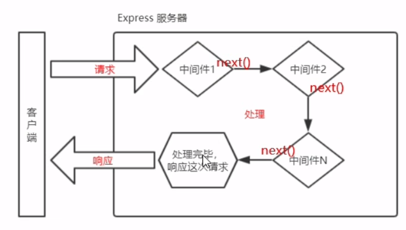
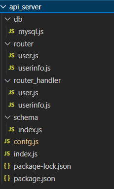

# express学习笔记


## 目录

- [express学习笔记](#express学习笔记)
  - [目录](#目录)
  - [概念](#概念)
  - [实现API接口服务器](#实现api接口服务器)
    - [基本示例:post get all listen](#基本示例post-get-all-listen)
    - [获取URL中的**查询参数**](#获取url中的查询参数)
    - [获取URL中的**动态参数**](#获取url中的动态参数)
  - [静态web服务器](#静态web服务器)
    - [**基本使用示例**](#基本使用示例)
    - [**托管多个静态网页**](#托管多个静态网页)
    - [**挂载路径前缀**](#挂载路径前缀)
  - [路由](#路由)
    - [概念](#概念-1)
    - [**最简用法:直接挂载到app上**](#最简用法直接挂载到app上)
    - [**高级用法:将路由抽离为单独模块**](#高级用法将路由抽离为单独模块)
    - [为路由添加访问前缀](#为路由添加访问前缀)
  - [中间件](#中间件)
    - [概念](#概念-2)
    - [示例](#示例)
    - [**中间件的分类**](#中间件的分类)
    - [**应用级别中间件**](#应用级别中间件)
    - [**路由级别中间件**](#路由级别中间件)
    - [**错误级别中间件**](#错误级别中间件)
    - [**内置中间件**](#内置中间件)
    - [**第三方中间件**](#第三方中间件)
    - [**自定义中间件:尝试实现urlencoded模块**](#自定义中间件尝试实现urlencoded模块)
  - [常用中间件的使用](#常用中间件的使用)
    - [CORS跨源访问限制](#cors跨源访问限制)
    - [express-session身份认证](#express-session身份认证)
    - [JWT认证机制机制](#jwt认证机制机制)
  - [session认证完整案例](#session认证完整案例)
  - [jwt认证完整案例](#jwt认证完整案例)
  - [综合案例：结合jwt认证机制、express、mysql时间api服务器](#综合案例结合jwt认证机制expressmysql时间api服务器)

------------------------------------------------------------------

## 概念

express作用和nodejs的http模块类似,用于创建web服务器<br>
express是基于http模块封装的,使用起来比http模块简单,效率更高

**express用处**

- web服务器
- API接口服务器

------------------------------------------------------------------

## 实现API接口服务器

### 基本示例:post get all listen

```js
const express = require("express")

const app = express();

app.get("/test_01",(request,response)=>{
    response.send("hello world!!")
})

app.post("/test_02",(request,response)=>{
    response.send({hello:"world"})
})

app.all("/test_03",(request,response)=>{
    response.send({hello:"world"})
})

app.listen(8000,()=>{
    console.log("express server is running at http://127.0.0.1:8000")
})
```

------------------------------------------------------------------

### 获取URL中的**查询参数**

```js
app.get("/test_04",(request,response)=>{
    // request.query默认是空对象
    // 客户端使用 ?name=DingYigui&age=20 这种查询字符串形式的URL时
    // request.query=={"name"="DingYigui","age"=20}

    console.log(request.query)
    
    response.send(request.query)
})
```

------------------------------------------------------------------

### 获取URL中的**动态参数**

```js
app.get("/test_05/:name/:age",(request,response)=>{
    // request.params 默认是空对象 是动态匹配到的URL参数
    // 客户端使用 /test_05/DingYigui/20 形式的URL时
    
    // request.params=={"name"="DingYigui","age"=20}
    console.log(request.params)
    response.send(request.params)
})
```

------------------------------------------------------------------

## 静态web服务器

### **基本使用示例**

```js
const express = require("express")

const app = express();

app.use(express.static("./site0"))

app.listen(8000,()=>{
    console.log("express server is running at http://127.0.0.1:8000")
})
```

> 要访问 `/site0/index` 只需访问 `/index`

------------------------------------------------------------------

### **托管多个静态网页**

```js
app.use(express.static("./site1"))
app.use(express.static("./site2"))
```

> 注意: 若访问的index.html在两个文件目录中均存在,则优先访问第一个文件夹

------------------------------------------------------------------

### **挂载路径前缀**

```js
app.use("/subSite",express.static("./site1"))
```

> 要访问 `/site1/index` 则需访问 `/subSite/index`

------------------------------------------------------------------

## 路由

### 概念

路由就是**映射关系**,在express中就是指**客户端请求**和**服务端处理函数**的**映射关系**

express路由的**组成**: `app.METHOD(PATH,HANDLER)`

- `METHOD` 请求的方法
- `PATH` 请求的URL地址
- `HANDLER` 处理函数

express路由的**匹配规则**

- 将按照定义的**先后顺序**进行匹配
- **请求类型**和**请求URL**需**同时匹配**才会调用对应的**处理函数**

------------------------------------------------------------------

### **<sky>最简用法</sky>:直接挂载到app上**  

<red>express不建议将路由直接挂载到app上,这样会导致代码量越来越多,不便管理</red>

```js
app.get("/test_01",(request,response)=>{
    response.send("hello world!!")
})

app.post("/test_02",(request,response)=>{
    response.send({hello:"world"})
})

app.all("/test_03",(request,response)=>{
    response.send({hello:"world"})
})
```

------------------------------------------------------------------

### **<sky>高级用法</sky>:将路由抽离为单独模块**  

<gre>express官方推荐用法</gre>  

```js
// ./src/user.js
const express = require("express")
const routerApp = express.Router()     //创建路由对象

routerApp.get("/user/list",(req,res)=>{ //挂载路由
    res.send("getted user list")
})
routerApp.post("/user/add",(req,res)=>{ //挂载路由
    res.send("added user")
})

module.exports = routerApp //导出路由对象
```

```js
// ./index.js
const express = require("express")
const app = express()

const userRouter = require("./src/user.js") //导入user路由模块
app.use("/api",userRouter) //注册路由

app.listen(8000,()=>{
    console.log("server is running at http://127.0.0.1:8000");
})
```

>`app.use()`用于注册全局**中间件**

------------------------------------------------------------------

### 为路由添加访问前缀

```js
app.use("/api",userRouter) //添加访问前缀
```

------------------------------------------------------------------

## 中间件

### 概念

中间件(Middleware),特指业务流程的中间处理环节

但一个请求到达express服务器后,可连续调用多个中间件对请求进行**预处理**
  

**中间件本质为函数**

```js
const mw = function (request,response,next){
    console.log("这是一个中间件函数")
    next()
}
```

**next()函数**  
next()函数实现多个中间件之间的**连续调用**,表示把**流转关系**转交给**下一个中间件**或**路由**

  

### 示例

**案例1:全局生效的中间件**

```js
const express = require("express")
const app = express()

//定义中间件1
const mw1 = function(req,res,next){
    req.startTime = Date.now()
    console.log("执行了第1个中间件")
    next()
}
//定义中间件2
const mw2 = function(req,res,next){
    console.log("执行了第2个中间件")
    next()
}

//注册中间件1:先注册的先执行,后注册的后执行
app.use(mw1)
//注册中间件2
app.use(mw2)


app.get("/testRW",(req,res)=>{ //挂载路由
    var now = Date.now()
    var gap = now-req.startTime
    res.send("处理该请求耗时:"+ gap + "ms")
})


app.listen(8000,()=>{
    console.log("server is running at http://127.0.0.1:8000");
})
```

> **注意**:对于全局生效的中间件,一定要在路由之前注册中间件

**案例2:局部生效的中间件**

```js
const express = require("express")
const app = express()

//定义中间件1
const mw1 = function(req,res,next){
    req.startTime = Date.now()
    console.log("执行了第1个中间件")
    next()
}
//定义中间件2
const mw2 = function(req,res,next){
    console.log("执行了第2个中间件")
    next()
}


//以下三种方式均可
app.get("/testRW_2_1",mw1,(req,res)=>{ //挂载路由
    var now = Date.now()
    var gap = now-req.startTime
    res.send("处理该请求耗时:"+ gap + "ms")
})

// 以下两种方式等效
app.get("/testRW_2_2",mw1,mw2,(req,res)=>{ //挂载路由
    var now = Date.now()
    var gap = now-req.startTime
    res.send("处理该请求耗时:"+ gap + "ms")
})

app.get("/testRW_2_3",[mw1,mw2],(req,res)=>{ //挂载路由
    var now = Date.now()
    var gap = now-req.startTime
    res.send("处理该请求耗时:"+ gap + "ms")
})

app.listen(8000,()=>{
    console.log("server is running at http://127.0.0.1:8000");
})
```

### **中间件的分类**

- **应用**级别中间件

- **路由**级别中间件
- **错误**级别中间件
- Express**内置**中间件
- **第三方**中间件

### **应用级别中间件**

通过`app.use()` `app.post()` `app.get()`绑定到**app实例**上的中间件都称为**应用级别中间件**

```js
const express = require("express")
const app = express()

app.use((req,res,next)=>{
    console.log("这是一个应用级别中间件,同时也是全局中间件")
    next();
})

app.get("/api/test",
    (req,res,next)=>{
        console.log("这是一个应用级别中间件,同时也是局部中间件")
        next();
    },
    (req,res)=>{
        res.send("hello world")
    }
)
```

### **路由级别中间件**

绑定到`express.Router()`的**实例**上的中间件都称为**路由级别中间件**

```js
const express = require("express")
const app = express()
const router = app.Router()

router.use((req,res,next)=>{
    console.log("这是一个路由级别中间件")
    next();
})

router.get("/test",
    (req,res,next)=>{
        console.log("这是一个路由级别中间件")
        next();
    },
    (req,res)=>{
        res.send("hello world")
    }
)

app.use("/api",router)
```

### **错误级别中间件**  

用于捕获整个项目中发生异常错误的中间件,**防止项目异常崩溃的问题**  
**格式:**`function(err,req,res,next){}`  
**注意:** <red>错误级别中间件需放在路由之后</red>

```js
//创建路由
app.get("/test",(req,res)=>{
    throw new Error("服务器发生了内部错误!!!") //手动抛出一个错误
    res.send("hello world")                 //此处便不会执行
})

//注册错误级别中间件
app.use((err,req,res,next)=>{
    console.log(err.message)                //输出错误信息
    res.send(err.message)                   //向客户端响应
})
```

### **内置中间件**

自`express@4.16.0`起内置了三个常用中间件

- `express.static`
  - 用于托管指定目录下的静态网页
  - (该中间件可兼任旧版本)
- `express.json()`
  - 用于解析<red>**请求体中**</red>的**JSON格式**的数据,解析完毕后将被挂载到`req.body`上  
  - (该中间件不可兼任旧版本的express)
- `express.urlencoded()`
  - 用于解析<red>**请求体中**</red>中的**URL-encoded格式**的数据,解析完毕后将被挂载到`req.body`上
  - (该中间件不可兼任旧版本的express)

```js
// 解析 application/json 格式的数据
app.use(express.json())
// 解析 application/x-www-form-urlencoded 格式的数据
app.use(express.urlencoded({extented:false}))

app.post("/",(req,res)=>{ //此时便能够解析并获取到请求体中的json格式和urlencoded格式的数据了
    console.log(req.body)
    res.send(req.body)
})
```

### **第三方中间件**

在`express@4.16.0`内置`express.urlencoded`模块之前,常使用的一个叫<red>body-parser</red>的模块  
实际上该模块就是`express.urlencoded`的前身

```js
const parser = require("body-parser")
app.use(parser.urlencoded({extented:false}))
```

### **自定义中间件:尝试实现urlencoded模块**

实现将请求体中的`a=123&b=321`格式的数据解析为`{a:123,b:321}`格式的json对象

```js
const express = require("express")
const app = express()

////////////////////////////////////////////////////////////////////////////////
const qs = require("querystring")
function BodyUrlDataDecoded(req,res,next){//定义中间件
    req.bodyUrlData = []
    req.on("data",(chunk)=>{ //监听req的data
        req.bodyUrlData.push(chunk) //收集数据片段
    })
    req.on("end",()=>{//监听req的end事件
        var temp = req.bodyUrlData.toString() //将收集的数据片段转换为字符串
        req.body = qs.parse(temp) // 将字符串通过nodejs内置的querystring模块解析为json对象
        next()
    })
}
app.use(BodyUrlDataDecoded) //注册中间件
////////////////////////////////////////////////////////////////////////////////


app.all("/",(req,res)=>{
    res.setHeader("Access-Control-Allow-Origin","*")
    res.setHeader("Access-Control-Allow-Headers","*")
    console.log(req.body);
    res.send(req.body)
})
app.listen(8000,()=>{
    console.log("express server is running at http://127.0.0.1:8000");
})
```

**测试自定义中间件**

```html
<!-- jquery库 ,crossorigin="anonymous"表示不携带当前页面的cookie -->
<script crossorigin="anonymous" src="https://cdn.bootcdn.net/ajax/libs/jquery/3.6.0/jquery.min.js"></script>
<!-- axios 库 ,crossorigin="anonymous"表示不携带当前页面的cookie -->
<script crossorigin="anonymous" src="https://cdn.bootcdn.net/ajax/libs/axios/0.27.2/axios.min.js"></script>
<button id="btn">点击使用axios(config)发送请求</button>
<script>
    $("#btn").click(function(){
        //axios(config)
        axios({
            method: 'post',
            url:"http://127.0.0.1:8000/",
            params: {//url格式数据
            },
            headers:{//报头
            },
            data: "a=123&b=321"
            // data:{
            //     a:123,
            //     b:321
            // }
        })
        .then(function (response) {
            console.log(response);
        })
        .catch(function (error) {
            console.log(error);
        })
        .then(function () {
            // always executed
        });
    })
</script>
```

## 常用中间件的使用

### CORS跨源访问限制

**方法1:添加请求头**

```js
res.setHeader("Access-Control-Allow-Origin","*")
res.setHeader("Access-Control-Allow-Headers","*")
```

方法2: 通过第三方中间件cors

```js
const cors = require("cors")
app.use(cors)
```

### express-session身份认证

**基本使用**

```js
const session = require("express-session")
const express = require("express")
const app = express()

app.use(session({
    secret: "keyboard cat",     //任意字符串,用于加密cookie
    resave: false,              //固定写法
    saveUninitialized: true,    //固定写法
}))

app.use(express.json())
app.use(express.urlencoded({ extended: false }))

app.post("/api/login", (req, res) => {

    console.log(req.session);

    //判断用户名和密码是否正确
    if (req.body.username != "admin" && req.body.password != "admin") {
        res.send({ status: 1, msg: "登陆失败" })
        return;
    }

    //保存此次会话的用户信息
    req.session.userinfo = req.body
    req.session.islogin = true
    res.send({ status: 0, msg: "登陆成功" })
    return;
})
```

**`console.log(req.session);`输出的数据格式**

```js
// 登陆前
Session {
  cookie: { path: '/', _expires: null, originalMaxAge: null, httpOnly: true }
}

//登陆后
Session {
  cookie: { path: '/', _expires: null, originalMaxAge: null, httpOnly: true },
  userinfo: { username: 'admin', password: 'admin' },
  islogin: true
}
```

**实现 `登陆` `登出` 的案例**

```js
const express = require("express")
const app = express()
const session = require("express-session")

app.use(express.static("./webRoot"))

app.use(session({
    secret: "keyboard cat",     //任意字符串,用于加密cookie
    resave: false,              //固定写法
    saveUninitialized: true,    //固定写法
}))

app.use(express.json())
app.use(express.urlencoded({ extended: false }))

app.post("/api/login", (req, res) => {

    console.log(req.session);

    //判断用户名和密码是否正确
    if (req.body.username != "admin" && req.body.password != "admin") {
        res.send({ 
            status: 1, 
            msg: "登陆失败" 
        })
        return;
    }

    //保存此次会话的用户信息
    req.session.userinfo = req.body
    req.session.islogin = true
    res.send({ 
        status: 0, 
        msg: "登陆成功" 
    })
    return;
})

app.get("/api/logout", (req, res) => {

    //判断该请求的是否已经登陆
    if (!req.session.islogin) {
        res.send({ 
            status: 1, 
            msg: "logout失败" 
        })
        return;
    }

    //销毁该会话
    req.session.destroy()
    res.send({ status: 0, msg: "logout成功" })
    return;
})

app.get("/api/get-username", (req, res) => {
    //判断该请求的是否已经登陆
    if (!req.session.islogin) {
        res.send({ 
            status: 1, 
            msg: "get-username失败" 
        })
        return;
    }
    res.send({ 
        status: 0, 
        msg: "get-username成功", 
        username: req.session.userinfo.username 
    })
    return;
})


app.listen(8000, () => {
    console.log("server is running at http://127.0.0.1:8000");
})
```

```html
    <h1>登陆</h1>
    <form action="/api/login" method="post">
        <input type="text" name="username"><br>
        <input type="password" name="password"><br>
        <input type="submit" value="登陆"><br>
    </form>

    <h1>登出</h1>
    <form action="/api/logout" method="get">
        <input type="submit" value="登出"><br>
    </form>

    <h1>获取当前用户的用户名</h1>
    <form action="/api/get-username" method="get">
        <input type="submit" value="获取当前用户的用户名"><br>
    </form>
```

### JWT认证机制机制

**安装相关包**

- `jsonwebtoken` 用于将用户信息**加密**为JWT字符串
- `express-jwt` 用于将从客户端收到的JWT字符串**解密**为用户信息

```bash
npm install jsonwebtoken express-jwt
```

**实现JWT认证登陆的完整示例**

  

```js
const express = require("express")
const app = express()

//jwt身份认证
const jwtEncode = require("jsonwebtoken") //加密
// const jwtDecode = require("express-jwt")  //解密
var { expressjwt: jwtDecode } = require("express-jwt");
const secretKey = "dfwofwiefjw0wfej02fj023j0r2" //随便写一段密钥用于加密token

//用于支持跨源
const cors = require("cors")
app.use(cors())

// 静态资源
app.use(express.static("./webRoot"))

//解密请求头中的 jwtToken 解析还原为json对象 并把解析出来的信息挂载到 req.auth 上
//同时配置了访问权限 没有Token则不能访问任何接口 
//unless指定某些页面不需要Token 这里指定 /api/login 不需要身份认证便能访问
app.use(
    jwtDecode({
        secret: secretKey,
        algorithms: ["HS256"] //防止潜在的降级攻击所必需的
    })
        .unless({ path: [/^\/api\/login/] }) //指定 /api/login 不需要身份认证便能访问
)

//用于req.body
app.use(express.json())
app.use(express.urlencoded({ extended: false }))

//登陆api
app.post("/api/login", (req, res) => {

    //判断用户名和密码是否正确
    if (req.body.username != "admin" && req.body.password != "admin") {
        res.send({
            status: 1,
            msg: "登陆失败"
        })
        return;
    }

    //生成token
    //sign方法:sign(参数1,参数2,参数3)
    // 参数1 待加密的数据
    // 参数2 加密密钥
    // 参数3 配置项,可配置有效期
    var token = jwtEncode.sign({ username: req.body.username }, secretKey, { expiresIn: "30s" })
    //发送token
    res.send({
        status: 0,
        msg: "登陆成功",
        token: token
    })
})

// app.get("/api/logout", (req, res) => {
// logout不需要服务端执行任何操作了 只需要客户端删除token就好了
//     res.send({ 
//         status: 0, 
//         msg: "logout成功" 
//     })
//     return;
// })

app.get("/api/get-userinfo", (req, res) => {
    res.send({
        status: 0,
        msg: "获取用户的信息成功",
        userinfo: req.auth
    })
    return;
})

app.use((err, res, req, next) => { //处理错误
    if (err.name == "UnauthorizedError") {
        req.send({
            status: 401,
            msg: "未登陆或登陆状态已过期,请重新登陆",
            err: err
        })
    } else {
        req.send({
            status: 500,
            msg: "服务器未知错误",
            err: err
        })
    }
}
)


app.listen(8000, () => {
    console.log("server is running at http://127.0.0.1:8000");
})
```

**前端代码**

```html
    <!-- jquery库 ,crossorigin="anonymous"表示不携带当前页面的cookie -->
    <script crossorigin="anonymous" src="https://cdn.bootcdn.net/ajax/libs/jquery/3.6.0/jquery.min.js"></script>
    <!-- axios 库 ,crossorigin="anonymous"表示不携带当前页面的cookie -->
    <script crossorigin="anonymous" src="https://cdn.bootcdn.net/ajax/libs/axios/0.27.2/axios.min.js"></script>


    <h1>登陆</h1>
    用户:<input type="text" id="username"><br>
    密码:<input type="password" id="password"><br>
    <button id="btn-login">登陆</button>
    <div id="login-result"></div>
    <script>
        $("#btn-login").click(function () {
            console.log("123");
            //axios(config)
            axios({
                method: 'post',
                url: "/api/login",
                data: {
                    username: $("#username").val(),
                    password: $("#password").val(),
                }
            })
                .then((response) => {
                    console.log(response);
                    $("#login-result").text(JSON.stringify(response.data))
                    sessionStorage.setItem("token", response.data.token) //保存token
                })
        })
    </script>


    <h1>获取用户的信息</h1>
    <button id="btn-get-userinfo">获取</button>
    <div id="get-userinfo-result"></div>
    <script>
        $("#btn-get-userinfo").click(function () {
            //axios(config)
            axios({
                method: 'get',
                url: "/api/get-userinfo",
                headers: {//报头
                    Authorization: "Bearer " + sessionStorage.getItem("token") //获取token
                }
            })
                .then((response) => {
                    console.log(response);
                    $("#get-userinfo-result").text(JSON.stringify(response.data))
                })
        })
    </script>


    <h1>登出</h1>
    <button id="btn-logout">登出</button>
    <div id="logout-result"></div>
    <script>
        $("#btn-logout").click(function () {
            sessionStorage.setItem("token", "") //清除token
            $("#logout-result").text("登出完毕")

        })
    </script>
```

## session认证完整案例

```html
    <h1>登陆</h1>
    <form action="/api/login" method="post">
        <input type="text" name="username"><br>
        <input type="password" name="password"><br>
        <input type="submit" value="登陆"><br>
    </form>

    <h1>登出</h1>
    <form action="/api/logout" method="get">
        <input type="submit" value="登出"><br>
    </form>
    
    <h1>获取当前用户的用户名</h1>
    <form action="/api/get-username" method="get">
        <input type="submit" value="获取当前用户的用户名"><br>
    </form>
```

```js
const express = require("express")
const app = express()
const session = require("express-session")

app.use(express.static("./webRoot"))

app.use(session({
    secret: "keyboard cat",     //任意字符串,用于加密cookie
    resave: false,              //固定写法
    saveUninitialized: true,    //固定写法
}))

app.use(express.json())
app.use(express.urlencoded({ extended: false }))

app.post("/api/login", (req, res) => {

    console.log(req.session);

    //判断用户名和密码是否正确
    if (req.body.username != "admin" && req.body.password != "admin") {
        res.send({ 
            status: 1, 
            msg: "登陆失败" 
        })
        return;
    }

    //保存此次会话的用户信息
    req.session.userinfo = req.body
    req.session.islogin = true
    res.send({ 
        status: 0, 
        msg: "登陆成功" 
    })
    return;
})

app.get("/api/logout", (req, res) => {

    //判断该请求的是否已经登陆
    if (!req.session.islogin) {
        res.send({ 
            status: 1, 
            msg: "logout失败" 
        })
        return;
    }

    //销毁该会话
    req.session.destroy()
    res.send({ status: 0, msg: "logout成功" })
    return;
})

app.get("/api/get-username", (req, res) => {
    //判断该请求的是否已经登陆
    if (!req.session.islogin) {
        res.send({ 
            status: 1, 
            msg: "get-username失败" 
        })
        return;
    }
    res.send({ 
        status: 0, 
        msg: "get-username成功", 
        username: req.session.userinfo.username 
    })
    return;
})


app.listen(8000, () => {
    console.log("server is running at http://127.0.0.1:8000");
})
```

## jwt认证完整案例

```html
    <!-- jquery库 ,crossorigin="anonymous"表示不携带当前页面的cookie -->
    <script crossorigin="anonymous" src="https://cdn.bootcdn.net/ajax/libs/jquery/3.6.0/jquery.min.js"></script>
    <!-- axios 库 ,crossorigin="anonymous"表示不携带当前页面的cookie -->
    <script crossorigin="anonymous" src="https://cdn.bootcdn.net/ajax/libs/axios/0.27.2/axios.min.js"></script>


    <h1>登陆</h1>
    用户:<input type="text" id="username"><br>
    密码:<input type="password" id="password"><br>
    <button id="btn-login">登陆</button>
    <div id="login-result"></div>
    <script>
        $("#btn-login").click(function () {
            // console.log("123");
            //axios(config)
            axios({
                method: 'post',
                url: "/api/login",
                data: {
                    username: $("#username").val(),
                    password: $("#password").val(),
                }
            })
                .then((response) => {
                    console.log(response);
                    $("#login-result").text(JSON.stringify(response.data))
                    sessionStorage.setItem("token", response.data.token) //保存token
                })
        })
    </script>
```

```js
const express = require("express")
const app = express()

//jwt身份认证
const jwtEncode = require("jsonwebtoken") //加密
// const jwtDecode = require("express-jwt")  //解密
var { expressjwt: jwtDecode } = require("express-jwt");
const secretKey = "dfwofwiefjw0wfej02fj023j0r2" //随便写一段密钥用于加密token

//用于支持跨源
const cors = require("cors")
app.use(cors())

// 静态资源
app.use(express.static("./webRoot"))

//解密请求头中的 jwtToken 解析还原为json对象 并把解析出来的信息挂载到 req.auth 上
//同时配置了访问权限 没有Token则不能访问任何接口 
//unless指定某些页面不需要Token 这里指定 /api/login 不需要身份认证便能访问
app.use(
    jwtDecode({
        secret: secretKey,
        algorithms: ["HS256"] //防止潜在的降级攻击所必需的
    })
        .unless({ path: [/^\/api\/login/] }) //指定 /api/login 不需要身份认证便能访问
)

//用于req.body
app.use(express.json())
app.use(express.urlencoded({ extended: false }))

//登陆api
app.post("/api/login", (req, res) => {

    //判断用户名和密码是否正确
    if (req.body.username != "admin" && req.body.password != "admin") {
        res.send({
            status: 1,
            msg: "登陆失败"
        })
        return;
    }

    //生成token
    //sign方法:sign(参数1,参数2,参数3)
    // 参数1 待加密的数据
    // 参数2 加密密钥
    // 参数3 配置项,可配置有效期
    var token = jwtEncode.sign({ username: req.body.username }, secretKey, { expiresIn: "30s" })
    //发送token
    res.send({
        status: 0,
        msg: "登陆成功",
        token: token
    })
})

// app.get("/api/logout", (req, res) => {
// logout不需要服务端执行任何操作了 只需要客户端删除token就好了
//     res.send({ 
//         status: 0, 
//         msg: "logout成功" 
//     })
//     return;
// })

app.get("/api/get-userinfo", (req, res) => {
    res.send({
        status: 0,
        msg: "获取用户的信息成功",
        userinfo: req.auth
    })
    return;
})

app.use((err, res, req, next) => { //处理错误
    if (err.name == "UnauthorizedError") {
        req.send({
            status: 401,
            msg: "未登陆或登陆状态已过期,请重新登陆",
            err: err
        })
    } else {
        req.send({
            status: 500,
            msg: "服务器未知错误",
            err: err
        })
    }
}
)


app.listen(8000, () => {
    console.log("server is running at http://127.0.0.1:8000");
})

```

## 综合案例：结合jwt认证机制、express、mysql时间api服务器



`package.json`

```json
{
  "name": "api_server",
  "version": "1.0.0",
  "description": "",
  "main": "index.js",
  "scripts": {
    "test": "echo \"Error: no test specified\" && exit 1"
  },
  "keywords": [],
  "author": "",
  "license": "ISC",
  "dependencies": {
    "bcryptjs": "^2.4.3",
    "express-jwt": "^7.7.5",
    "joi": "^17.6.0"
  }
}
```

`index.js`

```js
const express = require("express")
const cors = require("cors")
const confg = require("./confg")
var { expressjwt: jwtDecode } = require("express-jwt");


const app = express()


app.use((req,res,next)=>{
    res.msgSend=(msg,errMsg=null,status=1,data=null)=>{
        res.send(
            {
                status,
                msg,
                errMsg,
                data
            }
        )
    }
    next()
})
app.use(
    jwtDecode({
        secret:confg.jwtSecretKey,
        algorithms: ["HS256"]
    })
        .unless({path:[/\/api/]})
)
app.use(cors())//跨域访问访问中间件
app.use(express.json())//解析请求体中json格式字符串中间件
app.use(express.urlencoded({extended:false}))//解析请求体中url格式字符串中间件


const user = require("./router/user")
app.use("/api",user)//注册user模块

const userinfo = require("./router/userinfo")
app.use("/my",userinfo)//注册userinfo模块


app.use((err,req,res,next)=>{
    if(err.name === "UnauthorizedError")
        res.msgSend("身份认证失败,未登陆或登陆超时,请重新登陆",err.message)
    else
        res.msgSend("未知错误",err.message)
    next()
})


app.listen(8000,()=>{
    console.log("api server is running at http://127.0.0.1:8000");
})
```

`confg.js`

```js
const jwtSecretKey = "2374bnp0r0fj3u3t7gh452ris95247" // 随便写的用于加密的字符串
const jwtExpiresIn = "6h" // jwt过期时间


module.exports ={
    jwtSecretKey,
    jwtExpiresIn
} 
```

`db/mysql.js`

```js
const mysql = require("mysql")

const db = mysql.createPool(
    {
        host:"127.0.0.1",
        user:"root",
        password: "root",
        database: "my_db_01"
    }
)
module.exports = db

/*

my_db_01
    tb_users
        id INT auto_increment NOT NULL UNIQUE PRIMARY KEY,
        username VARCHAR(255) NOT NULL UNIQUE,
        password VARCHAR(255) NOT NULL,
        nickname VARCHAR(255) ,
        email VARCHAR(255) ,
        user_pic TEXT ,

var sql = `
CREATE DATABASE IF NOT EXISTS my_db_01;
use my_db_01;
CREATE TABLE IF NOT EXISTS `my_db_01`.`tb_users` (
  `id` INT NOT NULL AUTO_INCREMENT,
  `username` VARCHAR(255) NOT NULL,
  `password` VARCHAR(255) NOT NULL,
  `email` VARCHAR(255) NULL,
  `user_pic` TEXT NULL,
  PRIMARY KEY (`id`),
  UNIQUE INDEX `id_UNIQUE` (`id` ASC) VISIBLE,
  UNIQUE INDEX `username_UNIQUE` (`username` ASC) VISIBLE);
`
db.query(sql,(err,result)=>{
    console.log(err || result);
})

*/
```

`router/user.js`

```js
const express = require("express")
const user_handler = require("../router_handler/user")
const router = express.Router()

router.post("/signup",user_handler.signup)
router.post("/signin",user_handler.signin)

module.exports=router
```

`router_handler/user.js`

```js
const db = require("../db/mysql")
const bcrypt = require("bcryptjs")
const Joi = require("joi")
const { sign_schema } = require("../schema")
const jwt = require("jsonwebtoken")
const confg = require("../confg")


exports.signup = (req, res) => {//注册接口
    const userinfo = req.body
    const value = sign_schema.validate({ username: userinfo.username, password: userinfo.password });//验证帐号密码合法性
    if (value.error) {
        return res.msgSend("用户名或密码格式不合法", value.error.details)
    } else {
        const sql = "select * from tb_users where username=?"
        db.query(sql, userinfo.username, (err, result) => {
            if (err)
                return res.msgSend("SQL查询用户是否存在失败", err.message)
            else if (result.length != 0) {
                return res.msgSend("用户名被占用,请更换其他用户名")
            } else {
                const passwordHash = bcrypt.hashSync(userinfo.password)//对密码进行加密
                const sql = "insert into tb_users set ?"
                db.query(sql, { username: userinfo.username, password: passwordHash }, (err, result) => {
                    if (err)
                        return res.msgSend("注册用户失败", err.message)
                    else if (result.affectedRows == 0) {
                        return res.msgSend("注册用户失败")
                    } else
                        return res.msgSend("注册用户成功", null, 1)
                })
            }
        })
    }
}

exports.signin = (req, res) => {//登陆接口
    //应当先验证帐号密码是否合法;否则直接用该数据来拼接SQL查询语句将有可能导致数据库遭到注入攻击
    const userinfo = req.body
    const value = sign_schema.validate({ username: userinfo.username, password: userinfo.password });//验证帐号密码合法性
    if (value.error) {
        return res.msgSend("用户名或密码格式不合法", value.error.details)
    } else {
        const sql = "select * from tb_users where username=?"
        db.query(sql, userinfo.username, (err, result) => {//查询用户名是否存在
            if (err)
                return res.msgSend("SQL查询用户是否存在失败", err.message)
            else if (result.length != 1) {//查询结果应当有且只有一个
                return res.msgSend("用户名不存在")
            } else if (bcrypt.compareSync(userinfo.password, result[0].password) == false) {//验证密码是否正确
                return res.msgSend("密码错误,登陆失败")
            } else {
                const token = jwt.sign({ username: result[0].username, id: result[0].id }, confg.jwtSecretKey, { expiresIn: confg.jwtExpiresIn }) //生成token
                return res.send({
                    status: 0,
                    msg: "登陆成功",
                    token: "Bearer " + token //返回拼接好的token
                })
            }
        })
    }
}
```

`router/userinfo.js`

```js
const express = require("express")
const userinfo_handler = require("../router_handler/userinfo")
const router = express.Router()

router.get("/getuserinfo",userinfo_handler.getUserInfo)
router.post("/setuserinfo",userinfo_handler.setUserInfo)
router.post("/update/avatar",userinfo_handler.updateAvatar)

module.exports=router
```

`router_handler/userinfo.js`

```js
const db = require("../db/mysql")
const bcrypt = require("bcryptjs")

const { setUserInfo_schema } = require("../schema")
const { updateAvatar_schema } = require("../schema")

module.exports.getUserInfo = (req, res) => {
    const userId = req.auth.id
    const sql = "select * from tb_users where id=?"
    db.query(sql, userId, (err, result) => {
        if (err) {
            return res.msgSend("SQL查询用户失败", err.message)
        } else if (result.length != 1)
            return res.msgSend("SQL查询用户信息不唯一")
        else {
            res.msgSend("获取用户信息成功", null, 0, { ...result[0], password: "" })
        }
    })
}


module.exports.setUserInfo = (req, res) => {
    const userId = req.auth.id
    const userInfo = req.body
    const value = setUserInfo_schema.validate({ nickname: userInfo.nickname, password: userInfo.password, email: userInfo.email });//验证表单合法性
    if (value.error) {
        return res.msgSend("用户名或密码或email格式不合法", value.error.details)
    } else {
        var setUserInfo = {}//构建用于用于更新数据库的对象
        if (userInfo.password) {
            setUserInfo.password = bcrypt.hashSync(userInfo.password)//对密码进行加密
        }
        if (userInfo.nickname) {
            setUserInfo.nickname = userInfo.nickname
        }
        if (userInfo.email) {
            setUserInfo.email = userInfo.email
        }
        const sql = "update tb_users set ? where id=?"
        db.query(sql, [setUserInfo, userId], (err, result) => {
            if (err)
                return res.msgSend("设置用户信息失败", err.message)
            else if (result.affectedRows != 1) {
                return res.msgSend("设置用户信息失败")
            } else
                return res.msgSend("设置用户信息成功", null, 0)
        })
    }
}


module.exports.updateAvatar = (req, res) => {
    const userId = req.auth.id
    const userInfo = req.body
    const value = updateAvatar_schema.validate({ avatar: userInfo.avatar });//验证表单合法性
    if (value.error) {
        return res.msgSend("avatar格式不合法", value.error.details)
    } else {
        const sql = "update tb_users set ? where id=?"
        db.query(sql, [{user_pic:userInfo.avatar}, userId], (err, result) => {
            if (err)
                return res.msgSend("更新用户头像失败", err.message)
            else if (result.affectedRows != 1) {
                return res.msgSend("更新用户头像失败")
            } else
                return res.msgSend("更新用户头像成功", null, 0)
        })
    }
}
```

`schema/index.js`

```js
const Joi = require("joi")

const id = Joi.number().integer().min(1)
const username = Joi.string().alphanum().min(3).max(30)
const password = Joi.string().alphanum().min(3).max(30)//.pattern(new RegExp('^[a-zA-Z0-9]{3,30}$'))
const nickname = Joi.string().alphanum().min(3).max(30)
const email= Joi.string().email({ minDomainSegments: 2, tlds: { allow: ['com', 'net'] } })
const avatar = Joi.string().dataUri()//'data:image/png;base64,VE9PTUFOWVNFQ1JFVFM='

const sign_schema = Joi.object({
    username:username.required(),
    password:password.required(),
})

const setUserInfo_schema = Joi.object({
    // id,//id不允许修改
    // username,//username不允许修改
    nickname,
    password,
    email
    }).or("nickname","password","email") //至少包含一个信息

const updateAvatar_schema = Joi.object({
    avatar:avatar.required() 

})

module.exports.sign_schema = sign_schema
module.exports.setUserInfo_schema = setUserInfo_schema
module.exports.updateAvatar_schema = updateAvatar_schema
```

<style>
    red{
        color:red;
    }
    gre{
        color:green;
    }
    sky{
        color:skyblue;
    }
</style>
