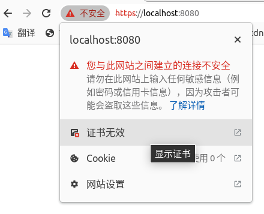
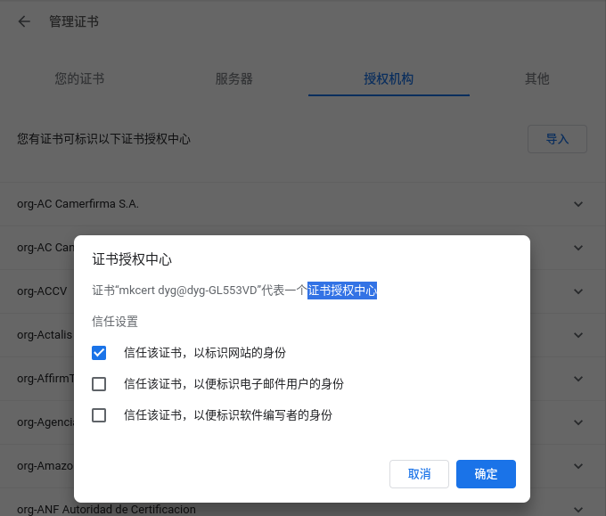
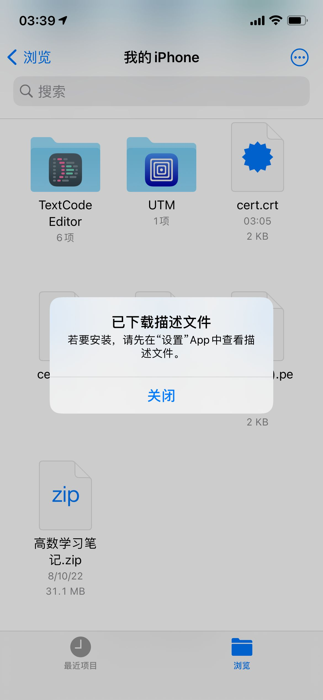
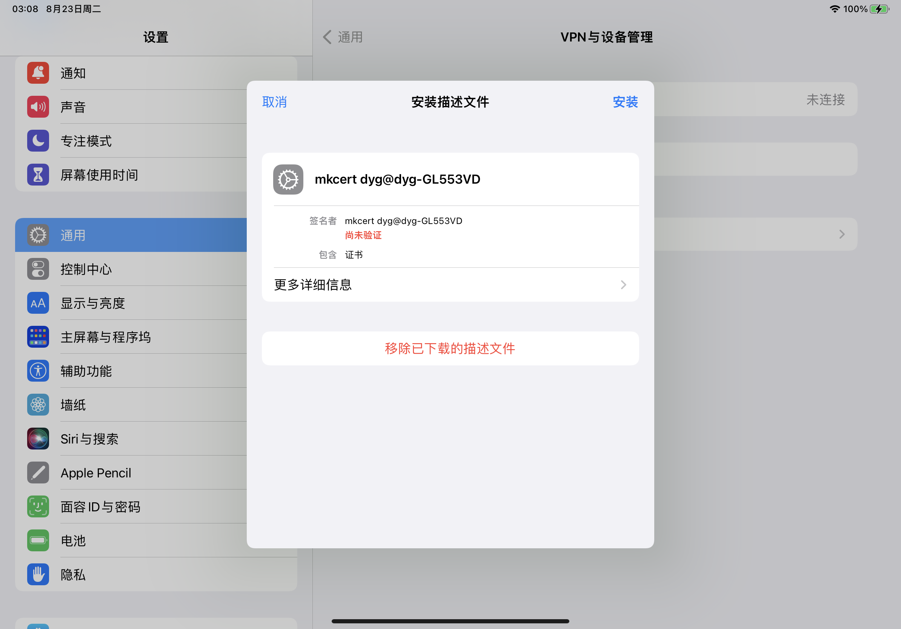
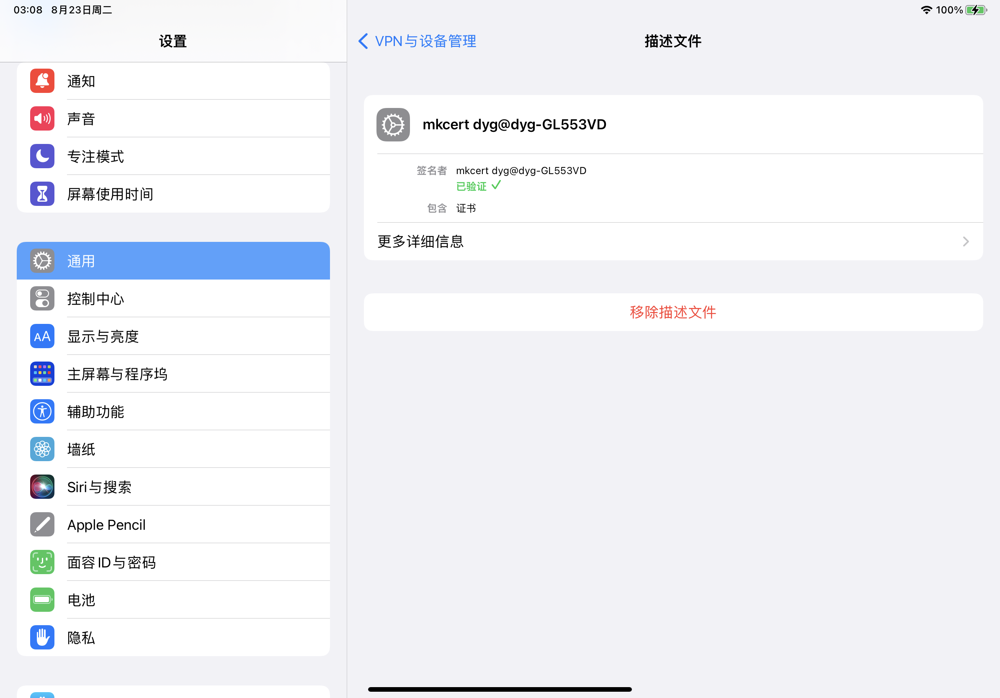
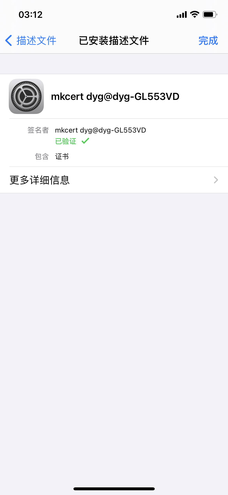
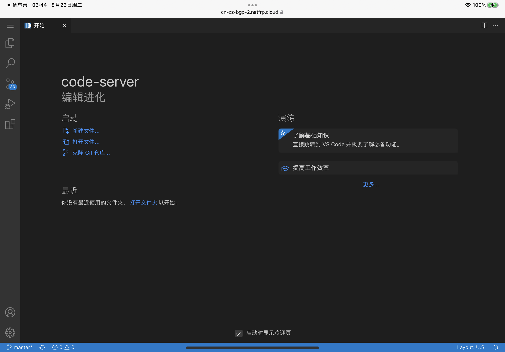
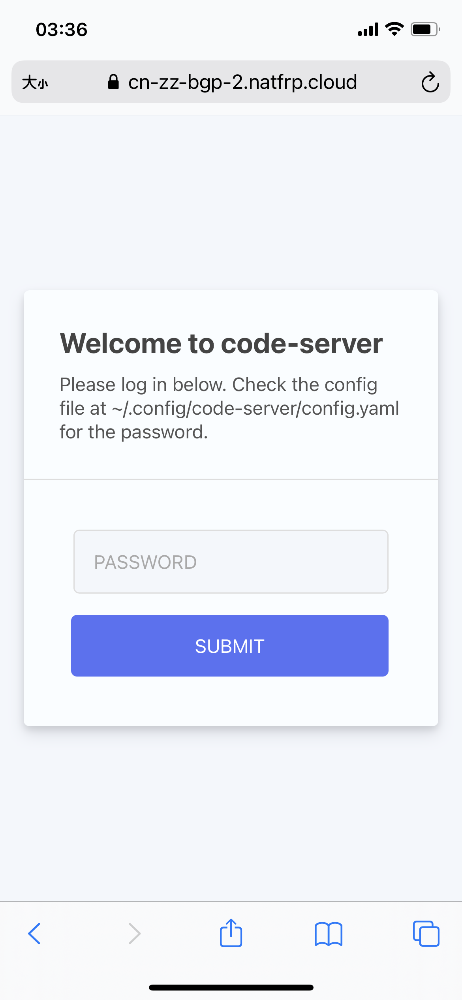

# mkcert生成自签https证书过程记录

## 目录

- [mkcert生成自签https证书过程记录](#mkcert生成自签https证书过程记录)
  - [目录](#目录)
  - [相关概念](#相关概念)
  - [安装mkcert](#安装mkcert)
  - [生成用户证书](#生成用户证书)
  - [安装颁发者证书](#安装颁发者证书)
    - [在PC端安装](#在pc端安装)
    - [在IOS端安装](#在ios端安装)

## 相关概念

- **数字证书认证机构（CA），**
  - 是负责发放和管理数字证书的权威机构，
  - 负责签发证书、认证证书、管理已颁发证书
  - CA 也拥有用户的证书（内含公钥）和私钥。
  - 任何人都可以得到 CA 的证书（含公钥），用以验证 CA 所签发的证书。

- **用户证书**
  - 用户若欲获取证书，应先向 CA 提出申请，CA 判明申请者的身份后，为之分配一个公钥，并将该公钥与其身份信息绑定，为该整体签名，签名后的整体即为证书，发还给申请者。
- **鉴别用户证书的真伪**
  - 一个用户想鉴别另一个用户的证书的真伪，用 CA 的公钥对那个证书上的签字进行验证，一旦验证通过，该证书就被认为是有效的。

## 安装mkcert

**安装mkcert工具**

```bash
sudo apt-get install mkcert
```

## 生成用户证书

**生成证书:`cert.crt` 和 私钥:`cert-key.key`**

```bash
mkcert -cert-file ~/.ssl/cert.crt -key-file ~/.ssl/cert-key.key cn-zz-bgp-2.natfrp.cloud 43.249.193.55 localhost 127.0.0.1 ::1

# 输出结果:
# Created a new local CA 💥
# Note: the local CA is not installed in the system trust store.
# Note: the local CA is not installed in the Firefox and/or Chrome/Chromium trust store.
# Run "mkcert -install" for certificates to be trusted automatically ⚠️
# 
# Created a new certificate valid for the following names 📜
#  - "cn-zz-bgp-2.natfrp.cloud"
#  - "43.249.193.55"
#  - "localhost"
#  - "127.0.0.1"
#  - "::1"
# 
# The certificate is at "~/.ssl/cert.crt" and the key at "~/.ssl/cert-key.key" ✅
# 
# It will expire on 22 November 2024 🗓
# 
# 
```

**配置服务器安装用户证书(以code-server为例)**

```bash
# vi ~/.config/code-server/config.yaml
# code-server的配置文件:
bind-addr: 0.0.0.0:8080
auth: password
password: ???????????????????????
# cert 为刚刚生成的证书
cert: /home/userName/.ssl/cert.crt
# cert-key 为刚刚生成的私钥
cert-key: /home/userName/.ssl/cert-key.key
```

**此时访问localhost将依然报错,因为没有为浏览器安装颁发者的证书**

  

## 安装颁发者证书

### 在PC端安装

**方法1:使用命令将颁发者mkcert机构证书添加到系统信任,同时安装到本机的火狐浏览器和谷歌浏览器**

```bash
mkcert -install

# 输出结果:
# 
# The local CA is now installed in the system trust store! 
# 翻译:本地证书已经添加到到系统信任仓库
# Warning: "certutil" is not available, so the CA can't be automatically installed in Firefox and/or Chrome/Chromium! ⚠️
# 翻译:certutil(证书工具)不可用,所以证书无法自动安装到本机的浏览器
# Install "certutil" with "apt install libnss3-tools" and re-run "mkcert -install" 👈
# 翻译: 执行 "apt install libnss3-tools"来安装"certutil",然后 重新执行 "mkcert -install"

# 安装libnss3-tools
apt install libnss3-tools
# 重新执行 "mkcert -install"
mkcert -install
```

**此时浏览器就能正常访问了**

  

**方法2:手动将颁发者mkcert机构证书手动添加到客户端的浏览器**
**查看 CA 证书的存放位置**

```bash
mkcert -CAROOT
# 输出结果:
# /root/.local/share/mkcert

tree $(mkcert -CAROOT)
# 输出结果: 
# /home/dyg/.local/share/mkcert
# ├── rootCA-key.pem 颁发者机构的私钥
# └── rootCA.pem 颁发者机构的证书
```

**然后将上述颁发者mkcert机构证书文件`rootCA.pem`手动添加到pc端的浏览器中**

  

### 在IOS端安装

**将颁发者mkcert机构证书手动添加到**

**安装前**
  

  

**安装中**
  
  
  
  
  
  

**安装后**
  

  
