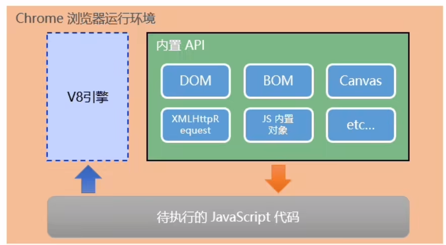

# nodejs学习笔记


## 目录

- [nodejs学习笔记](#nodejs学习笔记)
  - [目录](#目录)
  - [基本概念](#基本概念)
  - [模块](#模块)
    - [概念](#概念)
    - [通过`module.exports`实现模块化](#通过moduleexports实现模块化)
    - [npm包管理工具](#npm包管理工具)
  - [内置模块](#内置模块)
    - [fs模块](#fs模块)
    - [path路径模块](#path路径模块)
    - [http模块](#http模块)
  - [尝试自定义模块](#尝试自定义模块)
  - [第三方模块](#第三方模块)
    - [moment.js 三方模块](#momentjs-三方模块)
    - [i5ting\_toc 第三方模块](#i5ting_toc-第三方模块)
    - [express模块](#express模块)

## 基本概念

- <red>**Nodejs是基于ChromeV8的js解析引擎**</red>

- **js解析引擎**
  - Chrome 浏览器 -> V8 **性能最好**
  - Firefox 浏览器 ->   OdinMonkey 奥丁猴
  - Safri 浏览器 -> JSCore
  - IE 浏览器 -> Chakra查克拉
- **运行环境区别**
  - **Nodejs**是js的**后端**运行环境,能调用**nodejs的内置API**
  - **浏览器**是js的**前端**运行环境,能调用**浏览器的内置API**
  -   
  -   
- **nodejs用途**
  - 基于 **Express** 框架,可快速构建 **Web应用**
  - 基于 **Express** 框架,可快速构建 **跨平台桌面应用**
  - 基于 **restify** 框架,可快速构建 **API接口项目**
  - 读写和操作数据库;创建实用的命令行辅助前端开发;......
- 学习路径
  - js基础语法
  - nodejs内置API
  - 第三方API:express mysql

## 模块

### 概念

**模块的分类**

- 内置模块
- 第三方模块
- 自定义模块

**CommonJS模块化规范**

- 一个 `.js` 文件就是一个模块,每个模块内部的 **module变量** 代表 **当前模块**
- `module` 变量是一个 **对象** ,其 exports属性 是 对外的接口
- 使用 `require()` 加载模块时,就是在加载 `module.exports` 属性

>注意: 现已新增 **exports 变量** ,其默认指向`module.exports`所指向的对象,能够被覆盖,即当:`exports={}`时, `exports`便不再指向`module.exports`所指向的对象.

**模块的加载机制**
> 注意: 使用`require()`引入模块 `XXX.js` 时,会执行 `XXX.js` 中的代码  
> 但模块在第一次引入后会被缓存,后续再次引入不会执行其中代码

- 引入**内置模块**

    ```js
    const fs = require(fs)
    ```

    > 内置模块的优先级最高,即使`./node_modules/`下有`./fs/` 同名模块文件,也会优先加载内置模块
- 引入**第三方模块**

    ```js
    const app = require(express)
    ```

    > 先到当前目录的`./node_modules/`查找模块,若没有则进入到上一级目录的`../node_modules/`,直到文件系统的根目录`/node_modules/`
- 引入**自定义模块**

    ```js
    // 可以省略.js后缀
    const demo1 = require(./demo/demo1.js)
    const demo/demo1 = require(./demo/demo1)

    // 若/demo2/目录下有package.json文件 则会从main属性找到模块的入口
    const demo2 = require(./demo/demo2/demo2.js)
    const demo2 = require(./demo/demo2)
    ```

    > 注意:引入**自定义模块**时必须使用`./`或`../`的相对路径,可以省略 `.js` 的文件名,  
    > **require会自动按一下顺序补全后缀名**
    > - 不补全
    > - 补全`.js`
    > - 补全`.json`
    > - 补全`.node`
    > - 任然无法定位文件则报错
- **自定义模块:引入目录**

    ```js
    const demo2 = require(./demo/demo2)
    ```

    > 若引入的是一个目录,则有三种情况
    > - 优先在查找**被引入目录**下的`package.json`的`main`属性所指向的文件
    > - 若失败则查找**被引入目录**下的`index.js`文件
    > - 若仍然无法找到,则报错

### 通过`module.exports`实现模块化

**使用示例**

```js
// demo1.js
module.exports.name = "DingYigui"
module.exports.sayHi = function(){
    console.log("Hi")
}
```

```js
// demo2.js
const demo1 = require("./demo1")
demo1.sayHi();
```

### npm包管理工具

**包的分类**

- 项目包 存放在`./node_modules/`
- 全局包 只有工具性质的包才有安装到全局的必要,因为其提供了终端命令工具

**包的规范结构**

- 包必须以单独的目录存在
- 包的根目录下必须包含`package.js`
- `package.js`必须包含 `name` `version` `main` 三个属性,其中main表示包的入口
    > 通过`require(express)`引入包的过程: `./node_modules/express/package.js` -> `main` -> `./express.js` -> `module.exports`

**使用npm安装第三方包后多出的文件夹和文件**

- `node_modules/` 存放以安装的包, **require** 的搜索路径
- `package-lock.json` 记录 **node_modules** 目录下每一个包的下载信息,包名,版本,下载地址.

> 不要手动修改`node_modules/`和`package-lock.json`中的内容

**包管理配置文件package.js**

- 记录项目名称,版本,描述等
- 记录项目中用到的其他包
- 记录仅在开发期间用到的包
- 记录仅在开发和部署期间用到的包

> 该文件可通过`npm init -y` 命令生成  
> 该文件中的 `dependencies` 项 会在执行 `npm install/uninstall packageName` 后更新  
> 若省略包名,即执行 `npm install` 则会安装 `package.js` 中 `dependencies` 节点所记录的**所有包**

**npm命令**

- `npm init -y` 初始化当前项目
- `npm install/uninstall pkgName` 安装/卸载包名
- `npm install/uninstall pkgName@1.0.0` 安装/卸载包名
  - `-g` 执行全局的操作
  - `-D` `--save-dev` 所安装的包仅开发过程中使用到,记录到 `devDependencise` 节点中
- `npm config set registry=https://registry.npmmirror.com/` 换源
- `npm config get registry` 查看源设置情况
- `npm login` 登陆npm帐号
- `npm publish` 发布当前包
- `npm unpublish  包名 --force` 删除发布的包
  - 只能删除72小时以内发布的包
  - 不能重新发布24小时内删除的包

**版本号规范X.X.X**

- 第一位数字 大版本,从底层重构
- 第二位数字 功能版本,添加了新功能
- 第三位数字 Bug修复版本,修复了Bug

> 版本号提升规则: 某一位数字提升,该位之后的所有位归零

**搜索包的官网**<br>
搜索包:[npmjs.com](npmjs.com) <br>
下载包:[registry.npmjs.org](registry.npmjs.org)

**nrm工具**

- 安装: `npm install nrm -g`
- 查看可用镜像 nrm ls
- 切换镜像 nrm use taobao

## 内置模块

### fs模块

- `fs.readFile(path[,options],callback(err,data))` 读取指定文件,options默认为`utf-8`

- `fs.writeFile(path,data[,options],callback(err))` 写入指定文件,options默认为`utf-8`
  - 注意该函数只能创建文件不能创建文件夹
  - 重复调用会覆盖上一次写入文件的内容

**简单案例**

```js
const fs = require("fs")

fs.readFile("./1.fs.js","utf-8",(err,data)=>{
    if (err) {
        console.log(err);
    }else{
        console.log(data);
    }
})

fs.writeFile("./1.readfile.js","这是写入的数据",err=>{
    if (err) {
        console.log(err);
    }
})
```

**实际案例:数据格式化**

```js
/*
将原数据:
语文=100 数学=100 英语=100
转换为: 
语文:100
数学:100
英语:100
*/

const fs = require("fs")

fs.readFile("./src/成绩.txt","utf-8",(err,data)=>{
    if (err) {
        console.log("文件读取错误" + err.message);
    }else{
        console.log("文件读取成功:" + data);

        var list = data.split(" ")
        var newList = []
        var target = ""

        console.log("处理数据中......");
        list.forEach((value,index)=>{
            newList.push(value.replace("=",":"))
        })
        target = newList.join("\r\n")

        console.log("处理数据完毕:");
        console.log(target);

        console.log("写入数据中......");
        fs.writeFile("./src/成绩-output.txt",target,err=>{
            if (err) {
                console.log(err);
            }else{
                console.log("写入完毕.");
            }
        })
    }
})
```

**路径拼接的问题**<br>
在使用相对路径读取文件时,`./`表示**当前目录**,在程序中,该**当前目录**默认为node命令执行时所在的目录,而不是程序文件所在的目录
<br>
**解决方案**

- 使用 绝对路径
- 使用字符串拼接 `__dirname` + 相对路径(不能带有 `./` 或 `../`)
  - __dirname表示当前`.js`文件所在目录
  - 这种方式仍然存在一些问题

### path路径模块

- `path.join([...paths])` 用来将多个路径片段拼接成一个完整的路径字符串

- `path.basename(/path/to/fileName.txt)` 用来获取路径中的`文件名.扩展名`
- `path.extname(/path/to/fileName.txt)` 用来获取路径中的`.扩展名`

**简单案例**

```js
const path = require("path")

var temp1 = path.join("/home","/dyg","./","../","/admin","test.txt")
console.log(temp1);
/*
输出:
/home/admin/test.txt
*/

var temp2 = path.join(__dirname,"test.txt")
console.log(temp2);
/*
输出:
/mnt/D/GitProject/YiguiDing.github.ioV2/source/_posts/nodejs学习笔记/demos/test.txt
*/
```

```js
var temp3 = path.basename("/path/to/fileName.txt")
console.log(temp3);
/*
输出:
fileName.txt
*/

var temp4 = path.basename("/path/to/fileName.12345","345")
console.log(temp4);
/*
输出:
fileName.12
*/
```

```js
var temp5 = path.extname("/path/to/fileName.12345")
console.log(temp5);
/*
输出:
.12345
*/
```

**综合案例**

```js
const fs = require("fs")
const path = require("path")


fs.readFile(path.join(__dirname,"./src/待拆分文件.html"),"utf-8",(err,data)=>{
    if(err){
        console.log(err);
    }else{
        // console.log(data);
        resolveCSS(data);
        resolveJS(data);
        resolveHTML(data);
    }
})


function resolveCSS(html){
    const reg = /<style>[\s\S]*<\/style>/
    var value = reg.exec(html)[0].replace(/<style>/g,"").replace(/<\/style>/g,"")
    // console.log(value);
    fs.writeFile(path.join(__dirname,"./src/index.css"),value,err=>{
        if(err)
            console.log("resolveCSS failed:"+err);
        else
            console.log("resolveCSS success");
    })
}

function resolveJS(html){
    const reg = /<script>[\s\S]*<\/script>/
    var value = reg.exec(html)[0].replace(/<script>/g,"").replace(/<\/script>/g,"")
    // console.log(value);
    fs.writeFile(path.join(__dirname,"./src/index.js"),value,err=>{
        if(err)
            console.log("resolveJS failed:"+err);
        else
            console.log("resolveJS success");
    })
    return value;
}

function resolveHTML(html){
    var value = html
    .replace(/<style>[\s\S]*<\/style>/,"")
    .replace(/<script>[\s\S]*<\/script>/,"")
    .replace(/<\/title>/,`</title>
        <link rel="stylesheet" href="./index.css" \>
        <script src="./index.js"></script>
    `)
    fs.writeFile(path.join(__dirname,"./src/index.html"),value,err=>{
        if(err)
        console.log("resolveHTML failed:"+err);
        else
        console.log("resolveHTML success:"+value);
    })
}
```

**./src/待拆分文件.html**

```html
<!DOCTYPE html>
<html lang="en">
<head>
    <meta charset="UTF-8">
    <meta http-equiv="X-UA-Compatible" content="IE=edge">
    <meta name="viewport" content="width=device-width, initial-scale=1.0">
    <title>Document</title>
    <style>
        #id_1{
            width: 200px;
            height: 100px;
            background-color: skyblue;
            color: red;
        }
    </style>
        <style>
            #id_2{
                width: 200px;
                height: 100px;
                background-color: skyblue;
                color: red;
            }
        </style>
    <script>
        console.log("this is js code")
    </script>
</head>
<body>
    <div id="id_1">
        测试文字
        测试文字
        测试文字
        测试文字
    </div>
</body>
</html>
```

### http模块

**request 的属性和方法**

- `request.url` 如:`/`;`/index.html`
- `request.method` 如 `GET` `POST`

**response 的属性和方法**

- `response.end(string)` 向客户端响应内容
- `response.setHeader("key","value")` 设置响应头
  - 防止中文乱码`response.setHeader("Content-Type","text/url;charset=utf-8")`

**简易案例**

```js
//导入http模块
const http = require("http")

//创建实例对象
const server = http.createServer()

//绑定request事件
server.on("request",(req,res)=>{
    console.log("收到了一个http请求...");
})

//启动服务
server.listen(8000,()=>{
    console.log("服务器已启动,正在监听8000端口...");
})
```

**简易动态响应(路由)的实现**

```js
//导入http模块
const http = require("http")

//创建实例对象
const server = http.createServer()

//绑定request事件
server.on("request",(req,res)=>{
    const url = req.url
    let content = `<h1>404</h1>`
    
    if(url==="/" || url==="/index" || url==="/index.html"){
        content = `<h1>index</h1>`
    }else
    if(url==="/about" ||  url==="/about.html"){
        content = `<h1>about</h1>`
    }

    res.setHeader("Content-Type","text/html;charset=utf-8")
    res.end(content)
})

//启动服务
server.listen(8000,()=>{
    console.log("服务器已启动,正在监听8000端口...");
})
```

**实现简易Web服务器**

```js
//导入http模块
const fs = require("fs")
const path = require("path")
const http = require("http")

//创建实例对象
const server = http.createServer()

//绑定request事件
server.on("request",(req,res)=>{
    const rootUrl = "./src"
    let url = req.url
    let content = `<h1>404</h1>`
    
    if(url==="/" || url==="/index" || url==="/index.html"){
        url=`/index.html`
    }

    fs.readFile(path.join(__dirname,rootUrl,url),"utf-8",(err,data)=>{
        if(err) {
            // content = err.message
        }
        else {
            content = data
        }
        // res.setHeader("Content-Type","text/html;charset=utf-8") //text/html会导致浏览器无法识别css代码
        res.end(content)
    })
})

//启动服务
server.listen(8000,()=>{
    console.log("服务器已启动,http://127.0.0.1:8000/");
})
```

## 尝试自定义模块

**目录结构**

- 自定义模块根目录
  - index.js
  - package.json
  - README.md
- test.js

**index.js**

```js
// 实现html转义
function htmlEncode(content){//编码
    return content.replace(/<|>|"|&/g,march=>{
        switch(march){
            case '<':
                return '&lt;';
            case '>':
                return '&gt;';
            case '"':
                return '&quot;';
            case '&':
                return "&amp;";
         }
    })
}
function htmlDecode(content){//解码
    return content.replace(/&lt;|&gt;|&quot;|&amp;/g,march=>{
        switch(march){
            case '&lt;':
                return '<';
            case '&gt;':
                return '>';
            case '&quot;':
                return '"';
            case '&amp;':
                return "&";
         }
    })
}
module.exports.htmlEncode = htmlEncode
module.exports.htmlDecode = htmlDecode
```

**package.json**

```json
{
  "name": "demo-test",
  "version": "1.0.0",
  "description": "描述",
  "main": "index.js",
  "scripts": {
    "test": "echo \"Error: no test specified\" && exit 1"
  },
  "author": "",
  "license": "ISC"
}

```

**test.js**

```js
const test = require("./6.自定义模块")

var html = `<h1 style="color:skyblue">测试</h1>`
var encode = test.htmlEncode(html)
var decode = test.htmlDecode(encode)

console.log(encode);
console.log(decode);
```

## 第三方模块

**为什么需要第三方包?**<br>
nodejs内置模块仅提供了底层API,使用内置模块开发效率低,<br>
第三方模块是基于内置模块开发的,提供了更高级更方便的API,提高了开发效率

### moment.js 三方模块

```js
const moment = require("moment")

var tm = moment().format("YYYY-MM-DD HH-mm-ss")
console.log(tm);
```

### i5ting_toc 第三方模块

(用处不大)<br>
i5ting_toc 是md转html的命令行工具,需全局安装<br>
**使用**

```
i5ting_toc -f ./fileName.md -o 
```

### express模块

<red>详细笔记:[express学习笔记]()</red>  
express作用和nodejs的http模块类似,用于创建web服务器<br>
express是基于http模块封装的,使用起来比http模块简单,效率更高

<style>
    red{
        color:red;
    }
    sky{
        color:skyblue;
    }

</style>
