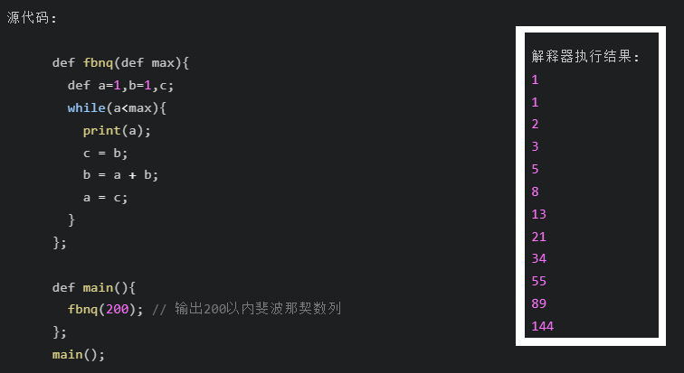

# 尝试使用递归下降算法实现简易词法分析器和文法分析器以及解释器

## 目录

- [尝试使用递归下降算法实现简易词法分析器和文法分析器以及解释器](#尝试使用递归下降算法实现简易词法分析器和文法分析器以及解释器)
  - [目录](#目录)
  - [缘由](#缘由)
  - [目前支持的语法](#目前支持的语法)
  - [实现效果](#实现效果)
    - [解释器测试](#解释器测试)
  - [词法分析的实现](#词法分析的实现)
  - [文法定义](#文法定义)
  - [文法分析的实现](#文法分析的实现)
  - [解释器的实现](#解释器的实现)

## 缘由

2021年08月的时候，在bilibili上看到过一个讲解如何用700行手写实现一个编译器的[视频](https://www.bilibili.com/video/BV1Kf4y1V783)，
源代码在这里，[cpc](https://github.com/archeryue/cpc)

当时虽然调侃的评论了一句`c--`,但其实内心对写出这种东西的人还是感到由衷的钦佩的，

视频的内容我那时只大概的浏览过一些，当时没有时间仔细去看。

再那后来不久的时间里，我又看到过另外一个编译器项目，[`the-super-tiny-compiler`](https://github.com/jamiebuilds/the-super-tiny-compiler),

这个项目仅用几百行的代码用比较贴近真实编译器的流程实现了将某种作者定义的代码翻译成为类似于c语言的代码，

这个项目的代码我大概看过，并用ts尝试着将它重新实现了一遍，最近，就是上周的时候，我另外尝试着为其实现了一个解释器，使得可以将其生成的抽象语法树翻译执行。

还有一个项目，[Recursive Descent Parser](https://github.com/AttackOnMorty/rdp) 一个递归下降Parser的实现，用的是js实现的。

这个项目中的代码提供了一种比较完美编程范式，但是在文法的定义部分有些让人感到难以理解，我那时刚看到这个项目的时候，完全看不懂，过于沮丧，放弃了。

后来还看到过一个项目，名字忘了，大概就是在前端中实现了一个虚拟机，使得可以加载并执行那种语言编写的游戏，

还有iPhone上的iSH,也是开源项目,32bit虚拟机，解释执行字节码，可以运行Linux。

还有就是UTM,一款可以在手机上运行的开源的虚拟机，能在平板电脑上运行win7系统。

总之，这些都是我之前接触过、看过、用过、让我感到Amazing的项目,这些项目或多或少都影响了我，使我产生了也要写一个类似东西的想法。

然后，最近在学游戏设计模式，其中作者在讲解行为模式的部分时，提到了解释器模式和如何实现一个虚拟机并执行字节码的内容，用于使得玩家可以用另外一种和游戏本身的编程语言无关的语言来二次开发游戏角色的行为。

这部分内容中作者虽然讲了很多这种解释器模式的缺点和实现虚拟机执行字节码的优点，但却没有提及如何生成字节码，作者只给了一种通过图形界面拖拽生成指令序列的方式来生成字节码，优点自然是对用户友好，但缺点也是显然的，图形化的界面感觉就不如直接编写程序那样能对游戏做到非常精细化的控制。

总之，但这让我回想起了这之前看到过的上述几个项目，让我突然也想完整的实现一个编译器，编译出字节码，另外再实现一个虚拟机，用来执行字节码。有这个想法后我便抑制不住内心的想要实现它的冲动。

这几天我重新阅读了上面几个项目的源代码，甚至去读了js的标准文档，去看了它的文法定义，另外还大概看了另一个项目 [tiny-js](https://github.com/gfwilliams/tiny-js),这个项目用大概2000行的代码实现了一款可嵌入至c++程序的js解释器，虽然没有完全看完，但给我的感觉还是挺震撼的，就是太牛了。

最近几天，终于尝试着把词法分析和文法分析的内容搞懂了，特别是如何定义文法的那部分。

昨天下午(2023/12/20)五点的时候，感觉已经差不多完整理解了，然后通宵敲了一晚上的代码，一直到今天早上，完整的从头实现了Tokenizer Parser 以及，解释器，支持的语法包括：变量、函数的定义和调用，循环语句，块作用域变量和全局作用域变量，甚至可以注入预定义函数，某种程度上讲，我认为这已经图灵完备了。感觉就像是玩游戏终于通过了某一关 Exciting!

## 目前支持的语法

- 语句：
  - 空语句 `;`
  - 块语句 `{}`
  - if语句 `if(){}else{}`
  - where语句 `where(){}`
  - 标识符定义语句
    - 变量定义 `def a=1,b=2,c;`
    - 函数定义 `def main(def a){};`
- 表达式：
  - 逗号表达式 `,`
  - 赋值表达式：
    - 基本赋值表达式 `=`
    - 复合赋值表达式 `+= -= *= /=`
  - 逻辑或表达式 `||`
  - 逻辑与表达试 `&&`
  - 等值判断表达式 `== !=`
  - 条件表达式 `< > <= >=`
  - 加减运算表达式 `+ -`
  - 乘除取余运算表达式 `* / %`
  - 括号表达式: `(表达式)`
  - 标识符表达式 `a`
  - 函数调用表达式 `main(1,2,3);`

## 实现效果

### 解释器测试

:::code-tabs
@tab 解释器代码:`test/index.ts`
@[code ts](./demo/src/test/index.ts)
@tab 输出结果:`output.txt`
@[code ts](./demo/src/test/output.txt)
:::

## 词法分析的实现

`Tokenizer.ts`
@[code ts](./demo/src/Tokenizer.ts)

## 文法定义

`ast.ts`
@[code ts](./demo/src/ast.ts)

## 文法分析的实现

`Parser.ts`
@[code ts](./demo/src/Parser.ts)

## 解释器的实现

`Interpreater.ts`

@[code ts](./demo/src/Interpreater.ts)
