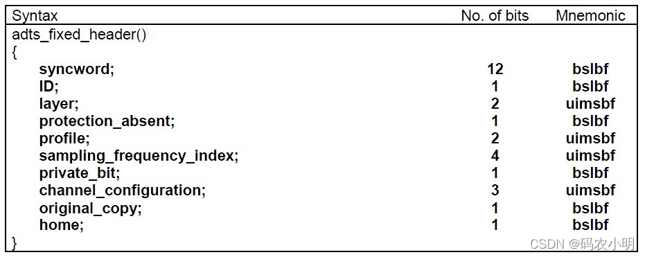
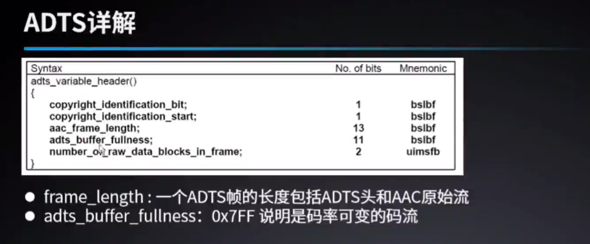
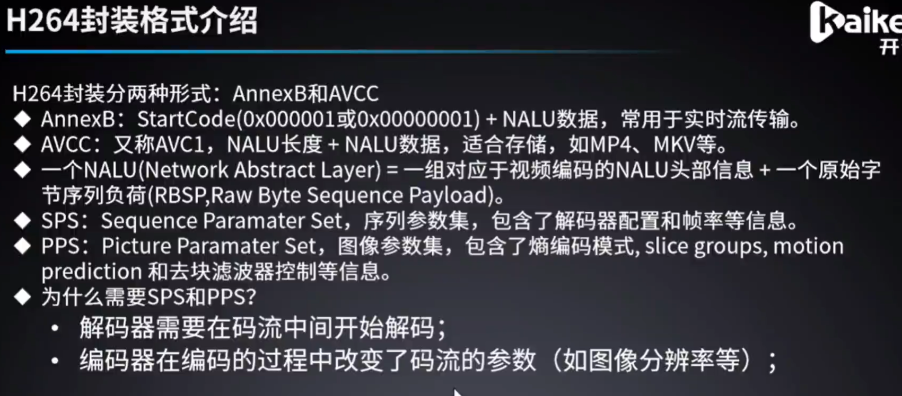
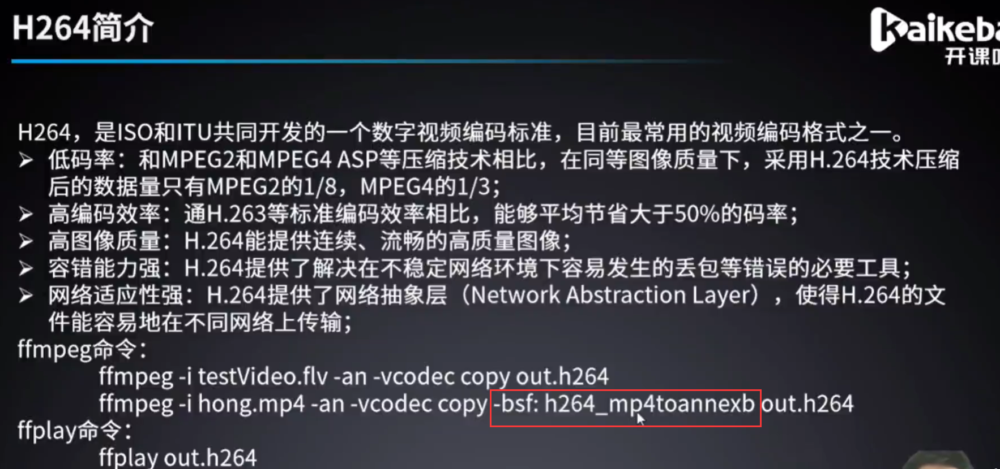

## ffmpeg简介

**组成**

- ffmpeg音视频转码、编解码工具
- ffprobe多媒体分析器
- ffplay音视频播放器
- ffserver多媒体实时广播流服务器

**模块**

- **AVCodec编解码模块**
- **AVFormat封装模块**
- AVFilter滤镜模块
- AVUtil基本工具模块
- AVDevice采集与渲染（输入与输出）模块
- swcacle视频图像转换模块
- swresample音频转换计算模块

**应用**

- **开发音视频播放器（ffmpeg+SDL/QT）**
- 开发流媒体服务器/在线直播 (ffmpeg + Live555/libRTMP)
- **提取可移植的codec算法 (音频、视频)**
- 开发编解码、转码器 (ffmpeg + libx264/libx265)
- 视频会议 (ffmpeg+ webrtc)
- 辅助工具，后处理(postproc + libavutils)
- **CV训练工具 (ffmpeg+opencv)**

## 开发环境搭建

- 根据 <https://ffmpeg.org/download.html>页面提示，
- 可从[Windows builds from gyan.dev](https://www.gyan.dev/ffmpeg/builds/)下载windows预编译版，
- 下载发行版（full-shared）[release builds-ffmpeg-release-full-shared.7z](https://www.gyan.dev/ffmpeg/builds/ffmpeg-release-full-shared.7z)

**目录结构**

```bash
$ cd ffmpeg-6.1.1-full_build-shared
$ ls
bin/  doc/  include/  lib/  LICENSE  presets/  README.txt
```

配置PKG_CONFIG_PATH

```bash
# 可能也不是必要的
export PKG_CONFIG_PATH=$PKG_CONFIG_PATH:/path/to/ffmpeg-6.1.1/lib/pkgconfig/
```

## 日志系统

```c
#include <stddef.h>
#include <libavutil/log.h> // ffmpeg的日志系统

int main(int argc, char **argv)
{
    // 设置日志级别
    av_log_set_level(AV_LOG_INFO);
    av_log(NULL, AV_LOG_INFO, "this is a info log.\n");
    av_log(NULL, AV_LOG_ERROR, "this is a error log.\n");
    av_log(NULL, AV_LOG_DEBUG, "this is a debug log.\n");
    av_log(NULL, AV_LOG_FATAL, "this is a fatal log.\n");
    return 0;
}
```

## 编译命令

**最简写法**

```makefile
#######################################
# simple test
#######################################
# 编译
# gcc -c src/main.c -o ./out.o -I D:/app/ffmpeg-6.1.1-full_build-shared/include
# 链接
# gcc ./out.o -o ./out.exe -L D:/app/ffmpeg-6.1.1-full_build-shared/lib  -l avutil -l avformat -l avcodec
#######################################
# OUTPUT
#######################################
TARGET = main.exe
BUILD_DIR = build
OUTPUT_DIR = output
#######################################
# SOURCES
#######################################
C_CPP_DEFS =

C_SOURCES =  \
	src/main.c
vpath %.c $(sort $(dir $(C_SOURCES)))

CPP_SOURCES = \
	$(wildcard src/lib/*.cpp) \
	# src/main.cpp
vpath %.cpp $(sort $(dir $(CPP_SOURCES)))

C_CPP_INCLUDES =  \
	-I D:/app/ffmpeg-6.1.1-full_build-shared/include \
	-I src/lib/

LIBDIR = \
	-L D:/app/ffmpeg-6.1.1-full_build-shared/lib  -l avutil -l avformat -l avcodec

DLL_SOURCES = \
	$(wildcard D:/app/ffmpeg-6.1.1-full_build-shared/bin/*.dll)
#######################################
# COMMAND
#######################################
CC = gcc
XX = g++
#######################################
# OBJECTS
#######################################
C_CPP_FLAGS =  $(C_CPP_DEFS) $(C_CPP_INCLUDES)

$(BUILD_DIR):
	mkdir $@

C_OBJECTS = $(addprefix $(BUILD_DIR)/,$(notdir $(C_SOURCES:.c=.o)))
vpath %.o $(sort $(dir $(C_OBJECTS)))

$(BUILD_DIR)/%.o: %.c | $(BUILD_DIR)
	$(CC) -c $(C_CPP_FLAGS) $< -o $@

CPP_OBJECTS = $(addprefix $(BUILD_DIR)/,$(notdir $(CPP_SOURCES:.cpp=.o)))
vpath %.o $(sort $(dir $(CPP_OBJECTS)))

$(BUILD_DIR)/%.o: %.cpp | $(BUILD_DIR)
	$(XX) -c $(C_CPP_FLAGS) $< -o $@

#######################################
# LINK
#######################################
LD_FLAGS = $(LIBDIR)

$(OUTPUT_DIR):
	mkdir $@
	cp ${DLL_SOURCES} $@

$(OUTPUT_DIR)/$(TARGET): $(C_OBJECTS) $(CPP_OBJECTS) | $(OUTPUT_DIR)
	$(CC)  $(C_OBJECTS) $(CPP_OBJECTS) -o $@ $(LD_FLAGS)

#######################################
# COMMAND
#######################################
all: $(OUTPUT_DIR)/$(TARGET)

clean:
	-rm -fR $(BUILD_DIR)
	-rm -fR $(OUTPUT_DIR)

```

## 打开输入

```c
#include <stddef.h>
#include <libavutil/log.h> // ffmpeg的日志系统
#include <libavformat/avformat.h>

int err;
int main(int argc, char **argv)
{
    // 设置日志级别
    av_log_set_level(AV_LOG_INFO);

    // 提示用法
    if (argc < 2)
    {
        av_log(NULL, AV_LOG_ERROR, "usage %s media.mp4_or_url", argv[0]);
        return -1;
    }

    const char *url = argv[1];
    AVFormatContext *formatCtx = NULL;
    // 打开流
    err = avformat_open_input(&formatCtx, url, NULL, NULL);
    if (err)
    {
        av_log(NULL, AV_LOG_FATAL, "open url %s fail: %s;", url, av_err2str(err));
        return err;
    }
    // 输出流信息
    av_dump_format(formatCtx, 0, url, 0);
    // 关闭流
    avformat_close_input(&formatCtx);
    return 0;
}
```

**输出**

```bash
mime type is not rfc8216 compliant
[hls @ 000002a673c8a8c0] Opening 'http://devimages.apple.com/iphone/samples/bipbop/gear1/fileSequence0.ts' for reading
[hls @ 000002a673c8a8c0] Opening 'http://devimages.apple.com/iphone/samples/bipbop/gear1/fileSequence1.ts' for reading
Input #0, hls, from 'http://devimages.apple.com/iphone/samples/bipbop/gear1/prog_index.m3u8':
  Duration: 00:30:01.00, bitrate: N/A
  Program 0
    Metadata:
      variant_bitrate : 0
  Stream #0:0: Audio: aac ([15][0][0][0] / 0x000F), 0 channels
    Metadata:
      variant_bitrate : 0
  Stream #0:1: Video: h264 ([27][0][0][0] / 0x001B), none, 90k tbn
    Metadata:
      variant_bitrate : 0
```

## 解封装提取AAC音频

**AAC**

- AAC只是数据编码格式
- 码流组织格式有：
  - ADIF(Audio Data Interchange Format)
  - ADTS (Audio Data Transport Stream)
- ADIF编码信息存在一个固定的地方,所以ADIF主要用于磁盘存储文件，
- ADTS编码信息是每一个包中都有,ADTS主要用于渐进式传输的网络流

**ADTS 流格式**

- ADTS流格式为ADTS头部加AAC裸数据。
- `[ADTS头](AAC数据) | [ADTS头](AAC数据) | ...`
- ADTS Header为固定的7字节长度，格式可以用下面字母序列来表示，一个字母表示一种字段，数量表示比特长度。
- `AAAAAAAA AAAABCCD EEFFFFGH HHIJKLMM MMMMMMMM MMMOOOOO OOOOOOPP (QQQQQQQQ QQQQQQQQ)`
- 其中A-J称为ADTS固定头部，K-Q称为可变头部。

| 标志 | 比特 | 描述                                                                                                  |
| :--- | :--- | :---------------------------------------------------------------------------------------------------- |
| A    | 12   | 同步字段，全1                                                                                         |
| B    | 1    | MPEG版本: 0 for MPEG-4, 1 for MPEG-2，mp4是0                                                          |
| C    | 2    | Layer: 全0                                                                                            |
| D    | 1    | 保护缺失标识ProtectionAbsent , 1 表示无 CRC ，0 表示有 CRC                                            |
| E    | 2    | AAC编码级别, MPEG-4 Audio Object Type减1。0: Main Profile, 1:LC, 2: SSR，3:保留。常用低复杂度编码LC。 |
| F    | 4    | MPEG-4 采样率表序号，注意这里是序号，不是采样率值，参考采样率表。                                     |
| G    | 1    | 私有位，设为0，解码时忽略                                                                             |
| H    | 3    | 声道数，取值范围1-7。                                                                                 |
| I    | 1    | 源标识, 编码设为0，解码忽略                                                                           |
| J    | 1    | home, 编码设为0，解码忽略                                                                             |
| K    | 1    | 版权标志位，编码设为0，解码忽略                                                                       |
| L    | 1    | 版权标志开始位，编码设为0，解码忽略                                                                   |
| M    | 13   | 帧长度，为AAC原始数据长度+ADTS头长度（ProtectionAbsent == 1 ? 7 : 9）                                 |
| O    | 11   | Buffer fullness， 0x7FF 说明是码率可变的码流                                                          |
| P    | 2    | AAC帧数量减1值，有1个帧时此值为0                                                                      |
| Q    | 16   | 如果保护缺失标识ProtectionAbsent为0，标识有2字节CRC校验字段                                           |

**固定头**


**可变头**


**采样率对照表**


**提取视频中的AAC音频**

> 如果ffplay不能播放，是因为aac格式不是adts

```c
#include <stddef.h>
#include <libavutil/avutil.h>     // for log
#include <libavformat/avformat.h> // for avformat
#include <libavcodec/avcodec.h>   // for packet
#include "./lib/adts.h"           // for adts 音频头
int err;
int main(int argc, char **argv)
{
  // 设置日志级别
  av_log_set_level(AV_LOG_INFO);

  // 提示用法
  if (argc < 2)
  {
    av_log(NULL, AV_LOG_ERROR, "usage: %s input.mp4 output.aac\n", argv[0]);
    return -1;
  }

  const char *input = argv[1];
  const char *output = argv[2];

  // 打开流
  AVFormatContext *format_ctx = NULL;
  err = avformat_open_input(&format_ctx, input, NULL, NULL);
  if (err < 0)
  {
    av_log(NULL, AV_LOG_ERROR, "open input %s fail: %s;\n", input, av_err2str(err));
    return err;
  }
  av_dump_format(format_ctx, 0, input, 0);
  // 获取码流信息，实际是去对formatCtx中stream相关的参数赋值，因为后面需要用
  // Read packets of a media file to get stream information.
  err = avformat_find_stream_info(format_ctx, NULL);
  if (err < 0)
  {
    av_log(NULL, AV_LOG_ERROR, "find stream info failed:%s\n", av_err2str(err));
    return err;
  }
  // 获取音频流
  int audio_idx = av_find_best_stream(format_ctx, AVMEDIA_TYPE_AUDIO, -1, -1, NULL, 0);
  if (audio_idx < 0)
  {
    av_log(NULL, AV_LOG_ERROR, "find best audio stream index failed; index: %d\n", audio_idx);
  }
  else
  {
    av_log(NULL, AV_LOG_INFO, "find best audio stream index is %d\n", audio_idx);
  }

  // 创建文件
  FILE *dest_fp = fopen(output, "wb");
  if (dest_fp == NULL)
  {
    av_log(NULL, AV_LOG_ERROR, "make file failed.");
    return -1;
  }

  // 初始化packet
  AVPacket *packet = av_packet_alloc();

  // 读取packet
  while (av_read_frame(format_ctx, packet) == 0)
  {
    // 找到音频流
    if (packet->stream_index == audio_idx)
    {
      // 写入ADTS_Header
      uint8_t adts_header[7] = {0};
      set_ADTS_Header(
          adts_header,
          packet->size,
          format_ctx->streams[audio_idx]->codecpar->profile,
          format_ctx->streams[audio_idx]->codecpar->sample_rate,
          format_ctx->streams[audio_idx]->codecpar->channels //
      );
      if (fwrite(adts_header, 1, sizeof(adts_header), dest_fp) != sizeof(adts_header))
      {
        av_log(NULL, AV_LOG_ERROR, "write ADTS_Header failed.\n");
        return -1;
      }
      // 写入文件（data是原始数据）
      if (fwrite(packet->data, 1, packet->size, dest_fp) != packet->size)
      {
        av_log(NULL, AV_LOG_ERROR, "write file failed.\n");
        return -1;
      }
    }
    // 释放packet中的data
    av_packet_unref(packet);
  }
  // 释放packet
  av_packet_free(&packet);

  // 关闭流
  if (format_ctx)
    avformat_close_input(&format_ctx);

  // 关闭文件
  if (dest_fp)
  {
    fclose(dest_fp);
  }
  return 0;
}
```

**adts.h**

```c
#ifndef _ADTSHEADER_H
#define _ADTSHEADER_H
#include <stdio.h>
#include <stdint.h>

#define ADTS_HEADER_LEN 7;

const int sampling_frequencies[] = {
    96000, // 0x0
    88200, // 0x1
    64000, // 0x2
    48000, // 0x3
    44100, // 0x4
    32000, // 0x5
    24000, // 0x6
    22050, // 0x7
    16000, // 0x8
    12000, // 0x9
    11025, // 0xa
    8000   // 0xb
    // 0xc d e f是保留的
};

void set_ADTS_Header(char data[7],
                int data_length,
                int profile,
                int samplerate,
                int channels)
{

    int sampling_frequency_index = 3; // 默认使用48000hz
    int adtsLen = data_length + 7;
    // ADTS不是单纯的data，是hearder+data的，所以加7这个头部hearder的长度，这里7是因为后面protection absent位设为1，不做校验，所以直接加7，如果做校验，可能会是9

    int frequencies_size = sizeof(sampling_frequencies) / sizeof(sampling_frequencies[0]);
    int i = 0;
    for (i = 0; i < frequencies_size; i++) // 查找采样率
    {
        if (sampling_frequencies[i] == samplerate)
        {
            sampling_frequency_index = i;
            break;
        }
    }
    if (i >= frequencies_size)
    {
        printf("unsupport samplerate:%d\n", samplerate);
    }

    data[0] = 0xff;                                    // syncword:0xfff                          高8bits
    data[1] = 0xf0;                                    // syncword:0xfff                          低4bits
    data[1] |= (0 << 3);                               // MPEG Version:0 for MPEG-4,1 for MPEG-2  1bit
    data[1] |= (0 << 1);                               // Layer:0                                 2bits
    data[1] |= 1;                                      // protection absent:1                     1bit
    data[2] = (profile) << 6;                          // profile:profile               2bits
    data[2] |= (sampling_frequency_index & 0x0f) << 2; // sampling frequency index:sampling_frequency_index  4bits
    data[2] |= (0 << 1);                               // private bit:0                   1bit
    data[2] |= (channels & 0x04) >> 2;                 // channel configuration:channels  高1bit
    data[3] = (channels & 0x03) << 6;                  // channel configuration:channels 低2bits
    data[3] |= (0 << 5);                               // original：0                1bit
    data[3] |= (0 << 4);                               // home：0                    1bit
    data[3] |= (0 << 3);                               // copyright id bit：0        1bit
    data[3] |= (0 << 2);                               // copyright id start：0      1bit
    data[3] |= ((adtsLen & 0x1800) >> 11);             // frame length：value    高2bits
    data[4] = (uint8_t)((adtsLen & 0x7f8) >> 3);       // frame length: value    中间8bits
    data[5] = (uint8_t)((adtsLen & 0x7) << 5);         // frame length: value    低3bits
    data[5] |= 0x1f;                                   // buffer fullness:0x7ff 高5bits
    data[6] = 0xfc;                                    // 11111100       //buffer fullness:0x7ff 低6bits
    // number_of_raw_data_blocks_in_frame：  //    表示ADTS帧中有number_of_raw_data_blocks_in_frame + 1个AAC原始帧。
}

#endif // _ADTSHEADER_H
```

**AAC音频格式**

- 
- ADIF-头信息仅在开头，适用于文件传输
- ADTS-头信息在任意帧，适用于流媒体
  - 7~9个字节的头信息
  - 
  - 
  - 

## 解封装提取H264视频


**264封装格式**

- AnnexB 每一帧数据都由`startCode`+`NALU`数据组成，适合于流媒体实时传输的封装格式
- AVCC 整个文件由NALU长度+NALU数据组成， 适合存储
  

**字节流过滤器：AVCC转AnnexB**




代码和提取音频几乎没有区别

```c
#include <stddef.h>
#include <libavutil/avutil.h>     // for log
#include <libavformat/avformat.h> // for avformat
#include <libavcodec/avcodec.h>   // for packet
#include <libavcodec/bsf.h>       // for bsf

int err;
int main(int argc, char **argv)
{
  // 设置日志级别
  av_log_set_level(AV_LOG_INFO);

  // 提示用法
  if (argc < 2)
  {
    av_log(NULL, AV_LOG_ERROR, "usage: %s input.mp4 output.h264\n", argv[0]);
    return -1;
  }

  const char *input = argv[1];
  const char *output = argv[2];

  // 打开流
  AVFormatContext *format_ctx = NULL;
  err = avformat_open_input(&format_ctx, input, NULL, NULL);
  if (err < 0)
  {
    av_log(NULL, AV_LOG_ERROR, "open input %s fail: %s;\n", input, av_err2str(err));
    return err;
  }
  av_dump_format(format_ctx, 0, input, 0);

  // 获取码流信息，实际是去对formatCtx中stream相关的参数赋值，因为后面需要用
  // Read packets of a media file to get stream information.
  err = avformat_find_stream_info(format_ctx, NULL);
  if (err < 0)
  {
    av_log(NULL, AV_LOG_ERROR, "find stream info failed:%s\n", av_err2str(err));
    return err;
  }
  // 获取视频流
  int video_idx = av_find_best_stream(format_ctx, AVMEDIA_TYPE_VIDEO, -1, -1, NULL, 0);
  if (video_idx < 0)
  {
    av_log(NULL, AV_LOG_ERROR, "find best video stream index failed; index: %d\n", video_idx);
  }
  else
  {
    av_log(NULL, AV_LOG_INFO, "find best video stream index is %d\n", video_idx);
  }

  // 创建文件
  FILE *dest_fp = fopen(output, "wb");
  if (dest_fp == NULL)
  {
    av_log(NULL, AV_LOG_ERROR, "make file failed.");
    return -1;
  }

  // 获取比特流过滤器
  // mp4 to annexb
  // Convert an H.264 bitstream from `length prefixed mode` to `start code prefixed mode`
  //  this filter is auto-inserted for MPEG-TS (muxer mpegts) and raw H.264 (muxer h264) output formats.
  // ffmpeg -i INPUT.mp4 -codec copy -bsf:v h264_mp4toannexb OUTPUT.ts
  const AVBitStreamFilter *bsf = av_bsf_get_by_name("h264_mp4toannexb");
  if (bsf == NULL)
  {
    av_log(NULL, AV_LOG_ERROR, "creat AVBitStreamFilter: h264_mp4toannexb  failed.");
    return -1;
  }
  // Allocate a context for a given bitstream filter.
  // 创建bsf上下文
  AVBSFContext *bsf_ctx = NULL;
  av_bsf_alloc(bsf, &bsf_ctx);

  // 复制编码参数
  // 提取h264,不需要改变编码参数
  avcodec_parameters_copy(bsf_ctx->par_in, format_ctx->streams[video_idx]->codecpar);

  // 初始化bsf
  // Prepare the filter for use
  av_bsf_init(bsf_ctx);

  // 初始化packet
  AVPacket *packet = av_packet_alloc();

  // 读取packet
  while (av_read_frame(format_ctx, packet) == 0)
  {
    // 找到视频流
    if (packet->stream_index == video_idx)
    {
      // 发送到bsf
      if (av_bsf_send_packet(bsf_ctx, packet) == 0)
      {
        // 从bsf接收数据
        while (av_bsf_receive_packet(bsf_ctx, packet)==0)
        {
          // 写入文件
          if (fwrite(packet->data, 1, packet->size, dest_fp) != packet->size)
          {
            av_log(NULL, AV_LOG_ERROR, "write file failed.\n");
            return -1;
          }
        }
      }
      else
      {
        av_log(NULL, AV_LOG_ERROR, "send packet to bsf failed.\n");
        return -1;
      }
    }
    // 释放packet中的data
    av_packet_unref(packet);
  }
  // 释放packet
  av_packet_free(&packet);

  // 关闭流
  if (format_ctx)
    avformat_close_input(&format_ctx);
  // 清除bsf
  if (bsf_ctx)
    av_bsf_free(&bsf_ctx);
  // 关闭文件
  if (dest_fp)
    fclose(dest_fp);
  return 0;
}
```

## 转封装——mp4-to-flv

**I、P、B帧**

- I帧，关键帧，GOP的第一帧，轻度压缩，
- P帧，前向预测编码帧。
- B帧，双向预测内插编码帧。
- 

**解码和显示顺序**

- B帧解码依赖I帧和P帧，B帧太多，则解码需要缓存更多数据
- B帧又是体机最小的帧，B帧多，可以降低带宽。
  

**PTS和DTS**


**转封装流程**


```c
#include <stdint.h>
#include <libavutil/avutil.h>     // for log
#include <libavformat/avformat.h> // for avformat
#include <libavcodec/avcodec.h>   // for packet
#include <libavcodec/bsf.h>       // for bsf

int main(int argc, char **argv)
{
  // 设置日志级别
  av_log_set_level(AV_LOG_INFO);

  // 提示用法
  if (argc < 2)
  {
    av_log(NULL, AV_LOG_ERROR, "usage: %s input.mp4 output.flv\n", argv[0]);
    return -1;
  }

  const char *input = argv[1];
  const char *output = argv[2];

  // 打开输入上下文
  AVFormatContext *in_format_ctx = NULL;
  int ret = avformat_open_input(&in_format_ctx, input, NULL, NULL);
  if (ret < 0)
  {
    av_log(NULL, AV_LOG_ERROR, "open input %s fail;\n", input);
    return -1;
  }

  // 显示输入的详细信息
  // Print detailed information about the input or output format
  av_dump_format(in_format_ctx, 0, input, 0);

  // 获取输入码流信息，实际是去对formatCtx中stream相关的参数赋值，因为后面需要用
  // Read packets of a media file to get stream information.
  ret = avformat_find_stream_info(in_format_ctx, NULL);
  if (ret < 0)
  {
    av_log(NULL, AV_LOG_ERROR, "find stream info failed\n");
    return -1;
  }

  // 创建输出上下文
  AVFormatContext *out_format_ctx = NULL;
  ret = avformat_alloc_output_context2(&out_format_ctx, NULL, NULL, output);
  if (ret < 0)
  {
    av_log(NULL, AV_LOG_ERROR, "alloc output format failed\n");
    return -1;
  }

  // 对输出流计数
  int out_stream_idx = 0;
  // 记录输入流和输出流的对应关系
  int io_stream_idx_map[in_format_ctx->nb_streams];
  memset(io_stream_idx_map, -1, sizeof(io_stream_idx_map));
  // 收集(挑选)视频流、音频流、字幕流
  for (uint8_t in_stream_idx = 0; in_stream_idx < in_format_ctx->nb_streams; in_stream_idx++)
  {
    AVStream *in_stream = in_format_ctx->streams[in_stream_idx];
    if (in_stream->codecpar->codec_type == AVMEDIA_TYPE_AUDIO ||
        in_stream->codecpar->codec_type == AVMEDIA_TYPE_VIDEO ||
        in_stream->codecpar->codec_type == AVMEDIA_TYPE_SUBTITLE)
    {
      // 创建输出的视频流、音频流、字幕流
      // Add a new stream to a media file. When demuxing
      AVStream *out_stream = avformat_new_stream(out_format_ctx, NULL);
      if (out_stream == NULL)
      {
        av_log(NULL, AV_LOG_ERROR, "creat media stream failed.\n");
        return -1;
      }
      // 拷贝流的编码参数
      // Copy the contents of src to dst.
      avcodec_parameters_copy(out_stream->codecpar, in_stream->codecpar);
      // Additional information about the codec
      out_stream->codecpar->codec_tag = 0; // codec_tag不需要拷贝

      // 记录对应关系
      io_stream_idx_map[in_stream_idx] = out_stream_idx++;
    }
  }

  if (out_format_ctx->oformat->flags & AVFMT_NOFILE)
  {
    // AVFMT_NOFILE cant be write
    av_log(NULL, AV_LOG_ERROR, "AVFMT_NOFILE cant be write.\n");
    return -1;
  }
  // Create and initialize a AVIOContext for accessing the resource indicated by url.
  // 输出文件
  // I/O context
  ret = avio_open(&out_format_ctx->pb, output, AVIO_FLAG_WRITE);
  if (ret < 0)
  {
    av_log(NULL, AV_LOG_ERROR, "open %s file failed.\n", output);
    return -1;
  }

  // 写入文件头
  ret = avformat_write_header(out_format_ctx, NULL);
  if (ret < 0)
  {
    av_log(NULL, AV_LOG_ERROR, "write stream header to output media file failed.\n");
    return -1;
  }

  // 读取流
  AVPacket *packet = av_packet_alloc();
  while (av_read_frame(in_format_ctx, packet) == 0)
  {
    // 如果找到
    if (io_stream_idx_map[packet->stream_index] >= 0)
    {
      // 获取输入流和输出流
      AVStream *inStream = in_format_ctx->streams[packet->stream_index];
      AVStream *outStream = out_format_ctx->streams[io_stream_idx_map[packet->stream_index]];

      // 修改stream_index
      packet->stream_index = io_stream_idx_map[packet->stream_index];

      // 重新计算pts(显示时间戳) : arg1 * arg2 / arg3
      packet->pts = av_rescale_q(packet->pts, inStream->time_base, outStream->time_base);
      // 重新计算dts(解码时间戳)
      packet->dts = av_rescale_q(packet->dts, inStream->time_base, outStream->time_base);
      // 重新计算duration
      packet->duration = av_rescale_q(packet->duration, inStream->time_base, outStream->time_base);

      // byte position in stream, -1 if unknown
      packet->pos = -1;

      // 写入packet
      // Write a packet to an output media file ensuring correct interleaving.
      if (av_interleaved_write_frame(out_format_ctx, packet) < 0)
      {
        av_log(NULL, AV_LOG_ERROR, "Write packet to output media file failed.\n");
        return -1;
      }
    }
    // 清除buffer
    av_packet_unref(packet);
  }
  av_packet_free(&packet);

  // 写入文件尾
  av_write_trailer(out_format_ctx);

  // 关闭输入上下文
  if (in_format_ctx)
    avformat_close_input(&in_format_ctx);

  // 关闭I/O context.
  if (out_format_ctx && out_format_ctx->pb && !(out_format_ctx->flags & AVFMT_NOFILE))
  {
    avio_closep(&out_format_ctx->pb);
  }
  // 关闭输出上下文
  if (out_format_ctx)
    avformat_free_context(out_format_ctx);

  return 0;
}
```

## 截取封装文件

**总结**

> - 时间基可以理解为砖块的厚度，
> - 时间戳可以理解为砖块的数量
> - 时间（墙的高度）=时间基(砖块厚度) \* 时间戳(砖块数量)

在 FFmpeg 中，有几个关键的时间基概念以及它们的作用：

1. **时间基（Time Base）**：在 FFmpeg 中，时间基是用于衡量时间的基本单位，通常表示每秒的帧数或样本数。默认的时间基是 1 秒等于 1000000 微秒（AV_TIME_BASE）。时间基在视频和音频编解码过程中起着重要作用，用于同步和计时。

2. **封装格式（Container Format）**：封装格式是用于封装音频、视频、字幕等多种数据流的容器。常见的封装格式有 MP4、AVI、MKV 等。封装格式中包含了媒体数据的描述信息以及时间基等元数据。

3. **TBR 帧率（Time Base Rate Frame Rate）**：TBR 帧率指的是视频流中实际的帧率，即每秒显示的帧数。TBR 帧率是根据时间基和时长计算得出的，确保视频流的播放速度。

4. **TBN 流的时间基（Time Base Numerator）**：TBN 是视频流的时间基的分子部分，用于确定每个时间单位的大小。TBN 指定了视频流中时间单位的数量。

5. **TBC 解码时间基（Time Base Denominator）**：TBC 是视频流的时间基的分母部分，用于指定视频解码器的时间单位。TBC 指定了视频解码器使用的时间单位。

这些概念之间的关系是：

- 时间基为其他时间相关参数提供了基础单位，比如 TBR 帧率、TBN 流的时间基和 TBC 解码时间基。
- 封装格式中通常包含了媒体数据流的时间基信息，确保播放器能够正确解释和同步音视频数据。
- TBR 帧率是根据时间基计算得出的实际帧率，用于确保视频流的播放速度。
- TBN 流的时间基和 TBC 解码时间基是视频流的时间基的分子和分母部分，分别指定了视频流中时间单位的大小和解码器的时间单位。

综上所述，时间基、封装格式、TBR 帧率、TBN 流的时间基和 TBC 解码时间基之间密切相关，共同确保了媒体文件的正确解析、同步和播放。


在FFmpeg中，时间基（Time Base）和时间戳（Timestamp）是用于描述媒体数据时间信息的重要概念。

1. **时间基（Time Base）**：时间基表示媒体数据中时间单位的大小，通常以分数的形式表示。它描述了时间的刻度，即每个时间单位的大小。例如，一个时间基为 1/1000 秒，则表示每个时间单位是毫秒级别的。时间基定义了媒体数据的时间分辨率。

2. **时间戳（Timestamp）**：时间戳表示特定媒体数据帧或样本的时间信息。它是一个以时间基为单位的整数值，用于表示特定帧或样本在时间轴上的位置。时间戳可以是相对时间，也可以是绝对时间。在视频中，时间戳通常表示每个视频帧的呈现时间；在音频中，时间戳表示每个音频样本的呈现时间。

为什么说时间基表示时间刻度，而时间戳表示有多少个时间刻度，相乘就是时长呢？

- **时间基表示时间刻度**：时间基描述了每个时间单位的大小，它是时间的刻度。就像一把尺子上的刻度一样，它告诉我们时间的单位大小是多少，但不提供任何特定时间点的信息。

- **时间戳表示有多少个时间刻度**：时间戳是特定帧或样本的时间信息，它表示了从媒体开始到该帧或样本的时间距离。这个距离是以时间基为单位的整数值。因此，如果我们将时间基乘以时间戳的值，就可以得到从媒体开始到该帧或样本的时长。例如，时间基为 1/1000 秒，时间戳为 500，则表示该帧或样本距离媒体开始的时间是 500 \* (1/1000) = 0.5 秒。

综上所述，时间基和时间戳在描述媒体数据时间信息时起到了不同的作用，时间基表示时间的刻度，而时间戳表示具体的时间距离，通过与时间基相乘可以得到时间的时长。


`时间 = 时间戳 \* 时间基`

```c
#include "libavutil/avutil.h"     // 工具函数
#include "libavformat/avformat.h" // 封装
#include "libavcodec/avcodec.h"   // 编解码器

int main(int argc, char **argv)
{

  av_log_set_level(AV_LOG_DEBUG);
  if (argc < 2)
  {
    av_log(NULL, AV_LOG_ERROR, "usage: %s <filename.mp4>\n", argv[0]);
  }

  char *inFileName = argv[1];

  // 打开输入
  // Open an input stream and read the header.
  AVFormatContext *format_ctx = NULL;
  avformat_open_input(&format_ctx, inFileName, NULL, NULL);

  // 获取流信息
  // Read packets of a media file to get stream information.
  avformat_find_stream_info(format_ctx, NULL);

  // 输出封装的input的详细信息
  // Print detailed information about the input or output format
  av_dump_format(format_ctx, 0, inFileName, 0);

  //  ffmpeg 内部时间基
  av_log(NULL, AV_LOG_INFO, "ffmpeg internal time base: %d / %d\n", AV_TIME_BASE_Q.num, AV_TIME_BASE_Q.den); // AV_TIME_BASE_Q 表示的是时间基,值为 1/1000000 秒

  // 时间基x时间戳=时间
  av_log(NULL, AV_LOG_INFO, "input format duration(timestamp):%lld\n", format_ctx->duration);                 // duration表征的是时间戳
  av_log(NULL, AV_LOG_INFO, "input format duration(s):%lf\n", format_ctx->duration * av_q2d(AV_TIME_BASE_Q)); // av_q2d将分数转换成小数

  for (uint8_t idx = 0; idx < format_ctx->nb_streams; idx++)
  {
    AVStream *stream = format_ctx->streams[idx];
    if (stream->codecpar->codec_type == AVMEDIA_TYPE_VIDEO)
    {
      // 视频流的时间基
      AVRational videoTimeBase = stream->time_base;
      av_log(NULL, AV_LOG_INFO, "video stream time base: %d / %d\n", videoTimeBase.num, videoTimeBase.den);
    }
    if (stream->codecpar->codec_type == AVMEDIA_TYPE_AUDIO)
    {
      // 音频流的时间基
      AVRational audioTimeBase = stream->time_base;
      av_log(NULL, AV_LOG_INFO, "audio stream time base: %d / %d\n", audioTimeBase.num, audioTimeBase.den);
    }
  }

  AVPacket *packet = av_packet_alloc();
  while (av_read_frame(format_ctx, packet) == 0)
  {
    AVStream *mediaStream = format_ctx->streams[packet->stream_index];
    AVRational streamTimeBase = mediaStream->time_base;

    av_log(NULL, AV_LOG_INFO, "stream index: %d\n", packet->stream_index);
    av_log(NULL, AV_LOG_INFO, "\t stream time base: %d / %d\n", streamTimeBase.num, streamTimeBase.den);

    av_log(NULL, AV_LOG_INFO, "\t packet pts渲染时间戳: %lld\n", packet->pts);
    av_log(NULL, AV_LOG_INFO, "\t packet ptsTime渲染时间: %lf\n", packet->pts * av_q2d(streamTimeBase));
    
    av_log(NULL, AV_LOG_INFO, "\t packet dts解码时间戳: %lld\n", packet->dts);
    av_log(NULL, AV_LOG_INFO, "\t packet ptsTime解码时间: %lf\n", packet->dts * av_q2d(streamTimeBase));

    av_log(NULL, AV_LOG_INFO, "\t packet duration时间戳: %lld\n", packet->duration);
    av_log(NULL, AV_LOG_INFO, "\t packet duration时间: %lf\n", packet->duration * av_q2d(streamTimeBase));


    // 释放buffer内存
    av_packet_unref(packet);
  }
  av_packet_free(&packet);

  return 0;
}

```