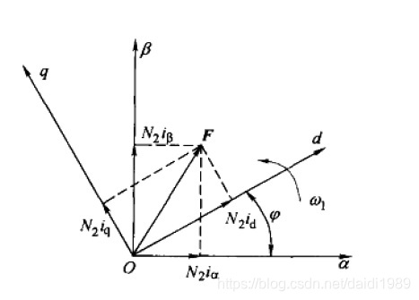
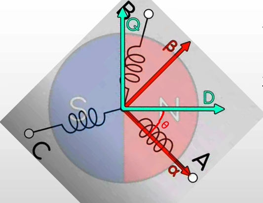

## 帕克变换

> - 实际上，完成帕克变换后得到的d和q值，描述的是施加在转子上的磁场（力矩和方向），  
> - 并且这个磁场方向一般垂直于d轴，即$i_d=0$
> - 这是为了确保所有电流都产生转矩，而不是增强或减小定子上永磁体的磁场。

- 克拉克变换就是把坐标轴固定在了转子上，
- 然后只关注施加在转子上的磁场（大小和方向），
- 不关注定子内的磁场（大小和方向）。
- 具体做法就是创建一个固定在转子上的坐标轴，
- 然后通过转子的磁场（大小和方向）和测量出的转子和定子的夹角，
- 就能计算出定子施加在转子上的磁场（大小和方向）

**dq坐标系**

- 建立一个dq坐标系,将其固定在定子上  
- 

**坐标轴旋转**

- 通过定子（α-β坐标轴）上的磁场（F）  
- 以及定子（α-β坐标轴）和转子（d-q坐标轴）的夹角（φ）  
- 计算作用在转子（d-q坐标轴）上的磁场(F)  
- 

### 基本形式推导

- Iα
  - 作用在D轴上的量 = Iα cos(θ)
  - 作用在Q轴上的量 = Iα -sin(θ)
- Iβ
  - 作用在D轴上的量 = Iβ sin(θ)
  - 作用在Q轴上的量 = Iβ cos(θ)

$$
I_d  = I_α \cos{θ} + I_β \sin{θ} \\
I_q  = - I_α \sin{θ} + I_β \cos{θ} \\
$$

$$
\left[
\begin{matrix}
    I_d \\
    I_q
\end{matrix}
\right]
=
\left[
\begin{matrix}
    \cos{θ} & \sin{θ} \\
    -\sin{θ} & \cos{θ}
\end{matrix}
\right]
\left[
\begin{matrix}
    I_α \\
    I_β
\end{matrix}
\right]
$$

> 系数矩阵实际是一个**旋转矩阵**，  
> 它实现了将两相静止坐标系 (α, β) 中的向量转换到同步旋转坐标系 (d, q) 中。

### 基本形式的逆变换

由于系数矩阵是一个正交矩阵（旋转矩阵），它的逆矩阵实际上就是它的转置矩阵。对于正交矩阵来说，转置等于逆矩阵，这是因为旋转矩阵的行列式为 1，而且其列向量之间相互正交。

因此，上述矩阵的逆变换（即从 (d, q) 坐标系回到 (α, β) 坐标系）可以表示为原矩阵的转置：

$$
\begin{bmatrix}
  I_\alpha \\
  I_\beta
\end{bmatrix}
=
\begin{bmatrix}
  \cos{\theta} & -\sin{\theta} \\
  \sin{\theta} & \cos{\theta}
\end{bmatrix}
\begin{bmatrix}
  I_d \\
  I_q
\end{bmatrix}
$$
