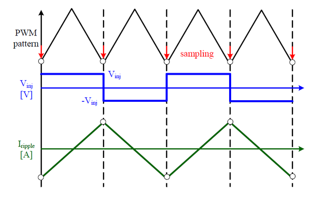

## 高频方波注入之电流响应信号的提取

采样得到的电流信号中同时包含基频电流信号和高频电流信号，而估计转子位置所需要的是其中的高频信号。

### 高频电流响应的特征

**黑色为PWM信号**

- SPWM信号 或 SVPWM信号
- 是高频方波信号的基频信号

**蓝色为高频方波信号**

- 其频率通常是PWM开关频率的整数倍（通常为两倍），远远高于电机绕组RL时间常数（十倍左右），最高可达开关频率的一半
- 幅值通常在母线电压的10%左右，
  - 幅值太小导致激励得到的高频电流信号量太小，难以采样，
  - 幅值太大会影响电磁转矩，浪费能量。

**绿色为电流响应**

- 其中包括电流基频信号和高频信号。

由于注入的方波电压信号频率远远高于电机绕组RL时间常数，所以其在方波的前半周期和后半周期中基频电流信号完全相同，而高频电流信号极性刚好相反，因而对注入方波的前半周期和后半周期中采样所得信号，**直接相加除2可得基频电流信号，直接相减可得高频电流信号。**
