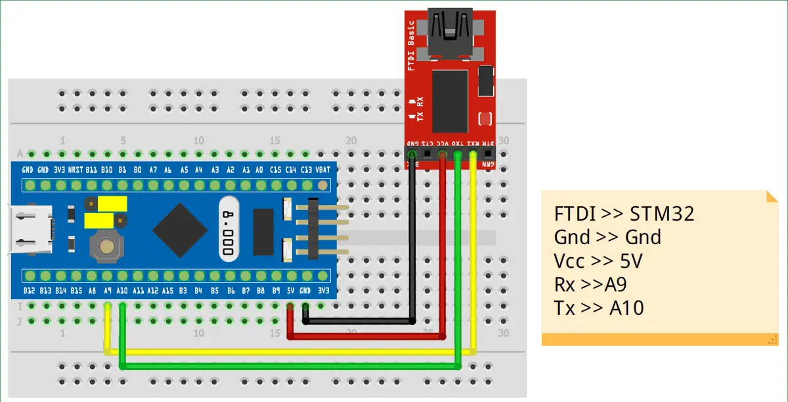
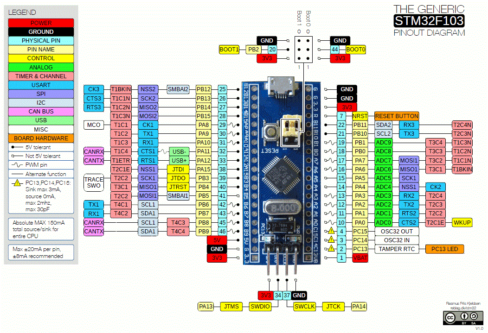
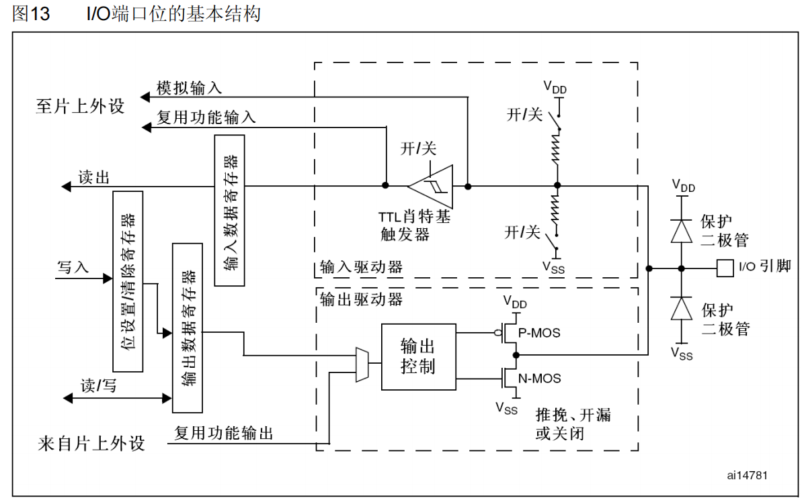
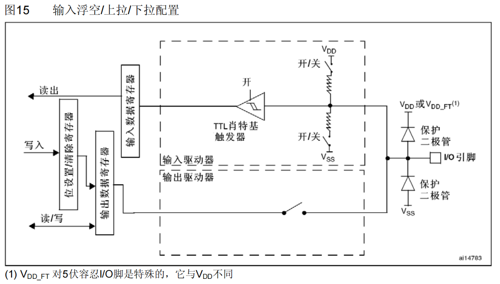
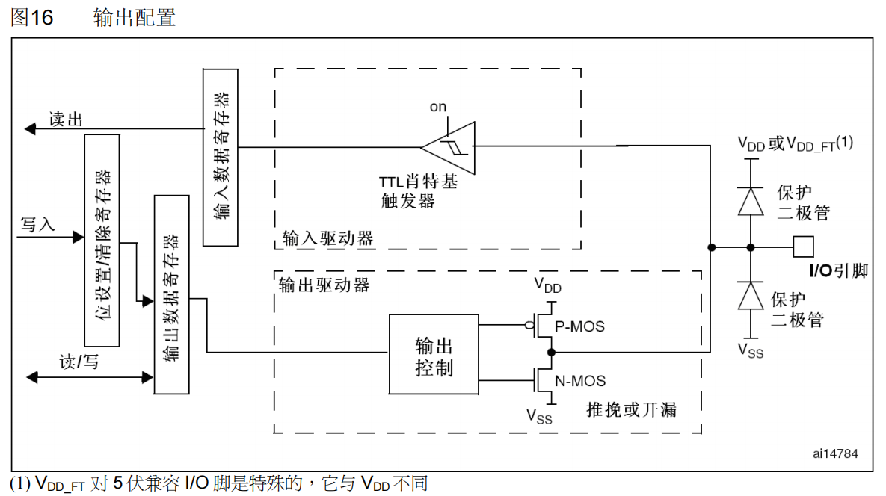
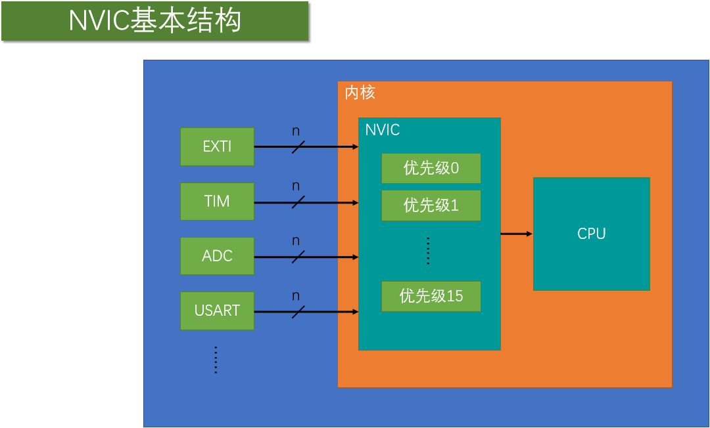
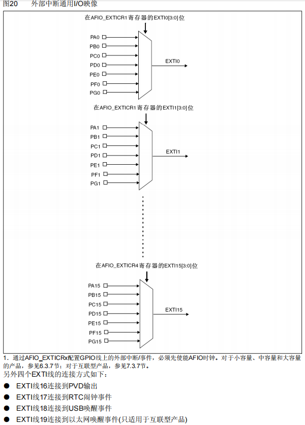

# STM32及标准库学习笔记



## 目录

- [STM32及标准库学习笔记](#stm32及标准库学习笔记)
  - [目录](#目录)
  - [F103C8T6简介](#f103c8t6简介)
  - [F1X片上资源](#f1x片上资源)
  - [系统结构](#系统结构)
  - [引脚定义](#引脚定义)
  - [启动配置](#启动配置)
  - [工程架构](#工程架构)
  - [Hello\_World](#hello_world)
  - [标准外设库](#标准外设库)
  - [RCC](#rcc)
    - [基本介绍](#基本介绍)
    - [常用函数](#常用函数)
  - [GPIO](#gpio)
    - [基本介绍](#基本介绍-1)
    - [stm32f10x\_gpio.h](#stm32f10x_gpioh)
    - [案例代码：点灯](#案例代码点灯)
  - [中断](#中断)
    - [基本概念](#基本概念)
    - [STM32的中断](#stm32的中断)
    - [EXTI外部中断](#exti外部中断)
    - [案例代码：光电计数器触发外部中断](#案例代码光电计数器触发外部中断)
  - [TIM定时器](#tim定时器)
    - [概念](#概念)
    - [基本、通用、高级定时器](#基本通用高级定时器)
      - [基本定时器](#基本定时器)
      - [通用定时器](#通用定时器)
      - [高级定时器](#高级定时器)
    - [案例：定时中断](#案例定时中断)
      - [基本结构](#基本结构)
      - [基本步骤](#基本步骤)
      - [通过内部时钟源——实现`setInterval(callback,ms)`](#通过内部时钟源实现setintervalcallbackms)
      - [通过外部时钟源——实现`setInterval(callback,times)`](#通过外部时钟源实现setintervalcallbacktimes)
    - [案例：定时输出比较——输出PWM波形](#案例定时输出比较输出pwm波形)
    - [案例：定时器输出捕获——测量方波](#案例定时器输出捕获测量方波)

## F103C8T6简介

- 系列：主流系列STM32F1
- 内核：ARM Cortex-M3
- 主频：72MHz
- RAM：20K（SRAM）
- ROM：64K（Flash）
- 供电：2.0~3.6V（标准3.3V）
- 封装：LQFP48
- 



## F1X片上资源

| 英文缩写 |        名称        |                       笔记                        |
| :------: | :----------------: | :-----------------------------------------------: |
|   NVIC   | 嵌套向量中断控制器 | 系统外设，内核中管理中断的设备，如配置中断优先级  |
| SysTick  |   系统滴答定时器   |   系统外设，内核定时器，给操作系统提供定时服务    |
|   RCC    |   复位和时钟控制   |    用于对系统时钟进行配置、开启其他模块的时钟     |
|   GPIO   |      通用IO口      |            通用IO口，可点灯，读取按键             |
|   AFIO   |      复用IO口      |   复用IO口，可实现复用端口重定义和中断端口配置    |
|   EXTI   |      外部中断      |         配置好外部中断后，可用于触发中断          |
|   TIM    |       定时器       | 可用于实现定时中断、测频率、生成PWM、配置成编码器 |
|   ADC    |     模数转换器     |    内置12位模数转换器 ,可直接读取IO口模拟电压     |
|   DMA    |    直接内存访问    |       配置好后，可替代CPU完成搬运数据的工作       |
|  USART   | 同步/异步串口通信  |        UART是同步串口 USART是同步/异步串口        |
|   I2C    |      I2C通信       |    内置控制器，实现了直接使用硬件输出时序波形     |
|   SPI    |      SPI通信       |                       同上                        |
|   CAN    |      CAN通信       |                       同上                        |
|   USB    |      USB通信       |                  USB从机模式接口                  |
|   RTC    |      实时时钟      |   实现年月日时分秒的计时功能，可接外部配用电池    |
|   CRC    |      CRC校验       |           直接通过硬件电路完成数据校验            |
|   PWR    |      电源控制      |                可让芯片睡眠，省电                 |
|   BKP    |     备份寄存器     |      在断电时通过备用电池完成保持数据的操作       |
|   IWDG   |     独立看门狗     |       在程序卡死一定的时间后，自动复位芯片        |
|   WWDG   |     窗口看门狗     |                       同上                        |
|   DAC    |     数模转换器     |             可在IO口直接输出模拟电压              |
|   SDIO   |      SD卡接口      |                     读写SD卡                      |
|   FSMC   | 可变静态存储控制器 |                     扩展内存                      |
| USB OTG  |    USB主机接口     |        USB主机模式接口，可读写其他USB设备         |

## 系统结构

**几个重要总线**

- `ICode总线` 连接Flash闪存 主要用来加载指令（Instruction）如：程序
- `DCode总线` 连接Flash闪存 主要用来加载数据（Data）如：常量、调试参数
- `System总线` 系统总线，通过总线矩阵连接到其他部分，如：SRAM(内存) FSMC
- `AHB系统总线` AHB(先进高性能)总线，挂载其他最基本的外设和高性能外设 如：复位、时钟控制、SDIO
  - `APB2` APB(先进外设)总线 连接一般外设 `频率一般72Mhz` `连接重要的外设` 如：高级定时器，GPIO，ADC
  - `APB1` APB(先进外设)总线 连接一般外设 `频率一般36Mhz` `连接次要的外设` 如：普通定时器，USB
- `DMA总线` DMA(直接内存访问)总线 DMA外设可以通过该总线代替CPU完成数据搬运工作，如：从ADC模数转换外设中的读取数值复制到内存中

- 

## 引脚定义

**特殊端口笔记**

|  引脚号  | 名称             | 默认功能    | 笔记                                               |
| :------: | :--------------- | :---------- | :------------------------------------------------- |
| **电源** |
|    1     | VBAT             | VBAT        | 可接3v备用电池给RTC时钟和备份寄存器供电            |
|   8-9    | VSSA VDDA        | VSSA VDDA   | 内部模拟电路供电                                   |
|  23-24   | VSS_1 VDD_1      | VSS_1 VDD_1 | 主电源                                             |
|  35-36   | VSS_2 VDD_2      | VSS_2 VDD_2 | 主电源                                             |
|  47-48   | VSS_3 VDD_3      | VSS_3 VDD_3 | 主电源                                             |
| **时钟** |
|    3     | PC14-OSC32-IN    | PC14        | 默认为PC14口 可外接32.768kMhz                      |
|    4     | PC15-OSC32-OUT   | PC15        | 默认为PC15口 可外接32.768kMhz                      |
|    5     | OSC_IN           | OSC_IN      | 默认为时钟输入 一般为8M                            |
|    6     | OSC_OUT          | OSC_OUT     | 默认为时钟输入 一般为8M                            |
| **复位** |
|    7     | NRST             | NRST        | 低电平复位 N表示低电平                             |
| **调试** |
|    34    | PA13             | JTMS/SWDIO  | 调试口 JTAG调试线1 / SWD调试线1                    |
|    37    | PA14             | JTCK/SWCLK  | 调试口 JTAG调试线2 / SWD调试线2（共两根线）        |
|    38    | PA15             | JTDI        | 调试口 JTAG调试线3                                 |
|    39    | PB3              | JTDO        | 调试口 JTAG调试线4                                 |
|    40    | PB4              | NJTRST      | 调试口 JTAG调试线5（共五根线）                     |
| **其他** |
|    2     | PC13-TARMPER-RTC | PC13        | 默认为PC13口 另外可以实现侵入检测或输出RTC校准时钟 |
|    10    | PA0-WKUP         | PA0         | 默认PA0 兼具唤醒功能，用于唤醒待机的STM32          |
|    20    | BP2              | BP2/BOOT1   | BOOT1用来配置启动模式，配置成功后退化为BP2         |
|    44    | BOOT0            | BOOT0       | BOOT0用来配置启动模式                              |

**所有引脚**


上图备注：

- 红色：电源
- 蓝色：最小系统相关
- 绿色：IO口 功能口
- 类型：S电源 I输入 O输出
- IO口电平：默认为3.3v；FT表示能够容忍5v电压
- 主功能： 该端口的默认功能
- 默认复用功能：该端口支持的其他功能
- 重定义功能：可将该端口上的功能重新映射到其他端口上

## 启动配置

- `BOOT1=x BOOT0=0` 从主闪存中加载程序并执行
- `BOOT1=0 BOOT0=1` 从系统存储器加载BootLoader程序并执行,该程序把从串口接收的数据写入主闪存，完成程序的烧录
- `BOOT1=1 BOOT0=1` 从内置SRAM启动，用于程序调试
- 

## 工程架构

**工程架构**


**项目结构**

```bash
.
|---Startup # 启动Stm32所需的最基本的几个文件,这几个文件可以在标准外设库中找到
|   +---startup*stm32f10x*??.s # 汇编启动文件，主要定义复位中断函数，在其中调用SystemInit();main();
|   +---system_stm32f10x.h
|   +---system_stm32f10x.c # 定义了系统初始化函数SystemInit()负责初始化寄存器
|   +---core_cm3.h # 内核寄存器描述
|   +---core_cm3.c # 内核寄存器配置函数
|   \---stm32f10x.h # 外设寄存器描述，当定义USE_STDPERIPH_DRIVER后，将自动包含stm32f10x_conf.h
|
|---StdPeriph_Lib # 标准外设库
|   +---misc.h # 内核中的外设
|   +---misc.c
|   +---stm32f10x_gpio.h # GPIO外设
|   +---stm32f10x_gpio.c
|   \---......略
|
|---User
|   +---main.c # 用户代码
|   +---stm32f10x_conf.h # 外设库配置文件，用来#include<标准外设>
|   +---stm32f10x_it.h
|   \---stm32f10x_it.c # 各种中断函数
```

## Hello_World

**寄存器点灯**

```cpp
#include "stm32f10x.h" // 包含了外设寄存器描述

int main(void)
{
    // 1.通过RCC寄存器 开启GPIO_C的时钟
    RCC->APB2ENR = 0x00000010;
    // 2.通过GOPIO_C_CRH高寄存器 配置13号口的模式 为通用推挽输出模式、最大速度为50Mhz
    GPIOC->CRH = 0x00300000;
    // 3.通过GPIO_C_ODR输出数据寄存器 配置C13口输出低电平
    GPIOC->ODR &= ~0x00002000;
    while (1)
    {
    }
}
```

**标准库点灯**

```cpp
// 定义 USE_STDPERIPH_DRIVER 后
// `stm32f10x.h` 会通过条件编译自动包含 `stm32f10x_conf.h` 文件
// 要在 `stm32f10x_conf.h` 中配置： `#include "stm32f10x_gpio.h"` 还有rcc
#define USE_STDPERIPH_DRIVER
#include "stm32f10x.h" // 包含了外设寄存器描述

int main(void)
{
    // 1. 启用APB2_GPIOC外设时钟
    RCC_APB2PeriphClockCmd(RCC_APB2Periph_GPIOC, ENABLE);
    // 2. 初始化GPIOC_13 为推挽输出、速度50MHz
    GPIO_InitTypeDef GPIO_InitStruct = {GPIO_Pin_13, GPIO_Speed_50MHz, GPIO_Mode_Out_PP};
    GPIO_Init(GPIOC, &GPIO_InitStruct);
    // 3.设置输出低电平
    GPIO_ResetBits(GPIOC, GPIO_Pin_13);
    while (1)
    {
    }
}
```

## 标准外设库

```bash
- STM32F10x_StdPeriph_Lib_V3.5.0
  - Libraries/ `标准库`
    - CMSIS/CM3/ `CMSIS表示：通用微控制器软件接口标准; CM3表示：Cortex-M3`
      - /CoreSupport/ `内核支持`
        - core_cm3.h `内核寄存器描述文件`
        - core_cm3.c `内核寄存器配置函数`
      - DeviceSupport/ `外设支持`
        - ST/STM32F10x/ `ST公司产品系列`
          - startup/ `启动文件,汇编代码,定义了复位中断和其他中断函数，复位中断函数中调用了SystemInit()和main()`
            - arm/ `ARM公司生产的芯片`
              - startup_stm32f10x_ld_vl.s
              - startup_stm32f10x_md_vl.s
              - startup_stm32f10x_hd_vl.s
              - startup_stm32f10x_ld.s
              - startup_stm32f10x_md.s
              - startup_stm32f10x_hd.s
              - startup_stm32f10x_xl.s
              - startup_stm32f10x_cl.s
          - stm32f10x.h `外设寄存器描述文件；当定义了USE_STDPERIPH_DRIVER后，将自动包含stm32f10x_conf.h文件，该文件用于包含标准外设库`
          - system_stm32f10x.c `定义了SystemInit()负责初始化寄存器`
          - system_stm32f10x.h
    - STM32F10x_StdPeriph_Driver/ `标准外设驱动`
      - inc/ `头文件`
        - misc.h `内核中的外设`
        - stm32f10x_dac.h
        - stm32f10x_gpio.h
        - ...略
      - src/ `具体实现`
        - ...略
      - Release_Notes.html
- Project/ `官方提供的工程案例和模板，可以作为使用库函数的参考`
  - STM32F10x_StdPeriph_Examples/ `案例`
  - STM32F10x_StdPeriph_Template/ `模板`
    - RIDE/
    - EWARM/
    - HiTOP/
    - MDK-ARM/
    - TrueSTUDIO/
    - stm32f10x_conf.h `用来配置标准外设库头文件的配置文件，同时包含一个所有库函数都需要的参数检查函数定义`
    - stm32f10x_it.c `用来存放中断函数`
    - stm32f10x_it.h
    - system_stm32f10x.c
    - main.c 主函数
    - Release_Notes.html 发布说明
- Utilities/ `官方用于测评STM32的程序`
- Release_Notes.html `发布说明`
- stm32f10x_stdperiph_lib_um.chm `帮助文档`
```

**启动文件的选择——型号分类及缩写**

| 文件                      | 缩写                  | 释义               | 释义     | 型号              |
| :------------------------ | :-------------------- | ------------------ | -------- | ----------------- |
| startup_stm32f10x_ld_vl.s | LD_VL(Value Line)     | 小容量产品超值系列 | 16~32K   | STM32F100         |
| startup_stm32f10x_md_vl.s | MD_VL(Value Line)     | 中容量产品超值系列 | 64~128K  | STM32F100         |
| startup_stm32f10x_hd_vl.s | HD_VL(Value Line)     | 大容量产品超值系列 | 256~512K | STM32F100         |
| startup_stm32f10x_ld.s    | LD(Low Density)       | 小容量产品         | 16~32K   | STM32F101/102/103 |
| startup_stm32f10x_md.s    | MD(Medium Density)    | 中容量产品         | 64~128K  | STM32F101/102/103 |
| startup_stm32f10x_hd.s    | HD(High Density)      | 大容量产品         | 256~512K | STM32F101/102/103 |
| startup_stm32f10x_xl.s    | XL(Extra Large)       | 加大容量产品       | 大于512K | STM32F101/102/103 |
| startup_stm32f10x_cl.s    | CL(Connectivity Line) | 互联型产品         | -        | STM32F105/107     |

## RCC

### 基本介绍

> RCC复位和时钟控制外设

**在系统结构中的位置**

- 位于AHB系统总线上
- 

**RCC相关寄存器**

- 时钟控制寄存器 `RCC_CR`
- 时钟配置寄存器`RCC_CFGR`
- 时钟中断寄存器 `RCC_CIR`
- APB2 外设复位寄存器 `RCC_APB2RSTR`
- APB1 外设复位寄存器 `RCC_APB1RSTR`
- **AHB 外设时钟使能寄存器** `RCC_AHBENR`
- **APB2 外设时钟使能寄存器** `RCC_APB2ENR`
- **APB1 外设时钟使能寄存器** `RCC_APB1ENR`
- 备份域控制寄存器 `RCC_BDCR`
- 控制/状态寄存器 `RCC_CSR`

### 常用函数

> 大部分功能都用不到，这里只粘贴几个最常用的函数的使用方法。

:::code-tabs

@tab RCC_APB2PeriphClockCmd

```cpp
/**
  * @brief  启用或禁用高速APB2外设时钟
  * @param  RCC_APB2Periph: 指定哪一个APB2外设获得时钟
  *   这个参数可以是以下任何参数的结合:
  *     @arg RCC_APB2Periph_AFIO, RCC_APB2Periph_GPIOA, RCC_APB2Periph_GPIOB,
  *          RCC_APB2Periph_GPIOC, RCC_APB2Periph_GPIOD, RCC_APB2Periph_GPIOE,
  *          RCC_APB2Periph_GPIOF, RCC_APB2Periph_GPIOG, RCC_APB2Periph_ADC1,
  *          RCC_APB2Periph_ADC2, RCC_APB2Periph_TIM1, RCC_APB2Periph_SPI1,
  *          RCC_APB2Periph_TIM8, RCC_APB2Periph_USART1, RCC_APB2Periph_ADC3,
  *          RCC_APB2Periph_TIM15, RCC_APB2Periph_TIM16, RCC_APB2Periph_TIM17,
  *          RCC_APB2Periph_TIM9, RCC_APB2Periph_TIM10, RCC_APB2Periph_TIM11
  * @param  NewState: 指定外设时钟的新状态.
  *   This parameter can be: ENABLE or DISABLE.
  * @retval None
  */
void RCC_APB2PeriphClockCmd(uint32_t RCC_APB2Periph, FunctionalState NewState);
```

@tab RCC_APB1PeriphClockCmd

```cpp
/**
  * @brief  启用或禁用低速APB1外设时钟
  * @param  RCC_APB1Periph: 指定哪一个APB1外设获得时钟
  *   这个参数可以是以下任何参数的结合:
  *     @arg RCC_APB1Periph_TIM2, RCC_APB1Periph_TIM3, RCC_APB1Periph_TIM4,
  *          RCC_APB1Periph_TIM5, RCC_APB1Periph_TIM6, RCC_APB1Periph_TIM7,
  *          RCC_APB1Periph_WWDG, RCC_APB1Periph_SPI2, RCC_APB1Periph_SPI3,
  *          RCC_APB1Periph_USART2, RCC_APB1Periph_USART3, RCC_APB1Periph_USART4,
  *          RCC_APB1Periph_USART5, RCC_APB1Periph_I2C1, RCC_APB1Periph_I2C2,
  *          RCC_APB1Periph_USB, RCC_APB1Periph_CAN1, RCC_APB1Periph_BKP,
  *          RCC_APB1Periph_PWR, RCC_APB1Periph_DAC, RCC_APB1Periph_CEC,
  *          RCC_APB1Periph_TIM12, RCC_APB1Periph_TIM13, RCC_APB1Periph_TIM14
  * @param  NewState: 指定外设时钟的新状态.
  *   This parameter can be: ENABLE or DISABLE.
  * @retval None
  */
void RCC_APB1PeriphClockCmd(uint32_t RCC_APB1Periph, FunctionalState NewState);
```

@tab RCC_AHBPeriphClockCmd

```cpp
/**
  * @brief  启用或禁用AHB(先进高性能)总线外设时钟
  *
  * @param  RCC_AHBPeriph: 指定哪一个AHB外设可以获得时钟
  *
  *   对于其他STM32互联型设备，这个参数可以是以下任何值的结合
  *   For @b STM32_Connectivity_line_devices, this parameter can be any combination
  *   of the following values:
  *     @arg RCC_AHBPeriph_DMA1
  *     @arg RCC_AHBPeriph_DMA2
  *     @arg RCC_AHBPeriph_SRAM
  *     @arg RCC_AHBPeriph_FLITF
  *     @arg RCC_AHBPeriph_CRC
  *     @arg RCC_AHBPeriph_OTG_FS
  *     @arg RCC_AHBPeriph_ETH_MAC
  *     @arg RCC_AHBPeriph_ETH_MAC_Tx
  *     @arg RCC_AHBPeriph_ETH_MAC_Rx
  *
  *   对于其他STM32设备，这个参数可以是以下任何值的结合
  *   For @b other_STM32_devices, this parameter can be any combination of the
  *   following values:
  *     @arg RCC_AHBPeriph_DMA1
  *     @arg RCC_AHBPeriph_DMA2
  *     @arg RCC_AHBPeriph_SRAM
  *     @arg RCC_AHBPeriph_FLITF
  *     @arg RCC_AHBPeriph_CRC
  *     @arg RCC_AHBPeriph_FSMC
  *     @arg RCC_AHBPeriph_SDIO
  * @note SRAM 和 FLITF 的时钟只能在睡眠模式被关闭
  *
  * @param  NewState: 新的状态
  *     @arg ENABLE
  *     @arg DISABLE
  */
void RCC_AHBPeriphClockCmd(uint32_t RCC_AHBPeriph, FunctionalState NewState);
```

:::
**RCC外设所有函数功能描述**

> 感觉大概知道下有哪些功能就行了

| 函数名 (加粗表示常用)         | 描述                                 |
| :---------------------------- | :----------------------------------- |
| RCC_DeInit                    | 将外设 RCC 寄存器重设为缺省值        |
| RCC_HSEConfig                 | 设置外部高速晶振（HSE）              |
| RCC_WaitForHSEStartUp         | 等待 HSE 起振                        |
| RCC_AdjustHSICalibrationValue | 调整内部高速晶振（HSI）校准值        |
| RCC_HSICmd                    | 使能或者失能内部高速晶振（HSI）      |
| RCC_PLLConfig                 | 设置 PLL 时钟源及倍频系数            |
| RCC_PLLCmd                    | 使能或者失能 PLL                     |
| RCC_SYSCLKConfig              | 设置系统时钟（SYSCLK）               |
| RCC_GetSYSCLKSource           | 返回用作系统时钟的时钟源             |
| RCC_HCLKConfig                | 设置 AHB 时钟（HCLK）                |
| RCC_PCLK1Config               | 设置低速 AHB 时钟（PCLK1）           |
| RCC_PCLK2Config               | 设置高速 AHB 时钟（PCLK2）           |
| RCC_ITConfig                  | 使能或者失能指定的 RCC 中断          |
| RCC_USBCLKConfig              | 设置 USB 时钟（USBCLK）              |
| RCC_ADCCLKConfig              | 设置 ADC 时钟（ADCCLK）              |
| RCC_LSEConfig                 | 设置外部低速晶振（LSE）              |
| RCC_LSICmd                    | 使能或者失能内部低速晶振（LSI）      |
| RCC_RTCCLKConfig              | 设置 RTC 时钟（RTCCLK）              |
| RCC_RTCCLKCmd                 | 使能或者失能 RTC 时钟                |
| RCC_GetClocksFreq             | 返回不同片上时钟的频率               |
| **RCC_AHBPeriphClockCmd**     | 使能或者失能 AHB 外设时钟            |
| **RCC_APB2PeriphClockCmd**    | 使能或者失能 APB2 外设时钟           |
| **RCC_APB1PeriphClockCmd**    | 使能或者失能 APB1 外设时钟           |
| RCC_APB2PeriphResetCmd        | 强制或者释放高速 APB（APB2）外设复位 |
| RCC_APB1PeriphResetCmd        | 强制或者释放低速 APB（APB1）外设复位 |
| RCC_BackupResetCmd            | 强制或者释放后备域复位               |
| RCC_ClockSecuritySystemCmd    | 使能或者失能时钟安全系统             |
| RCC_MCOConfig                 | 选择在 MCO 管脚上输出的时钟源        |
| RCC_GetFlagStatus             | 检查指定的 RCC 标志位设置与否        |
| RCC_ClearFlag                 | 清除 RCC 的复位标志位                |
| RCC_GetITStatus               | 检查指定的 RCC 中断发生与否          |
| RCC_ClearITPendingBit         | 清除 RCC 的中断待处理位              |

## GPIO

### 基本介绍

- GPIO（General Purpose Input Output）通用输入输出口
- 可配置为8种输入输出模式
- 引脚电平：0V~3.3V，部分引脚可容忍5V
- 输出模式下可控制端口输出高低电平
- 输入模式下可读取端口的高低电平或电压

**GPIO基本结构**

- 这里的寄存器实际上共有7个
  - 32bit配置寄存器x2 `GPIOx_CRL` `GPIOx_CRH` (4bit x 16 = 64bit)
  - 32bit配置锁定寄存器x1 `GPIOx_LCKR`
  - 32bit数据寄存器x2 `GPIOx_IDR` `GPIOx_ODR` (输入/输出)
  - 32bit置位/复位寄存器x1 `GPIOx_BSRR` (低16bit置位，高16bit复位) (可用于设置某位的同时清除另一位)
  - 16bit复位寄存器x1 `GPIOx_BRR` (低16bit复位)
- 

**GPIO位结构**

- 这里值得注意的一些点：
  - 对`输出数据寄存器`操作会影响16个端口
  - 对`位设置/清除寄存器`操作只影响具体的位
  - 复用功能输入实际上是数字信号
  - GPIO模式决定了上拉电阻和下拉电阻是否启用，以及上下MOS管是否受控。
- 

**八种GPIO模式**

|   模式名称   |     性质     | 特征                                               |
| :----------: | :----------: | :------------------------------------------------- |
|   浮空输入   | **数字输入** | 可读取引脚电平，若引脚悬空，则电平不确定           |
|   上拉输入   | **数字输入** | 可读取引脚电平，内部连接上拉电阻，悬空时默认高电平 |
|   下拉输入   | **数字输入** | 可读取引脚电平，内部连接下拉电阻，悬空时默认低电平 |
|   模拟输入   | **模拟输入** | GPIO无效，引脚直接接入内部ADC                      |
|   开漏输出   |  `数字输出`  | 可输出引脚电平，高电平为高阻态，低电平接VSS        |
|   推挽输出   |  `数字输出`  | 可输出引脚电平，高电平接VDD，低电平接VSS           |
| 复用开漏输出 |  `数字输出`  | 由片上外设控制，高电平为高阻态，低电平接VSS        |
| 复用推挽输出 |  `数字输出`  | 由片上外设控制，高电平接VDD，低电平接VSS           |

**数字输入模式电路**

- 特点
  - 无法输出
  - 浮空输入 上下拉电阻失效 电平不确定
  - 上拉输入 上拉电阻有效 默认高电平
  - 下拉输入 下拉电阻有效 默认低电平
- 

**模拟输入模式电路**

- 特点
  - 肖特基触发器关闭，无法读取数字输入信号
  - 输出电路断开，无法输出信号
  - 引脚信号直接接入ADC
- 

**数字输出模式电路**

- 特点
  - 上管无效为开漏输出
  - 上下管都有效为推挽输出
  - 肖特基触发器开启，可以读取到数字输入
- 

**复用输出模式**

- 特点
  - 输出的控制权转交给片上外设
  - 肖特基触发器开启，仍然能够读取数字输入
- 

### stm32f10x_gpio.h

```cpp
// -----------------------------------------------------
// 接口描述：
    void GPIO_DeInit(GPIO_TypeDef* GPIOx);
// 说明：
    复位指定GPIO
// 示例：
    GPIO_DeInit(GPIOA);
// -----------------------------------------------------
// 接口描述：
    void GPIO_AFIODeInit(void);
// 说明：
    复位AFIO外设
// 示例：
    GPIO_AFIODeInit(void);
// -----------------------------------------------------
// 接口描述：
    void GPIO_Init(GPIO_TypeDef* GPIOx, GPIO_InitTypeDef* GPIO_InitStruct);
// 说明：
    用结构体的参数来复位指定IO口
// 示例：
    GPIO_InitTypeDef GPIO_InitStruct;
    // 配置Pin
    GPIO_InitStruct.GPIO_Pin = GPIO_Pin_0;// GPIO_Pin_[0,15] And GPIO_Pin_All
    // 配置速度
    GPIO_InitStruct.GPIO_Speed = GPIO_Speed_50MHz; // GPIO_Speed_10MHz,GPIO_Speed_2MHz,GPIO_Speed_50MHz
    // 配置模式：
    // GPIO_Mode_AIN模拟输入
    // GPIO_Mode_IN_FLOATING 悬空数字输入 GPIO_Mode_IPD上拉数字输入
    // GPIO_Mode_Out_OD 开漏输出 GPIO_Mode_Out_PP推挽输出
    // GPIO_Mode_AF_OD复用开漏输出  GPIO_Mode_AF_PP复用推挽输出
    GPIO_InitStruct.GPIO_Mode = GPIO_Mode_Out_PP;
    GPIO_Init(GPIOA, &GPIO_InitStruct);
// -----------------------------------------------------
// 接口描述：
    void GPIO_StructInit(GPIO_InitTypeDef* GPIO_InitStruct);
// 说明：
    给接口体初始化(赋默认值)
// 示例：
    GPIO_InitTypeDef GPIO_InitStruct;
    GPIO_StructInit(&GPIO_InitStruct);
// -----------------------------------------------------
// 四个读取函数
    // 读取输入寄存器某位
    uint8_t GPIO_ReadInputDataBit(GPIO_TypeDef* GPIOx, uint16_t GPIO_Pin);
    // 读取输入寄存器
    uint16_t GPIO_ReadInputData(GPIO_TypeDef* GPIOx);
    // 读取输出寄存器某位
    uint8_t GPIO_ReadOutputDataBit(GPIO_TypeDef* GPIOx, uint16_t GPIO_Pin);
    // 读取输出寄存器
    uint16_t GPIO_ReadOutputData(GPIO_TypeDef* GPIOx);
// -----------------------------------------------------
// 四个写入函数
    // 给指定的某些位写入1
    void GPIO_SetBits(GPIO_TypeDef* GPIOx, uint16_t GPIO_Pin);
    // 给指定的某些位写入0
    void GPIO_ResetBits(GPIO_TypeDef* GPIOx, uint16_t GPIO_Pin);
    // 给指定的某些位写入1-Bit_SET或0-Bit_RESET
    void GPIO_WriteBit(GPIO_TypeDef* GPIOx, uint16_t GPIO_Pin, BitAction BitVal);
    // 给指定端口写入16位数据
    void GPIO_Write(GPIO_TypeDef* GPIOx, uint16_t PortVal);
// -----------------------------------------------------
// 锁定端口配置
    void GPIO_PinLockConfig(GPIO_TypeDef* GPIOx, uint16_t GPIO_Pin);
// -----------------------------------------------------
void GPIO_EventOutputConfig(uint8_t GPIO_PortSource, uint8_t GPIO_PinSource);
void GPIO_EventOutputCmd(FunctionalState NewState);
void GPIO_PinRemapConfig(uint32_t GPIO_Remap, FunctionalState NewState);
void GPIO_EXTILineConfig(uint8_t GPIO_PortSource, uint8_t GPIO_PinSource);
void GPIO_ETH_MediaInterfaceConfig(uint32_t GPIO_ETH_MediaInterface);
```

### 案例代码：点灯

**步骤**

- 配置RCC外设开启相关端口的时钟
- 配置GPIO口输出模式
- 输出

```cpp
#define USE_STDPERIPH_DRIVER
#include "stm32f10x.h"

int main(void)
{
    // 1.启用APB2_GPIOC外设时钟
    RCC_APB2PeriphClockCmd(RCC_APB2Periph_GPIOC, ENABLE);
    // 2.初始化GPIOC_13 为推挽输出、速度50MHz
    GPIO_InitTypeDef GPIO_InitStruct = {GPIO_Pin_13, GPIO_Speed_50MHz, GPIO_Mode_Out_PP};
    GPIO_Init(GPIOC, &GPIO_InitStruct);
    // 3.设置输出低电平
    GPIO_WriteBit(GPIOC,GPIO_Pin_13,Bit_RESET);
    while (1)
    {
    }
}
```

## 中断

### 基本概念

- **中断：** 在主程序运行过程中，出现了特定的**中断触发条件**（中断源），使得CPU暂停当前正在运行的程序，转而去处理**中断程序**，处理完成后又返回原来被暂停的位置继续运行
- **中断优先级：** 当有多个中断源同时申请中断时，CPU会根据中断源的轻重缓急进行裁决，优先响应更加紧急的中断源
- **中断嵌套：** 当一个中断程序正在运行时，又有新的更高优先级的中断源申请中断，CPU再次暂停当前中断程序，转而去处理新的中断程序，处理完成后依次进行返回

**中断执行流程**


### STM32的中断

**介绍**

- 68个可屏蔽中断通道，包含EXTI、TIM、ADC、USART、SPI、I2C、RTC等多个外设
- 使用NVIC统一管理中断，每个中断通道都拥有**16**个可编程的优先等级，可对优先级进行分组，进一步设置抢占优先级和响应优先级

**STM32中断向量表**

- 分类
  - 灰色的都是内核的中断，一般用不到。
    - Reset复位中断，当产生复位事件时程序就会自动执行复位中断。
  - 其余部分为外设中断
- 中断地址
  - 外设申请中断时，会跳转到相应的中断地址执行程序
  - 而中断跳转只能跳转到固定的地址
  - 用户定义的中断处理函数在编译器编译后，其地址是不固定的
  - 这就需要在跳转到中断地址后再次跳转到用户定义的中断函数，这部分工作将会由编译器自动完成（定义在了setup汇编文件中）。
- 

**NVIC-嵌套中断向量控制器**

- 是统一分配中断优先级和管理中断的**内核外设**，
- 负责根据中断的优先级决定中断的先后顺序，
- 以及是否要嵌套处理新的中断。
- 

**NVIC优先级分组**

- 分组
  - NVIC的中断优先级由优先级寄存器的4位决定（共16个优先级）
  - 这4位可以进行切分，分为
  - 高n位的**抢占优先级**和
  - 低(4-n)位的**响应优先级**
- 优先级
  - `抢占优先级高的可以中断嵌套，`
  - `响应优先级高的可以优先排队，`
  - `抢占优先级和响应优先级均相同的按中断号排队`

| 分组方式 |   抢占优先级    |   响应优先级    |
| :------: | :-------------: | :-------------: |
|  分组0   |  0位，取值为0   | 4位，取值为0~15 |
|  分组1   | 1位，取值为0~1  | 3位，取值为0~7  |
|  分组2   | 2位，取值为0~3  | 2位，取值为0~3  |
|  分组3   | 3位，取值为0~7  | 1位，取值为0~1  |
|  分组4   | 4位，取值为0~15 |  0位，取值为0   |

### EXTI外部中断

**介绍**

- EXTI（Extern Interrupt）外部中断
- `EXTI可以监测指定GPIO口的电平信号，当其指定的GPIO口产生电平变化时，EXTI将立即向NVIC发出中断申请，经过NVIC裁决后即可中断CPU主程序，使CPU执行EXTI对应的中断程序`
- 支持的触发方式：
  - 上升沿
  - 下降沿
  - 双边沿
  - 软件触发
- 支持的GPIO口：
  - **所有GPIO口**
  - 但**相同的Pin不能同时触发中断**,就是说PA0和PB0不能同时作为中断触发源
- 通道数（**共20个通道**）：
  - 16个GPIO_Pin
  - 外加PVD输出
  - RTC闹钟
  - USB唤醒
  - 以太网唤醒
- 触发响应方式：
  - 中断响应：通道电压变化，申请中断，让CPU执行中断函数
  - 事件响应：通道电压变化，触发事件，触发其他外设的操作
- **EXTI基本结构**
  - 

**EXTI外部中断框图**

- 下图左侧的输入线就是20个外部中断通道
- **边沿检测电路**根据**上升沿触发选择寄存器**和**下降沿触发选择寄存器**的值
- 决定输出到或门的值，然后输出到**请求挂起寄存器**，然后再输出至后续的与门。
- **中断屏蔽寄存器**就相当于是这个与门的开关，决定了中断信号能否发送至后续的NVIC
- 从或门输出的信号还将经过脉冲发生器，用来触发其他外设
- 

**AFIO中断引脚选择**

- AFIO主要用于引脚复用功能的选择和重定义
- 在STM32中，AFIO主要完成两个任务：
  - 复用功能引脚重映射
  - **中断引脚选择**
- 下图的主要意思就是**EXTIO只能是PA0~PG0中的其中一个**，具体选择哪一个，由AFIO来控制
- 

### 案例代码：光电计数器触发外部中断

**基本步骤**

- 开启GPIOx时钟
- 配置GPIOx_Pinx
- 开启AFIO时钟
- 配置AFIO，使GPIOx_Pinx通向 EXTIx中断信号
- 配置EXTI，启用EXTI_Linex
- 配置NVIC,设置EXTIxx_IRQn中断函数优先级
- 定义中断函数EXTIxx_IRQn
  - 在中断执行完毕后清除请求挂起寄存器对应的位

**配置GPIO_G_Pin_13口外部中断的示例代码**

```cpp
#include "stm32f10x.h"
#include "stdint.h"
#include "CountSensor.h"

/**
 * @ref 初始化光电计数器
 */
void CountSensor_Init()
{
    /**
     * 配置GPIO
     */
    // 开启APB2_GPIO_C外设时钟
    RCC_APB2PeriphClockCmd(RCC_APB2Periph_GPIOC, ENABLE);
    // 初始化GPIO_C13为上拉输入模式
    GPIO_InitTypeDef GPIO_InitStruct = {GPIO_Pin_13, GPIO_Speed_50MHz, GPIO_Mode_IPU};
    GPIO_Init(GPIOC, &GPIO_InitStruct);

    /**
     * 配置AFIO
     * AFIO用于配置引脚复用功能重映射 中断引脚
     */
    // 开启APB2_AFIO外设时钟
    RCC_APB2PeriphClockCmd(RCC_APB2Periph_AFIO, ENABLE);
    // 配置AFIO的数据选择器联通GPIO_C13到EXTI电路
    GPIO_EXTILineConfig(GPIO_PortSourceGPIOC, GPIO_PinSource13);

    /**
     * 配置EXTI
     */
    // EXTI外设时钟默认开启
    // 配置EXTI
    EXTI_InitTypeDef EXTI_InitStruct = {
        EXTI_Line13,          // 配置EXTI_Line13
        EXTI_Mode_Interrupt,  // 中断模式
        EXTI_Trigger_Falling, // 下降沿触发
        ENABLE,               // 启用
    };
    EXTI_Init(&EXTI_InitStruct);

    /**
     * 配置NVCI
     */
    // NVCI是内核外设，时钟默认开启
    // 通过NVIC寄存器配置优先级分组（先占优先级和从占优先级）
    NVIC_PriorityGroupConfig(NVIC_PriorityGroup_2);
    // 配置EXTI15_10_IRQn中断的优先级
    NVIC_InitTypeDef NVIC_InitStruct = {
        EXTI15_10_IRQn,
        0, // 先占优先级
        0, // 从占优先级
        ENABLE,
    };
    NVIC_Init(&NVIC_InitStruct);
}

uint16_t counter = 0;
uint16_t CountSensor_GetCounter()
{
    return counter;
}
/**
 * @ref 重写中断回调
 */
void EXTI15_10_IRQHandler()
{
    // 获取EXTI状态
    if (EXTI_GetITStatus(EXTI_Line13) == SET)
    {
        counter++;
        // 清除中断请求挂起寄存器相应的位
        EXTI_ClearITPendingBit(EXTI_Line13);
    }
}
```

## TIM定时器

### 概念

- TIM（Timer）定时器
- 定时器可以对**输入的时钟**进行**计数**，并在计数值达到设定值时触发中断
  - **输入时钟可以是系统时钟、外部输入**
  - **对高精度时钟计数，实际就是计时**
    - 对系统时钟72Mhz计数72次，就是1us
- **预分频器**、**16位计数器**、**自动重装寄存器**的时基单元，在72MHz计数时钟下可以实现最大59.65s的定时
  - 预分频器，可以对时钟进行分频，
  - 16位计数器,用来执行计数定时的计数器，每来一个时钟，计数器加1
  - 单个定时器最大定时时长： `(1/72Mhz) * 65536 * 65536 = 59.65232355555556 s`
  - 两个定时器级联最大定时时长：`59.65s * 65536 * 65536 ≈ 8千多年`
  - 三个定时器级联最大定时时长：`8K * 65536 * 65536 ≈ 34万亿年`
- 不仅具备基本的**定时中断功能**，而且还包含**内外时钟源选择**、**输入捕获**、**输出比较**、编码器接口、主从触发模式等多种功能
- 根据复杂度和应用场景分为了高级定时器、通用定时器、基本定时器三种类型

**定时器类型**

> STM32F103C8T6定时器资源：TIM1、TIM2、TIM3、TIM4

| 类型       | 编号                   | 总线 | 功能                                                                                                 |
| :--------- | :--------------------- | :--- | :--------------------------------------------------------------------------------------------------- |
| 高级定时器 | TIM1、TIM8             | APB2 | 拥有通用定时器全部功能，并额外具有重复计数器、死区生成、互补输出、刹车输入等功能                     |
| 通用定时器 | TIM2、TIM3、TIM4、TIM5 | APB1 | 拥有基本定时器全部功能，并额外具有内外时钟源选择、输入捕获、输出比较、编码器接口、主从触发模式等功能 |
| 基本定时器 | TIM6、TIM7             | APB1 | 拥有定时中断、主模式触发DAC的功能                                                                    |

### 基本、通用、高级定时器

#### 基本定时器

**基本定时器框图**

- **`CK_PSC`时钟：** 一般直接使用`CK_INT`内部时钟72Mhz作为定时器时钟
- **时基单元：** 预分频器+计数器+自动重装寄存器
  - **预分频器：** 对时钟进行降频
    - 写0 输出 72/1 Mhz （不分频/也叫1分频）
    - 写1 输出 72/2 Mhz （2分频）
    - 写2 输出 72/3 Mhz （3分频）
    - ......
    - 写n 输出 72/(n+1) Mhz （n+1分频）
  - **计数器：** 对预分频器输出的方波上升沿计数，计数就是计数器值+1
    - 对于基本定时器，计数器只有向上计数模式
  - **自动重装寄存器：** 当计数器数值达到自动重装值时，产生中断信号并清零计时器
    - 下图中向上的折现箭头就是中断信号，这种计数值等于重装值的中断一般称为更新中断，该中断信号会通往NVIC，配置好NVIC的定时器通道，那么定时器的更新中断就能得到CPU的响应
    - 向下的折现表示会产生一个事件，这里就是更新事件，不会触发中断，但可用于触发内部其他电路工作，可以实现一种不需要CPU直接参与的自动化任务。
- **主模式触发DAC:** 可以把定时器的更新事件，映射到TRGO（Trigger Oout）触发输出，然后再接到DAC的触发转换引脚上，实现定时触发DAC转换输出模拟量，不需要CPU参与，实现硬件自动化
- 

#### 通用定时器

**通用定时器框图**

- **时基单元**: 没有改变，和**基本定时器**一样
  - **计数器：**
    - 对于通用寄存器和高级寄存器，计数器支持向上计数、向下计数，中央对齐计数
- `CK_PSC`**时钟**
  - `CK_INT 内部时钟`
    - 可直接使用内部时钟72Mhz作为定时器时钟
  - `CK_PSC 外部时钟模式2`
    - 可以把ETR（TIMx_ETR）外部时钟引脚信号作为定时器时钟；如：TIM2_CH1_ETR引脚
    - 需要配置边沿检测、分配器
    - 可以用来对外部时钟引脚上的信号计数
  - `TRGI 外部时钟模式1`
    - TRGI主要作为触发输入使用，可以触发定时器的从模式
    - 也可以用来作为定时器的外部时钟输入信号
      - `ITRx` 是来自其他定时器的触发输出 用于实现定时器的级联
        - 具体来说，
          - 可以初始化TIM3,主模式，更新事件映射到TRGO;
          - 初始化TIM2,选择ITR2（也就是TIM3的TRGO）,外部时钟模式1，作为定时器的时钟信号。
        - 
      - `TI1F_ED` 连接的是输入捕获单元的CH1引脚，ED表示边沿触发，上升沿和下降沿均有效
        - 可用于输入捕获，测频率
      - `TI1FP1` CH1引脚的时钟
      - `TI1FP2` CH2引脚的时钟
- 编码器接口：可用于读取正交编码器的输出波形
- `TRGO`触发输出：
  - 可以把定时器内部的一些事件映射到该接口
- `捕获/比较电路`

  - 四个捕获/比较电路寄存器，及其**左侧**的电路称为**输入捕获电路**，可用于**测量方波频率**
  - 四个捕获/比较电路寄存器，及其**右侧**的电路称为**输出比较电路**，可用于**输出PWM波形**
  - 输入捕获电路 和 输出比较电路 **共用引脚和寄存器**，**不能同时使用**

- 

#### 高级定时器

**高级定时器框图**

- 对比高级定时器框图，新增的部分为右下角的一圈电路
  - `重复计数器`：实现每隔几个计数周期触发中断和更新事件，相当于对输出的更新信号又做了分频
  - **DTG(Dead Time Generate四驱时间生成)寄存器**，用于控制输出上下互补的PWM波，为了防止输出的互补PWM波驱动MOS管时，在开关切换的瞬间，由于器件的不理想，导致短暂的上下管都导通的情况发生，所以这里添加了死区生成电路，实现在上管完全关闭时，再开启下管。
  - **输出控制**，用于输出两个上下互补的PWM波形，用于控制三相电机，第四路由于用不到，所以只有一根线。
  - `BRK刹车输入功能`：当从外部引脚BKIN得到刹车信号时，或者时钟信号失效事件发生时，控制电路将自动切断电机的输出，防止意外发生。
- 

### 案例：定时中断

#### 基本结构


#### 基本步骤

1. 通过 RCC 开启相关外设时钟
2. 为时基单元选择时钟源：内部时钟源、外部时钟模式、编码器模式
3. 配置时基单元：预分频器、自动重装器、计数模式
4. 配置输出中断控制: 允许输出中断到NVIC
5. 配置NVIC: 打开定时中断通道、分配中断优先级
6. 运行控制：使能计数器

#### 通过内部时钟源——实现`setInterval(callback,ms)`

setInterval是一个在前端开发中经常使用的函数，这里尝试实现一下

:::code-tabs

@tab `main.cpp`

```c
#include "stm32f10x.h"
#include "OLED.h"
#include "Timer2.h"

uint16_t num = 0;
void update_callback()
{
    num++;
}

int main(void)
{
    OLED_Init();
    Timer2_setInterval(update_callback, 1000);
    while (1)
    {
        OLED_ShowString(1, 1, "Hello World!!!");
        OLED_ShowNum(2, 1, num, 10);
    }
}
```

@tab `Timer2.c`

```c
#include "stm32f10x.h"
#include "Timer2.h"
#include <stddef.h>

void (*callback)() = NULL;

/**
 * @arg _callback 回调函数
 * @arg ms 毫秒 取值范围 [1,0xffff/10+1]
 */
void Timer2_setInterval(void (*_callback)(), uint16_t ms)
{
    // 步骤
    // 1. 通过 RCC 开启相关外设时钟
    // 2. 为时基单元选择时钟源：内部时钟源、外部时钟模式、编码器模式
    // 3. 配置时基单元：预分频器、自动重装器、计数模式
    // 4. 配置输出中断控制: 允许输出中断到NVIC
    // 5. 配置NVIC: 打开定时中断通道、分配中断优先级
    // 6. 运行控制：使能计数器

    // 1开启Tim2外设时钟
    RCC_APB1PeriphClockCmd(RCC_APB1Periph_TIM2, ENABLE);

    // 2为TIM2时基单元选择内部时钟（可不写，默认使用内部时钟）
    TIM_InternalClockConfig(TIM2);

    // 3配置时基单元
    // CK_CNT_OV计数器溢出频率 = CK_CNT定时器时钟/(ARR重装值+1) = CK_PSC内部时钟/(PSC预分频器+1)/(ARR重装值+1)
    // 溢出频率
    //      1s => 72Mhz / 7.2k / 10k => 1s
    //      1ms => 72Mhz / 7.2k / 10  => 1ms
    TIM_TimeBaseInitTypeDef TIM_TimeBaseInitStruct;
    TIM_TimeBaseInitStruct.TIM_ClockDivision = TIM_CKD_DIV1;     // 采样点数，外部时钟信号滤波器的一个参数，这里填一分频，也就是不分频，那么就会以（内部时钟频率/1）的频率对外部时钟信号进行采样，这里用不到，随便写
    TIM_TimeBaseInitStruct.TIM_CounterMode = TIM_CounterMode_Up; // 计数模式，向上计数
    TIM_TimeBaseInitStruct.TIM_Prescaler = 7200 - 1;             // 预分频器
    TIM_TimeBaseInitStruct.TIM_Period = 10 * ms - 1;             // 自动重装器
    TIM_TimeBaseInitStruct.TIM_RepetitionCounter = 0;            // 重复计数器，高级定时器才有
    TIM_TimeBaseInit(TIM2, &TIM_TimeBaseInitStruct);

    // 上面配置时基单元的函数为了让写入预分频器和自动重装器的值立即生效，
    // 手动触发了更新事件，这里要清除一下，否则中断函数也会立即执行一次
    TIM_ClearFlag(TIM2, TIM_FLAG_Update);

    // 4把TIM2的更新中断连接到NVIC
    TIM_ITConfig(TIM2, TIM_IT_Update, ENABLE);

    // 5配置NVIC优先级
    NVIC_PriorityGroupConfig(NVIC_PriorityGroup_2);
    NVIC_InitTypeDef NVIC_InitStruct;
    NVIC_InitStruct.NVIC_IRQChannel = TIM2_IRQn;           // 定时器2中断通道
    NVIC_InitStruct.NVIC_IRQChannelCmd = ENABLE;           // 启用
    NVIC_InitStruct.NVIC_IRQChannelPreemptionPriority = 0; // 抢占优先级
    NVIC_InitStruct.NVIC_IRQChannelSubPriority = 0;        // 响应优先级
    NVIC_Init(&NVIC_InitStruct);

    // 回调
    callback = _callback;
    // 6启动定时器
    TIM_Cmd(TIM2, ENABLE);
}

/**
 * 重写中断函数
 */
void TIM2_IRQHandler()
{
    if (TIM_GetITStatus(TIM2, TIM_IT_Update) == SET)
    {
        if (callback)
            callback();
        // 清除更新中断Pending标志
        TIM_ClearITPendingBit(TIM2, TIM_IT_Update);
    }
}
```

@tab `Timer2.h`

```c
#ifndef __Timer2_H__
#define __Timer2_H__

#ifdef __cplusplus
extern "C" {
#endif

void Timer2_setInterval(void (*_callback)(), uint16_t ms);

#ifdef __cplusplus
}
#endif

#endif
```

:::

#### 通过外部时钟源——实现`setInterval(callback,times)`

:::code-tabs

@tab `main.cpp`

```c
#include "stm32f10x.h"
#include "OLED.h"
#include "Timer2.h"

uint16_t num = 0;
void update_callback()
{
    num++;
}

int main(void)
{
    OLED_Init();
    Timer2_setInterval(update_callback, 2);
    while (1)
    {
        OLED_ShowString(1, 1, "Hello World!!!");
        OLED_ShowNum(2, 1, num, 10);
    }
}

```

@tab `Timer2.c`

```c
#include "stm32f10x.h"
#include "Timer2.h"
#include <stddef.h>

void (*callback)() = NULL;

/**
 * @brief 外部触发times次后执行传入的_callback函数
 * @arg _callback 回调函数
 * @arg times 计数次数 取值范围 [1,0xffff-1]
 */
void Timer2_setInterval(void (*_callback)(), uint16_t times)
{
    // 步骤
    // 1. 通过 RCC 开启相关外设时钟
    // 2. 为时基单元选择时钟源：内部时钟源、外部时钟模式、编码器模式
    // 3. 配置时基单元：预分频器、自动重装器、计数模式
    // 4. 配置输出中断控制: 允许输出中断到NVIC
    // 5. 配置NVIC: 打开定时中断通道、分配中断优先级
    // 6. 运行控制：使能计数器

    // 1开启Tim2外设时钟
    RCC_APB1PeriphClockCmd(RCC_APB1Periph_TIM2, ENABLE);

    // 2为TIM2时基单元选择外部时钟
    // 2.1 PA0默认复用功能是TIM2_CH1_ETR,这里要配置PA0
    RCC_APB2PeriphClockCmd(RCC_APB2Periph_GPIOA, ENABLE);
    GPIO_InitTypeDef GPIO_InitStruct = {GPIO_Pin_0, GPIO_Speed_50MHz, GPIO_Mode_IPU};
    GPIO_Init(GPIOA, &GPIO_InitStruct);
    // 2.2 配置外部时钟2
    TIM_ETRClockMode2Config(
        TIM2,                        // 配置TIM2
        TIM_ExtTRGPSC_OFF,           // 外部时钟分频
        TIM_ExtTRGPolarity_Inverted, // 下降沿触发
        0x00                         // 滤波器配置
    );

    // 3配置时基单元
    TIM_TimeBaseInitTypeDef TIM_TimeBaseInitStruct;
    TIM_TimeBaseInitStruct.TIM_ClockDivision = TIM_CKD_DIV1;     // 采样点数，外部时钟信号滤波器的一个参数，这里填一分频，也就是不分频，那么就会以（内部时钟频率/1）的频率对外部时钟信号进行采样，这里用不到，随便写
    TIM_TimeBaseInitStruct.TIM_CounterMode = TIM_CounterMode_Up; // 计数模式，向上计数
    TIM_TimeBaseInitStruct.TIM_Prescaler = 1 - 1;                // 预分频器
    TIM_TimeBaseInitStruct.TIM_Period = times - 1;               // 自动重装器
    TIM_TimeBaseInitStruct.TIM_RepetitionCounter = 0;            // 重复计数器，高级定时器才有
    TIM_TimeBaseInit(TIM2, &TIM_TimeBaseInitStruct);

    // 上面配置时基单元的函数为了让写入预分频器和自动重装器的值立即生效，
    // 手动触发了更新事件，这里要清除一下，否则中断函数也会立即执行一次
    TIM_ClearFlag(TIM2, TIM_FLAG_Update);

    // 4把TIM2的更新中断连接到NVIC
    TIM_ITConfig(TIM2, TIM_IT_Update, ENABLE);

    // 5配置NVIC优先级
    NVIC_PriorityGroupConfig(NVIC_PriorityGroup_2);
    NVIC_InitTypeDef NVIC_InitStruct;
    NVIC_InitStruct.NVIC_IRQChannel = TIM2_IRQn;           // 定时器2中断通道
    NVIC_InitStruct.NVIC_IRQChannelCmd = ENABLE;           // 启用
    NVIC_InitStruct.NVIC_IRQChannelPreemptionPriority = 0; // 抢占优先级
    NVIC_InitStruct.NVIC_IRQChannelSubPriority = 0;        // 响应优先级
    NVIC_Init(&NVIC_InitStruct);

    // 回调
    callback = _callback;
    // 6启动定时器
    TIM_Cmd(TIM2, ENABLE);
}

/**
 * 重写中断函数
 */
void TIM2_IRQHandler()
{
    if (TIM_GetITStatus(TIM2, TIM_IT_Update) == SET)
    {
        if (callback)
            callback();
        // 清除更新中断Pending标志
        TIM_ClearITPendingBit(TIM2, TIM_IT_Update);
    }
}
```

@tab `Timer2.h`

```c
#ifndef __Timer2_H__
#define __Timer2_H__

#ifdef __cplusplus
extern "C"
{
#endif

    void Timer2_setInterval(void (*_callback)(), uint16_t times);

#ifdef __cplusplus
}
#endif

#endif
```

### 案例：定时输出比较——输出PWM波形

### 案例：定时器输出捕获——测量方波
