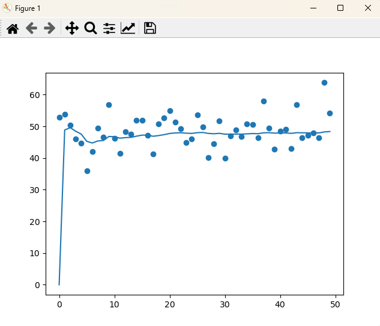

## 卡尔曼滤波器学习笔记

> [`【卡尔曼滤波器】_DR_CAN合集`学习笔记](https://www.bilibili.com/video/BV1ez4y1X7eR)

卡尔曼滤波器(Kalman Filter)
- 不是一般意义上的滤波器
- 是一种最优化递归数字处理**算法**(optimal recursive data processing algorithm)
- 更像是一种**观测器**(observer)

卡尔曼滤波器广泛应用的原因：世界中存在大量不确定性
- 不存在完美的数学模型
- 系统的扰动不可控，难以建模
- 测量的传感器存在误差

## 递归算法

案例：
- 用尺子多次`测量`硬币的直径$Z$，
- 使用求平均数的方式`估计`硬币真实直径$\hat{X}$。

测量结果

| 第n次测量结果$Z_n$ |
| :----------------: |
|    $Z_1=50.1mm$    |
|    $Z_2=50.4mm$    |
|    $Z_2=50.2mm$    |

**求平均数公式推导递归算法：**

$$
\begin{align*}
    \hat{X}_n &= \frac{1}{n}(Z_1+Z_2+\dots+Z_n) \\
              &= \frac{1}{n}(Z_1+Z_2+\dots+Z_{n-1})+\frac{1}{n}Z_n \\
              &= \frac{n-1}{n}\frac{1}{n-1}(Z_1+Z_2+\dots+Z_{n-1})+\frac{1}{n}Z_n \\
              &= \frac{n-1}{n}\hat{X}_{n-1}+\frac{1}{n}Z_n \\
              &= \hat{X}_{n-1}-\frac{1}{n}\hat{X}_{n-1}+\frac{1}{n}Z_n \\
              &= \hat{X}_{n-1}-\frac{1}{n}(Z_n-\hat{X}_{n-1}) \\
\end{align*}    
$$

**结论**
$$
    \hat{X}_n = \hat{X}_{n-1}-\frac{1}{n}(Z_n-\hat{X}_{n-1}) \\
    \text{本次估计} = \text{上次估计} + \frac{1}{n}(\text{本次测量}-\text{上次估计})    \\
$$
$$
    n\to+\infty; \frac{1}{n}\to 0; \hat{X}_n \to \hat{X}_{n-1}; \\
    \text{随着测量次数增加；测量结果不再重要；估计值逐渐稳定；}\\
    n\to0; \frac{1}{n}\to +\infty; \hat{X}_n \to Z_n; \\
    \text{测量次数较小时；测量结果作用较大；估计值受测量结果影响较大；}\\
$$

## 卡尔曼增益K

把上面案例中的系数$\frac{1}{n}$换成代表卡尔曼增益的系数K,

那么就得到了卡尔曼滤波算法中的第一个公式：

$$
    \hat{X}_n = \hat{X}_{n-1}+K_n(Z_n-\hat{X}_{n-1}) \\
    \text{本次估计} = \text{上次估计} + \text{增益系数K}(\text{本次测量}-\text{上次估计})
$$

其中卡尔曼增益K

$$
K_n=\frac{e_{EST_{n-1}}}{e_{EST_{n-1}}+e_{MEA_{n}}} \\

\text{本次卡尔纳曼增益} = \frac{\text{上次估计误差}}{\text{上次估计误差+本次测量误差}}
$$

分析：
- $\text{估计误差} \gg \text{测量误差} ; K \to 1 ; \text{本次估计} \to \text{本次测量};$
- $\text{估计误差} \ll \text{测量误差} ; K \to 0 ; \text{本次估计} \to \text{上次估计};$

## 卡尔曼滤波计算三步骤

**第一步:计算卡尔曼增益**

$$
K_n=\frac{e_{EST_{n-1}}}{e_{EST_{n-1}}+e_{MEA_{n}}}
$$

**第二步：计算估计值**

$$
\hat{X}_n = \hat{X}_{n-1}+K_n(Z_n-\hat{X}_{n-1}) \\
$$

**第三步：更新估计误差**

$$
e_{EST_{n}}=(1-K_n)e_{EST_{n-1}}
$$

**案例**

@[code python](./projects/01.递归算法.py)

