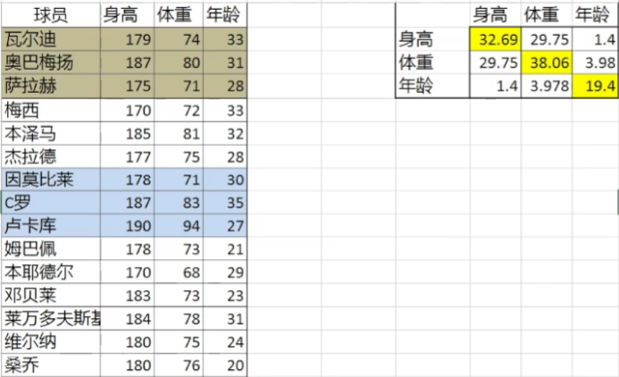

## 卡尔曼滤波器学习笔记

> [`【卡尔曼滤波器】_DR_CAN合集`学习笔记](https://www.bilibili.com/video/BV12D4y1S7fU)

## 协方差矩阵（Covariance Matrix）

**方差**

- **定义**：方差衡量数据相对于均值的离散程度，是统计学中描述数据波动大小的重要指标。
- **计算公式**：
  $$
  \text{Var}(X) = \frac{1}{n} \sum_{i=1}^{n} (x_i - \mu)^2
  $$
  其中，$X$ 是随机变量，$x_i$ 是数据点，$\mu$ 是均值，$n$ 是数据点的数量。
- 说明:
  - 方差计算的是各个数据点与均值之差的平方的平均值。
  - 方差值越大，表示数据点越分散；
  - 方差值越小，表示数据点越集中.

**协方差**

- **定义**：协方差是衡量两个随机变量之间线性相关程度的统计量.
- **计算公式**：
  $$
  \text{Cov}(X, Y) = \frac{1}{n} \sum_{i=1}^{n} (x_i - \mu_X)(y_i - \mu_Y)
  $$
  其中，$X$ 和 $Y$ 是两个随机变量，$x_i$ 和 $y_i$ 分别是 $X$ 和 $Y$ 的数据点，$\mu_X$ 和 $\mu_Y$ 分别是 $X$ 和 $Y$ 的均值，$n$ 是数据点的数量.
- **相关性体现**：
  - 当 $(x_i - \mu_X)(y_i - \mu_Y)$ 为同号相乘（即 $x_i$ 和 $y_i$ 同时高于或低于各自均值），乘积为正，累加后为正，体现正相关.
  - 当 $(x_i - \mu_X)(y_i - \mu_Y)$ 为异号相乘（即 $x_i$ 高于均值而 $y_i$ 低于均值，或反之），乘积为负，累加后为负，体现负相关.
- **协方差取值含义**：
  - 如果协方差为正，表示两个变量正相关；
  - 如果协方差为负，表示两个变量负相关；
  - 如果协方差为零，表示两个变量不相关

**协方差矩阵**

- 将方差和协方差写在一个矩阵中,体现变量间的联动关系:离散程度和相关性.
- **计算公式**:
  $$
  \begin{align*}
      \mathbf{\Sigma}(X,Y,Z)
      &= \begin{bmatrix}
          \text{Cov}(X, X) & \text{Cov}(X, Y) & \text{Cov}(X, Z) \\
          \text{Cov}(Y, X) & \text{Cov}(Y, Y) & \text{Cov}(Y, Z) \\
          \text{Cov}(Z, X) & \text{Cov}(Z, Y) & \text{Cov}(Z, Z) \\
      \end{bmatrix} \\
      &= \begin{bmatrix}
          \text{Var}(X) & \text{Cov}(X, Y) & \text{Cov}(X, Z) \\
          \text{Cov}(Y, X) & \text{Var}(Y) & \text{Cov}(Y, Z) \\
          \text{Cov}(Z, X) & \text{Cov}(Z, Y) & \text{Var}(Z) \\
      \end{bmatrix} \\
  \end{align*}
  $$
- 主对角线上元素体现的是随机变量的方差，非对角线上元素体现的是两个随机变量之间的协方差。
- **构造过度矩阵A**:
  $$
  \begin{align*}
    A(X,Y,Z)
    &= \begin{bmatrix}
   x_1 - \bar{x} & y_1 - \bar{y} & z_1 - \bar{z} \\
   x_2 - \bar{x} & y_2 - \bar{y} & z_2 - \bar{z} \\
   x_3 - \bar{x} & y_3 - \bar{y} & z_3 - \bar{z} \\
   \end{bmatrix} & \text{(各个元素和均值的偏差)} \\
   &= \begin{bmatrix}
        x_1 & y_1 & z_1 \\
        x_2 & y_2 & z_2 \\
        x_3 & y_3 & z_3 \\
    \end{bmatrix}
    - \begin{bmatrix}
        \bar{x} & \bar{y} & \bar{z}  \\
        \bar{x} & \bar{y} & \bar{z}  \\
        \bar{x} & \bar{y} & \bar{z}  \\
    \end{bmatrix} \\
   &= \begin{bmatrix}
        x_1 & y_1 & z_1 \\
        x_2 & y_2 & z_2 \\
        x_3 & y_3 & z_3 \\
    \end{bmatrix}
    - \frac{1}{3}
    \begin{bmatrix}
        x_1 + x_2 + x_3 & y_1 + y_2 + y_3 & z_1 + z_2 + z_3 \\
        x_1 + x_2 + x_3 & y_1 + y_2 + y_3 & z_1 + z_2 + z_3 \\
        x_1 + x_2 + x_3 & y_1 + y_2 + y_3 & z_1 + z_2 + z_3 \\
    \end{bmatrix} \\
    &= \begin{bmatrix}
        x_1 & y_1 & z_1 \\
        x_2 & y_2 & z_2 \\
        x_3 & y_3 & z_3 \\
    \end{bmatrix}
    - \frac{1}{3}
    \begin{bmatrix}
        1 & 1 & 1 \\
        1 & 1 & 1 \\
        1 & 1 & 1 \\
    \end{bmatrix}
    \begin{bmatrix}
        x_1 & y_1 & z_1 \\
        x_2 & y_2 & z_2 \\
        x_3 & y_3 & z_3 \\
    \end{bmatrix} \\
  \end{align*}
  $$
- **通过过渡矩阵A求协方差矩阵**:
  $$
  \begin{align*}
      \mathbf{\Sigma}(X,Y,Z)
      &= \begin{bmatrix}
          \text{Cov}(X, X) & \text{Cov}(X, Y) & \text{Cov}(X, Z) \\
          \text{Cov}(Y, X) & \text{Cov}(Y, Y) & \text{Cov}(Y, Z) \\
          \text{Cov}(Z, X) & \text{Cov}(Z, Y) & \text{Cov}(Z, Z) \\
      \end{bmatrix} \\
      &= \begin{bmatrix}
          \frac{1}{n} \sum_{i=1}^{n} (x_i - \bar{X})(x_i - \bar{X}) & \frac{1}{n} \sum_{i=1}^{n} (x_i - \bar{X})(y_i - \bar{Y}) & \frac{1}{n} \sum_{i=1}^{n} (x_i - \bar{X})(z_i - \bar{Z}) \\
          \frac{1}{n} \sum_{i=1}^{n} (y_i - \bar{Y})(x_i - \bar{X}) & \frac{1}{n} \sum_{i=1}^{n} (y_i - \bar{Y})(y_i - \bar{Y}) & \frac{1}{n} \sum_{i=1}^{n} (y_i - \bar{Y})(z_i - \bar{Z}) \\
          \frac{1}{n} \sum_{i=1}^{n} (z_i - \bar{Z})(x_i - \bar{X}) & \frac{1}{n} \sum_{i=1}^{n} (z_i - \bar{Z})(y_i - \bar{Y}) & \frac{1}{n} \sum_{i=1}^{n} (z_i - \bar{Z})(z_i - \bar{Z}) \\
      \end{bmatrix} \\
      &= \frac{1}{3}
      \begin{bmatrix}
     x_1 - \bar{x} & x_2 - \bar{x} & x_3 - \bar{x} \\
     y_1 - \bar{y} & y_2 - \bar{y} & y_3 - \bar{y} \\
     z_1 - \bar{z} & z_2 - \bar{z} & z_3 - \bar{z} \\
     \end{bmatrix}
     \begin{bmatrix}
     x_1 - \bar{x} & y_1 - \bar{y} & z_1 - \bar{z} \\
     x_2 - \bar{x} & y_2 - \bar{y} & z_2 - \bar{z} \\
     x_3 - \bar{x} & y_3 - \bar{y} & z_3 - \bar{z} \\
     \end{bmatrix} \\
      &=\frac{1}{3}A^TA
    \end{align*}
  $$

**案例**

@[code python](./projects/03.协方差矩阵.py)

