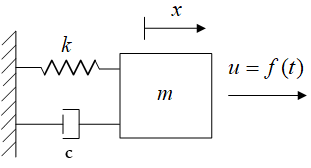

## 卡尔曼滤波器学习笔记

> [`【卡尔曼滤波器】_DR_CAN合集`学习笔记](https://www.bilibili.com/video/BV12D4y1S7fU)

## 状态空间方程

状态空间方程是控制理论和系统工程中用来描述线性时不变系统的一种方法。它由一组一阶微分方程组成，这些方程描述了系统状态变量随时间的变化。状态空间方程的一般形式如下：

$$
\dot{\mathbf{x}}(t) = A\mathbf{x}(t) + B\mathbf{u}(t)
$$

$$
\mathbf{y}(t) = C\mathbf{x}(t) + D\mathbf{u}(t)
$$

其中：
- $\mathbf{x}(t)$ 是系统状态向量，它包含了描述系统状态的所有变量。
- $\dot{\mathbf{x}}(t)$ 是状态向量的导数，表示状态变量随时间的变化率。
- $\mathbf{u}(t)$ 是输入向量，包含了所有作用于系统的外部输入。
- $\mathbf{y}(t)$ 是输出向量，包含了系统的所有输出。
- $A$ 是系统矩阵，描述了系统内部状态之间的相互关系。
- $B$ 是输入矩阵，描述了输入如何影响系统状态。
- $C$ 是输出矩阵，描述了系统状态如何影响输出。
- $D$ 是直通矩阵，描述了输入直接如何影响输出。

状态空间方程可以用于分析和设计控制系统，包括稳定性分析、可控性、可观测性、状态反馈控制和状态估计等。

## 弹簧阻尼质量系统

弹簧阻尼质量系统是一个经典的物理系统，通常用于描述机械振动问题。该系统由一个质量 $m$，一个弹簧 $k$ 和一个阻尼器 $c$ 组成。假设质量 $m$ 只能沿直线运动，弹簧的弹性系数为 $k$，阻尼器的阻尼系数为 $c$。

### 系统描述
- **质量 $m$**：系统的惯性部分，决定了系统的加速度.
- **弹簧 $k$**：弹性部分，提供恢复力，与位移成正比.
- **阻尼器 $c$**：耗散部分，提供阻力，与速度成正比.

### 系统的运动方程

根据牛顿第二定律，作用在质量 $m$ 上的净力等于质量乘以加速度：

$$
F_{\text{net}} = m \ddot{x}
$$

在弹簧阻尼质量系统中，作用在质量上的力包括：
- 弹簧力 $F_k = -kx$（根据胡克定律，方向与位移相反）
- 阻尼力 $F_c = -c \dot{x}$（方向与速度相反）
- 外部作用力 $u$

因此，净力 $F_{\text{net}}$ 可以表示为这些力的总和：

$$
F_{\text{net}} = F_k + F_c + u = -kx - c \dot{x} + u
$$

将净力的表达式代入牛顿第二定律，得到：

$$
m \ddot{x} = -kx - c \dot{x} + u
$$

重新排列项，得到系统的运动方程：

$$
m \ddot{x} + c \dot{x} + k x = u
$$

其中：
- $x$ 是质量的位移.
- $\dot{x}$ 是速度.
- $\ddot{x}$ 是加速度.
- $u$ 是外部作用力.

### 状态空间表示
为了将上述二阶微分方程转换为状态空间方程，我们引入状态向量 $\mathbf{x}$ 和输入向量 $\mathbf{u}$：

- 状态向量 $\mathbf{x}$ 定义为：
  $$
  \mathbf{x} = \begin{bmatrix} x \\ \dot{x} \end{bmatrix}
  $$

- 输入向量 $\mathbf{u}$ 定义为：
  $$
  \mathbf{u} = u
  $$

- 输出向量 $\mathbf{y}$ 可以是位移 $x$ 或速度 $\dot{x}$，这里假设输出为位移：
  $$
  \mathbf{y} = x
  $$

### 状态空间方程
将上述定义代入，得：

$$
\begin{align*}
  \dot{x} &= \dot{x} &= 0x+1\dot{x} + 0u \\ 
  \ddot{x} &= \frac{u-c\dot{x}-kx}{m} &= -\frac{k}{m}x-\frac{c}{m}\dot{x}+\frac{1}{m}u \\
  x &= x &= 1x+0\dot{x}+0u\\
\end{align*}
$$

即得到状态空间方程：

$$
\dot{\mathbf{x}}
=\begin{bmatrix}
    \dot{x} \\ 
    \ddot{x}
\end{bmatrix}
=\begin{bmatrix}
    0 & 1 \\ 
    -\frac{k}{m} & -\frac{c}{m}
\end{bmatrix}
\begin{bmatrix}
    x \\ 
    \dot{x}
\end{bmatrix}+
\begin{bmatrix}
    0 \\ 
    \frac{1}{m}
\end{bmatrix}
u
$$

$$
\mathbf{y} = \begin{bmatrix} 1 & 0 \end{bmatrix} \begin{bmatrix} x \\ \dot{x} \end{bmatrix} + 0 \cdot u
$$

因此，状态空间方程的矩阵形式为：

$$
\begin{align*}
    \dot{\mathbf{x}} &= A \mathbf{x} + B \mathbf{u} \\
    \mathbf{y} &= C \mathbf{x} + D \mathbf{u}
\end{align*}
$$

其中：
- $A = \begin{bmatrix} 0 & 1 \\ -\frac{k}{m} & -\frac{c}{m} \end{bmatrix}$
- $B = \begin{bmatrix} 0 \\ \frac{1}{m} \end{bmatrix}$
- $C = \begin{bmatrix} 1 & 0 \end{bmatrix}$
- $D = 0$

这些方程描述了弹簧阻尼质量系统的动态行为，可以用于进一步的分析和控制设计.

### 状态空间方程离散化：欧拉法（Euler Method）

欧拉法（Euler Method），也称为前向欧拉法或前向差分法。这种方法是一种简单的数值积分方法，用于将连续时间系统离散化。

**基本思想**

通过差分近似来替代微分。具体来说，它使用以下公式来近似状态变量的导数：

$$
\dot{x} \approx \frac{x_{k+1} - x_k}{T}
$$

其中：
- $x_k$ 是在第 $k$ 个采样点的状态向量.
- $x_{k+1}$ 是在第 $k+1$ 个采样点的状态向量.
- $T$ 是采样周期.

对于连续时间状态空间方程：

$$
\begin{align*}
    \dot{\mathbf{x}} &= A \mathbf{x} + B \mathbf{u} \\
    \mathbf{y} &= C \mathbf{x} + D \mathbf{u}
\end{align*}
$$

对状态方程进行离散化，得：

$$
\begin{align*}
  \dot{\mathbf{x}}(t) &= A \mathbf{x}(t) + B \mathbf{u}(t) \\
  \frac{\mathbf{x}_{k+1} - \mathbf{x}_k}{T} &= A \mathbf{x}_k + B \mathbf{u}_k \\
  \mathbf{x}_{k+1} &= \mathbf{x}_k + T (A \mathbf{x}_k + B \mathbf{u}_k) \\
  \mathbf{x}_{k+1} &= (I + T A) \mathbf{x}_k + T B \mathbf{u}_k
\end{align*}
$$

对输出方程进行离散化，得：

$$
\begin{align*}
    \mathbf{y}(t) &= H\mathbf{x}(t) + J\mathbf{u}(t) \\
    \mathbf{y}_k &= H\mathbf{x}_k + J\mathbf{u}_k \\
\end{align*}
$$

综上，得：
$$
\begin{cases}
    \mathbf{x}_{k+1} &= \Phi \mathbf{x}_k + \Gamma \mathbf{u}_k \\
    \mathbf{y}_k &= H\mathbf{x}_k + J\mathbf{u}_k \\
\end{cases}
$$

**其中**
$$
\begin{align*}
  \Phi &= I + T A \\
  \Gamma &= T B \\
  H &= C \\
  J &= D
\end{align*}
$$

> 欧拉法是一种简单而直观的离散化方法，适用于初步的系统分析和仿真。然而，由于其线性近似，欧拉法在精度和稳定性方面可能不如其他更复杂的离散化方法（如零阶保持法）。欧拉法的主要优点是计算简单，适用于实时控制系统和初步仿真.

## 不确定性

由于世界中存在大量不确定性：
- 不存在完美的数学模型、
- 测量传感器存在误差。

所以，可以引入噪声，以反映真实世界中的不确定性。
- 过程噪声（Process Noise）：$\mathbf{w}_{k-1}$
- 测量噪声(Measurement Noise)：$\mathbf{v}_k$

$$
\begin{cases}
    \mathbf{x}_{k+1} &= \Phi \mathbf{x}_k + \Gamma \mathbf{u}_k + \mathbf{w}_{k-1} \\
    \mathbf{y}_k &= H\mathbf{x}_k + J\mathbf{u}_k + \mathbf{v}_k \\
\end{cases}
$$

上式中 $\mathbf{x}_{k+1}$是一个包含过程噪声的计算值，$\mathbf{y}_k$是一个包含测量噪声的测量值。

使用卡尔曼滤波器进行**数据融合（Data Fusion）**,就能获得出一个噪声更小的估计值$\hat{X}_k$