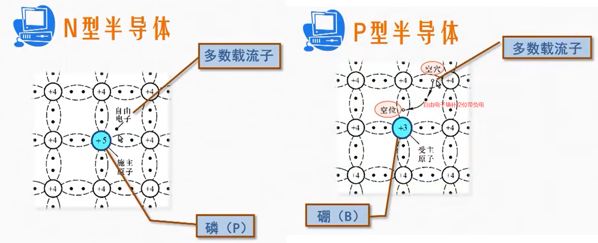
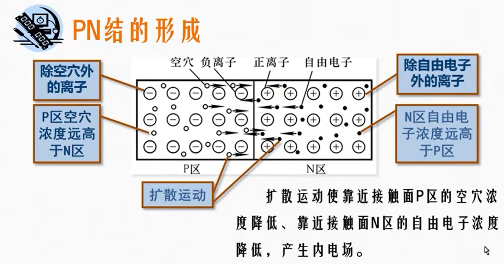
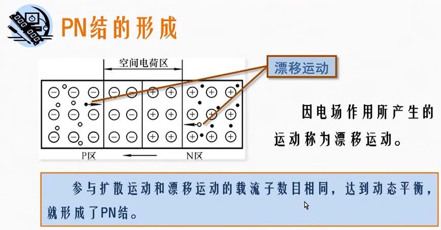
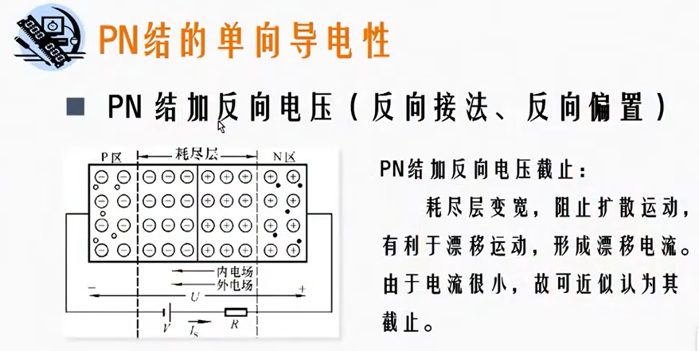

# 模拟电路

## 本征半导体

- 导体：金属，低价元素，原子核对最外层电子束缚力弱，在电场力作用下容易形成电子流
- 绝缘体：橡胶，原子核对最外层电子束缚力强，外电场强到一定程度才能形成电流
- 半导体：硅Si、锗Ge,正4价元素，原子核对最外层电子束缚力介于导体和绝缘体之间
- 本征半导体：纯净（无杂质）、晶体结构（形成共价键的稳定结构）的半导体
  - 晶体结构：如图，是形成共价键的稳定结构
  - 因热运动，具有足够能量的价电子挣脱共价键束缚成为自由电子，自由电子带负电，电子离开，留下空穴，带正电
  - 自由电子填补空穴，称为复合
  - 温度不变，自由电子和空穴的浓度一定（挣脱共价键的电子数=复合空穴的自由电子数），温度升高，热运动加剧，挣脱共价键的电子增多，空穴增多，浓度升高
  - 自由电子和空穴成对出现，一个自由电子对应一个空穴
  - 运载电荷的粒子称为载流子
    - 自由电子运载负电荷
    - 空穴运载正电荷
    - 在外加电场的作用下，自由电子和空穴都参加导电，运动方向相反，
    - 自由电子通过向空穴所在位置移动运载负电荷
    - 空穴通过被自由电子从反方向上填补来移动运载正电荷
      - 或者说，空穴抢来一个其他原子的电子，然后因电子被抢，产生空穴，带正电，通过这种方式，空穴移动，运载正电荷
    - 由于结构稳定，电子难以挣脱共价键，载流子少，导电性差
    - 热力学温度0k时，不导电
    - 温度升高，热运动加剧，载流子浓度增大，导电性增强
  - 从半导体变到本征半导体，因为形成了共价键，导电性能变差了。
  - 

## 掺杂半导体

**N型半导体**

- 掺杂元素：+5价的磷P元素
- 掺杂结果：
  - 5价元素周围多1个自由电子，磷元素呈现电中性
  - 掺杂N个磷元素就多N个自由电子，
  - 这些参入的自由电子就是多数载流子
  - 因热运动，
    - 共价键上产生了一对自由电子和空穴，
    - 空穴可能有机会抢走磷原子的电子，磷原子失去电子变成正离子
    - 空穴可能还是空穴，成为少数载流子
    - 自由电子还是自由电子，成为多数载流子
    - 空穴可能被磷原子的电子占领，空穴变少了，自由电子变多了
  - 空穴的浓度 < 自由电子的浓度
  - 参杂半导体主要靠多数载流子导电，参入杂质越多，导电性越强
  - 几个问题
    - 温度变化对载流子数目的影响：
      - 热运动加剧，价电子挣脱共价键束缚产生自由电子和空穴，载流子增多
    - 少子与多子的变化数目：
      - 出现一个自由电子就会出现一个空穴
      - 变化数目是相同的
    - 少子与多子的浓度变化：
      - 假设一块半导体参杂98个磷元素，在一定温度下，有2个自由电子和空穴
      - 然后温度升高，又有2个自由电子和空穴产生
      - 多数载流子从98+2变成了98+2+2，变化率为百分之2
      - 少数载流子从2个变成了2个，变化了为百分之100

**P型半导体**

- 掺杂元素：+3价的硼B元素
- 掺杂结果：
  - +3价元素周围多一个空位（空穴带正电，空位不带电），硼元素呈现电中性
  - 掺杂N个硼元素，就多N个空位，
  - 参杂的空位是多数载流子
  - 因热运动，
    - 共价键上产生了一对自由电子和空穴，
    - 自由电子可能有机会跑到了硼原子的空位上，硼原子得到电子变成负离子
    - 自由电子可能还是自由电子，成为少数载流子
    - 空穴还是空穴，成为多数载流子
    - 自由电子可能跑到了硼原子的空位上，自由电子变少了，空穴变多了
  - 自由电子的浓度 < 空穴的浓度
  - 导电性变强
  - 空穴为多数载流子

## PN结

> - 气体、液体、固体，因浓度差异而产生的运动称为扩散运动，这是由分子的运动而产生的
>   - 气体的扩散：食堂门口的菜香
>   - 液体的扩散：滴入清水的墨水
>   - 固体的扩散：堆放煤炭的白墙由外到内变黑
>   - 气体最活泼，固体最稳定，扩散速度同理

**PN结**

- 在同一块本征半导体上掺杂不同的元素，形成不同的区域
- P区：
  - p区，positive，掺杂的是+3价的硼，多一个空位，
  - **空穴**：共价键上的电子离开后留下空穴，硅少一个电子，成空穴，带正电
  - **负离子**：共价键上的电子来到硼的空位上，硼多一个电子成负离子，带负电
- N区
  - n区，negative，掺杂的是+5价的磷，多一个电子，
  - **自由电子**：共价键上的电子离开后变成自由离子，自由离子带负电
  - **正离子**：共价键上的电子离开后留下空穴，空穴吸引磷的电子，磷缺少电子后带正点
- 扩散运动：
  - 在P区和N区交接附近，由于浓度差异的原因，产生的扩散运动
  - P区空穴向N区运动
  - N区自由电子向P区运动
- 内电场：
  - 在P区和N区交接附近，由于扩散运动，
  - P区只剩下负离子
  - N区只剩下正离子
  - P区带负电，N区带正电，这就形成了电场，
  - 电场的建立阻止了扩散运动的进行
    - 扩散运动，空穴（正电荷）的移动的方向为P->N
    - 电场方向(从正指向负)为N->P,
- 漂移运动
  - 漂移运动是由于内电场作用而产生的运动
  - 由于内电场的建立，（内电场的方向是N->P），
  - 这就使得N区的空穴，也就是N区的少数载流子，在电场力的作用力下向P区运动
  - 同样使得P区的电子，也就是P区的少数载流子，在电场力的作用力下向N区运动
- PN结的形成
  - 因扩散运动而形成了内电场，而内电场又阻碍扩散运动继续进行，
  - 自由电子因扩散运动过去多少（N->P），
  - 就有多少空穴因漂移运动而过来多少(P->N)
  - 达到动态平衡，就形成了PN结形成
- 空间电荷区
  - 因扩散运动和漂移运动而在PN结交界面产生的很薄的电荷区
  - 也叫耗尽层，区域内的空穴和自由电子都耗尽了
- 
- 

**PN结正偏**

- 给PN结接上正向电压，正向电压可以抵消空间电荷区的内电场，
- 使得阻碍扩散运动的电场力消失，使得耗尽层变窄并最终消失，
- 使得扩散运动加剧，形成电流，PN结导通
- 注意电阻是必须的，否则电流过大，PN结温度升高，PN结将烧坏烧断
- 

**PN结反偏**

- 给PN结加反向电压，方向电压将叠加到空间电荷区的内电场上，
- 使得扩散运动被阻止，漂移运动被增强，耗尽层变宽，
- 漂移电流被增强，但参与漂移运动的是少数载流子，
- 电流依然微不足道，故可认为PN结截至
- 

**讨论**

- 半导体器件的温度稳定性差，因为不管是本征半导体，参杂半导体，还是PN结，他们的整个工作过程都受温度影响，
  - 温度升高，本征半导体的载流子增多，导电性能增强，
  - 温度升高，参杂半导体的少数载流子增多，参杂半导体性能变化（如何变化？）
  - 温度升高，PN结半导体的少数载流子增多，PN结半导体性能变化（如何变化？）
- 少数载流子对温度稳定性影响大。
