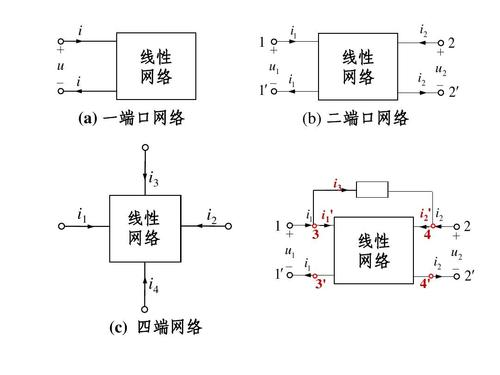

## 端口

- **定义**：**有两个接线端**的且满足**端口条件**的称为**一个端口**
- **端口条件**：流入一个接线端的电流等于流出另一个的电流

**一端口网络和二端口网络**

- 一端口网络：有**一个端口**的网络
- 二端口网络：有**两个端口**的网络
  - （也就是说这两个端口都分别满足**端口条件**）

**无源**/**有源**一端口网络：

- **简单来说：**
  - **吸收功率的是无源一端口，发出功率的是有源一端口**
- **定义:**
  - 对于**任何时刻 t**，**关联参考方向下**端口**吸收功率**的瞬时积分都 **大于等于`0`** 的网络是无源一端口
  - 

**例子**

- 电阻是无源一端口网络
- 电压源是有源一端口网络

**推广**

- 关联参考方向，也称**无源符号约定**
- 非关联参考方向，也称**有源符号约定**

