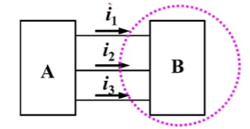

## KCL KVL 基尔霍夫电压/电流定律

**KCL 定义:**

- 流入**节点**的**电流**的代数和为 0
  - 
- **流入节点的电流和**等于**流出节点的电流和**
  - 
- 推广：流入网络的电流的代数和为 0
  - 

**KVL 定义:**

- 任何**回路**的**电压降**的代数和为 0
  - 
- 任何回路的**电压升的和**等于该回路的**电压降的和**
  - 
- 推广：两**节点**之间的任意两条**路径**(不论该路径包含多少支路)的**电压降的代数和**为 0
  - 

**前置概念：五个名词**

- **支路**：支路 是 由**元件** **端到端连接**组成的,并且是**没有分支**的
- **节点**：节点 是 连接至少 3 个或更多**支路**的点
- **路径**：路径 是 两个**节点**之间的**通路**，由至少一条或多条**支路**组成
- **回路**：回路 是 闭合的**路径**，由**支路**组成
- **网格**：网格 是 和**支路**没有**相交(intersection)**的**回路**；仅在**平面电路**中存在

**补充知识：什么是元件约束和拓扑约束**

- **元件约束**是由元件本身的属性决定的
  - 如电阻、受控源上的电压关系
  - 如独立源所输出的电压、电流
- **拓扑约束**就是 `KCL` 和 `KVL`
- 有了元件约束和拓扑约束才能求解方程
