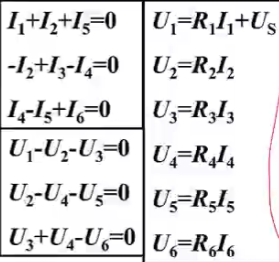

## 2B 法

**概念：** 对于 b 个支路，能列写出 2b 可方程，从而求解出 b 个支路的电压和电流

**案例分析：如何列写求解电路所需的方程**

**分析**

- 支路数 b=6
- 节点数 n=4
- 网孔数 m=3

**列写方程**

- 根据元件约束，
  - 能够列写出 b 个支路的电压电流关系方程【显然】
- 根据拓扑约束，
  - KCL
    - 能列写出**n 个** KCL 的方程，
    - **但只有 n-1 个是独立的**，【证明起来不难】
    - 因为其中任意 n-1 个方程就能推导出最后一个方程
    - **所以对于有 n 个节点的电路，任意选 n-1 个节点来列写 KCL 方程即可**
  - KVL
  - 能列写出**很多个** KVL 方程，
  - **但只有 b-n+1 个是独立的**，【证明起来比较困难】
  - **使用网孔回路列写的 KVL 方程一定是独立的**
- 所以总共能列写出 `b+(n-1)+(b-n+1) = 2b` 个方程
- 
