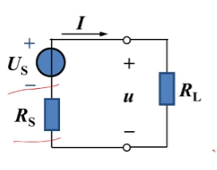
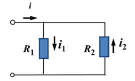
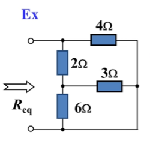
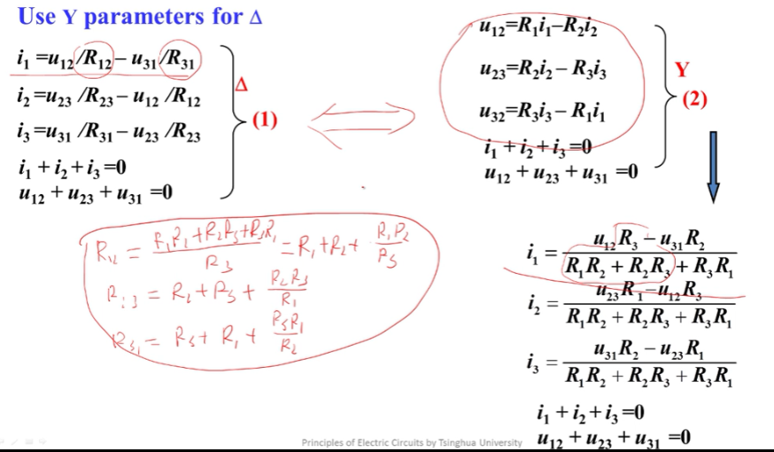
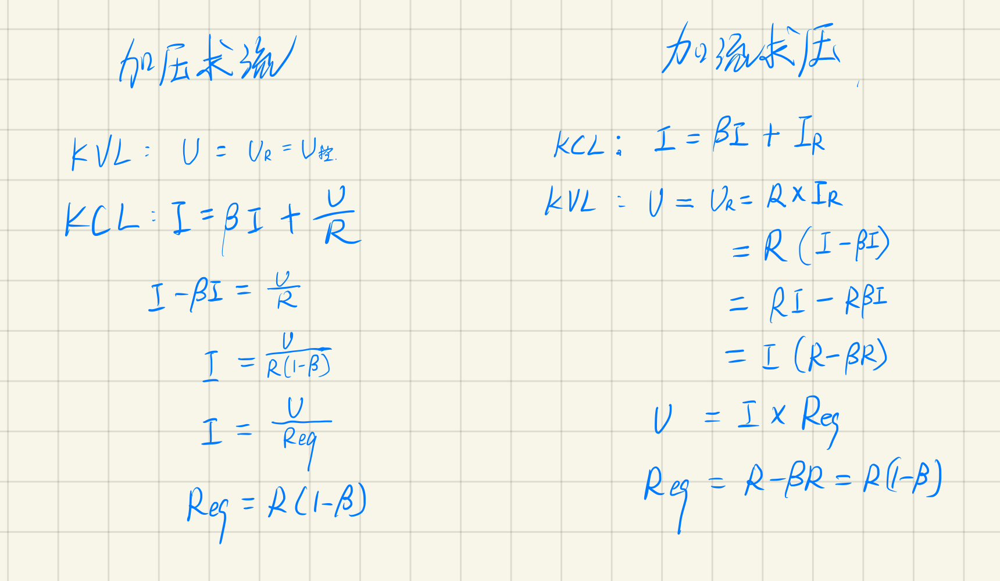
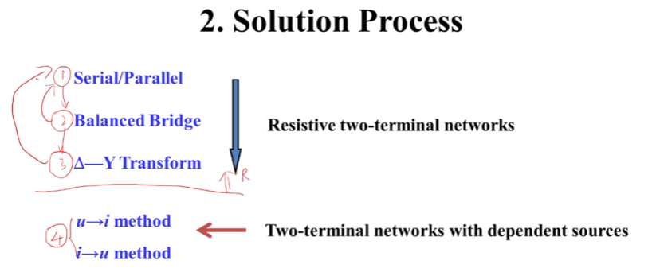
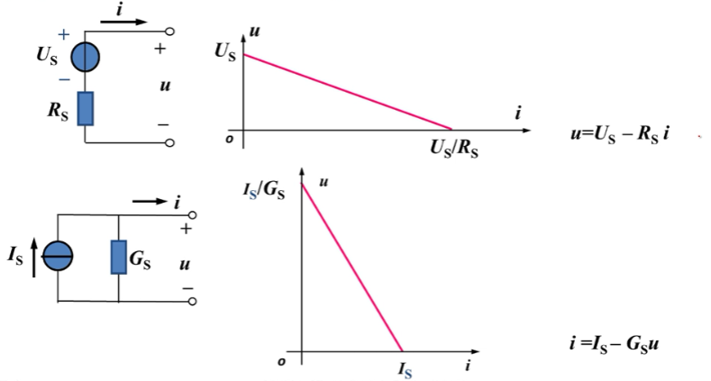

## 等效

### 电阻等效

**前置概念：**

- 二端网络：包含电阻、独立源、受控源的网络
- 不含独立源的二端网络：仅包含电阻、受控源的网络

**等效概念：**

- 对于**不含独立源的二端网络**，其**总能等效成一个电阻**
- **等效**的两个子电路，各自在端口上的电压和电流的关系有相同的**形式**和**参数**
  - 举例来说：
    - **相同的形式**：左边的电路: `U=[?]I` ; 右边的电路: `U=[Req]I` ;
    - **相同的参数**：`[?] = [Req]` ;
    - 

#### 电阻串联等效

**推导过程：**

- **列方程**
  - 元件约束:
    - $u_1 = i_1*r_1$
    - $u_2 = i_2*r_2$
    - $u_k = i_k*r_k$
    - $u_n = i_n*r_n$
  - KVL: $U=u_1+u_2+u_k+u_n$
  - KCL: $I=i_1=i_2=i_k=i_n$
- **解之得**：
  - $$U=i_1*r_1+i_2*r_2+i_k*r_k+i_n*r_n$$
  - $$U=I*r_1+I*r_2+I*r_k+I*r_n$$
  - $$U=(r_1+r_2+r_k+r_n)*I$$
  - $$R_{eq} = r_1+r_2+r_k+r_n\tag{最终结论}$$

**推广：分压器**

- 串联电路，$\frac{\text{电压}}{\text{总电压}}/=\frac{\text{电阻}}{\text{总电阻}}$
- 
- $$ \frac{u_1}{u} = \frac{r_1*i_1}{r*i} = \frac{r_i}{r} $$
- $$u_1=\frac{r_1}{r}u$$

**推广：电压信号源最大电压传输**

- 
- $$u\uparrow=\frac{R_L\uparrow}{R_L\uparrow+R_S\downarrow}U_S$$
- **要想使负载获得的电压信号尽可能的大**，**负载的电阻要尽可能大**，**信号源内阻要尽可能小**。

#### 电阻并联的等效

**推导过程：**

- **列方程：**
  - 元件约束:
    - $i_1 = g_1*u_1$
    - $i_2 = g_2*u_2$
    - $i_k = g_k*u_k$
    - $i_n = g_n*u_n$
  - KVL: $U=u_1=u_2=u_k=u_n$
  - KCL: $I+i_1+i_2+i_k+i_n$
- **解之得**：
  - $$I=g_1*u_1+g_2*u_2+g_k*u_k+g_n*u_n$$
  - $$I=g_1*U+g_2*U+g_k*U+g_n*U$$
  - $$I=(g_1+g_2+g_k+g_n)*U$$
  - $$G_{eq}=g_1+g_2+g_k+g_n\tag{结论}$$

**推广:分流器**

- 并联电导，$\frac{\text{电流}}{\text{总电流}}/=\frac{\text{电导}}{\text{总电导}}$
- 
- $$ \frac{i_1}{i} = \frac{g_1*u_1}{g*u} = \frac{g_i}{g} $$
- $$i_1=\frac{g_1}{g}i$$

**两电阻分流的特殊结论**

- 
- $$i_1=\frac{g_1}{g_1+g_2}i$$
- $$i_1=\frac{1/r_1}{1/r_1+1/r_2}i$$
- $$i_1=\frac{1/r_1}{1/r_1+1/r_2}i\tag{上下同乘$r_1$}$$
- $$i_1=\frac{1}{1+r_1/r_2}i\tag{上下同乘$r_2$}$$
- $$i_1=\frac{r_2}{r_2+r_1}i$$
- 即：**两电阻**分流，
  - $r_1$的分到的电流为: $r_2/(r_1+r_2)*i$
  - $r_2$的分到的电流为: $r_1/(r_1+r_2)*i$

**推广：电流信号源最大电流传输**

- 
- $$i\uparrow=\frac{G_L\uparrow}{G_L\uparrow+G_S\downarrow}I_S$$
- **要想使负载获得的电流信号尽可能的大**，**负载的电导要尽可能大**，**电流信号源内阻的电导要尽可能小**。
- **要想使负载获得的电流信号尽可能的大**，**负载的电阻要尽可能小**，**电流信号源内阻的阻值要尽可能大**。

#### 电阻的串并联等效

**两种解法：**

- 方法 1： 并联或串联等效内部电阻
- `( 6 // 3 + 2 ) // 4 = 2Ω`
- 
- 方法 2： 并联或串联等效直接连接在接线端上的电阻
- `4 // ( 2 + 6 // 3 ) = 2Ω`
- 

#### 平衡电桥

**前置知识**

- 等电位点：电位相同的点
- 等电位点之间的开路电压为 0
- 等电位点之间连接任意阻值的电阻对其他支路的支路量没有任何影响，
- 因为等电位点之间没有电压降，所以没有电流

**平衡电桥概念**：

- 当电桥两侧电阻值**交叉相乘**`相等`时，电桥两端的**电位相等**，其上连接的电阻可以忽略
- 即$R_1R_4=R_2R3$时，$AB$两点为等点位点
- 换种说法其实就是$\frac{R1}{R2}=\frac{R3}{R4}$
- 
- 

**推广：平衡点桥测电阻**

- 
- $R_x$为待测电阻，$R_3$为可调电阻器。
- 调整可调电阻器，使得电流表示数为 0，
- 即电桥平衡,于是可知此时
- $$R_2R_3=R_1R_x$$
- 即
- $$R_x=\frac{R_2R_3}{R_1}$$

**推广：平衡电桥测重量**

- 
- 应变片：受到压力后电阻会变小,释放压力后电阻会增大（也可能相反）。
- 设初始状态 R1=R2=R3=R4=R,则 Uab=0v;
- 当在应变片上施加压力时：
  - $R_1=>R_1-\Delta_R$
  - $R_3=>R_3+\Delta_R$
  - $U_{AB}≈\frac{\Delta_R}{2R}U_S$
- 即：压力增加导致增量 R:$\Delta_R$，然后引起$U_{AB}$变化，而$U_{AB}$就反映了重量

#### Y-△ 星三角等效变换

**结论**

- $\Delta=3Y$
- 

**[Y 接/T 形 ] (三端)网络**

- 

**[角接/π 形] (三端)网络**

- 

**推导**

- 
- 

**例题**

- 图中是一个电桥，但是不平衡，无法简单通过串并联来等效，需要先用星三角变换
- 

#### 带受控源的二端网络的电阻等效

**方法：**

- **加压求流法**：**假设端口上有一个电压，求电流**(用电压表示电流)，然后找到这个 Req
- **加流求压法**：**假设端口上有一个电流，求电压**(用电流表示电流)，然后找到这个 Req

**例题**

- 步骤：
- 

#### 电阻等效求解顺序

- 1.电阻串并联
- 2.平衡电桥
- 3.星三角变换
- 4.加压求流或加流求压(对于含受控源的网络)
  

### 电源等效

#### 独立源的等效变换

**理想源**

- 电压源串联等效为各电压源的和
  - 
- 电压源和电流源串联，等效为电流源，此时电压源的作用在于决定电流源发出的功率
  - 
- 电流源串联等效为各电流源的和
  - 
- 电压源和电流源并联，等效为电压源，此时电流源的作用在于决定电压源发出的功率
  - 

**实际源**

- 要使实际电压源和实际电流源等效，就是要使其 UI 特性曲线相同，
- 也就是要使得：$I_s=U_s/R_s$，并且要使得$U_s=I_s/G_s$
- 
- 例题
- 
- 

#### 带受控源的等效

> 这里说的是类似于独立源的等效，把受控电压源和电阻串联等效为受控电流源和电阻的并联

**例题**

- 
- 一种方式是使用 KCL 求解
- 另一种方式是通过等效变换将受控电流源变为受控电压源，然后列写 KVL 求解
- 

**例题 2**

- 
- 
