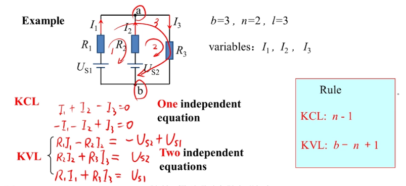
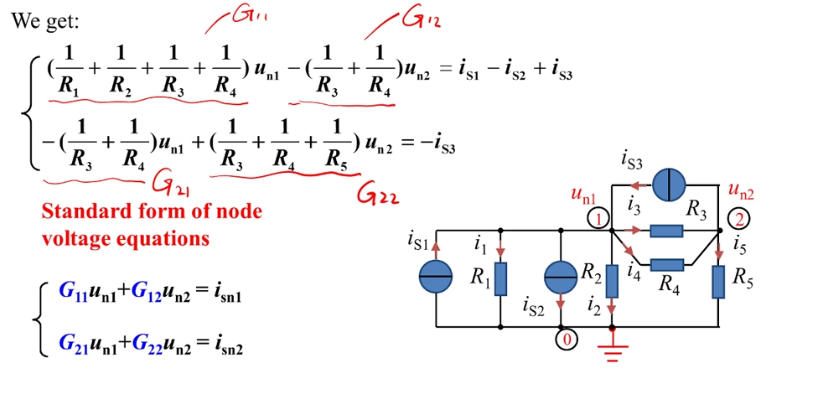
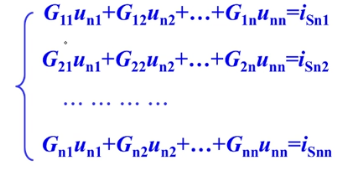
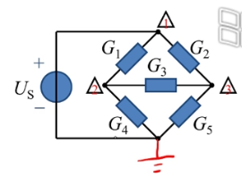
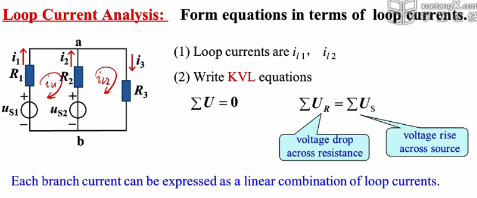
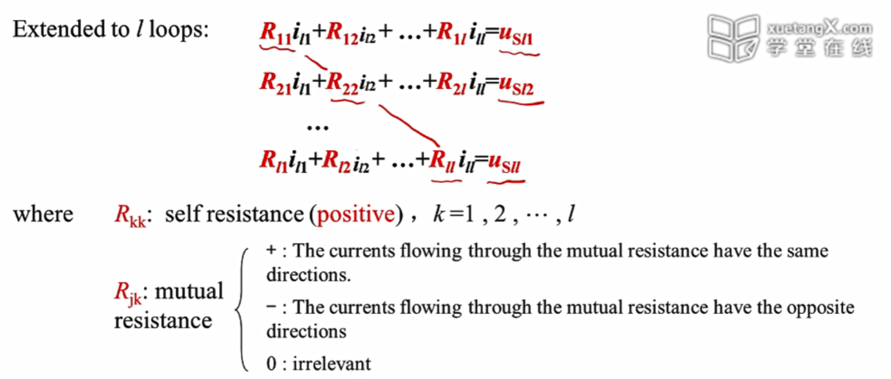
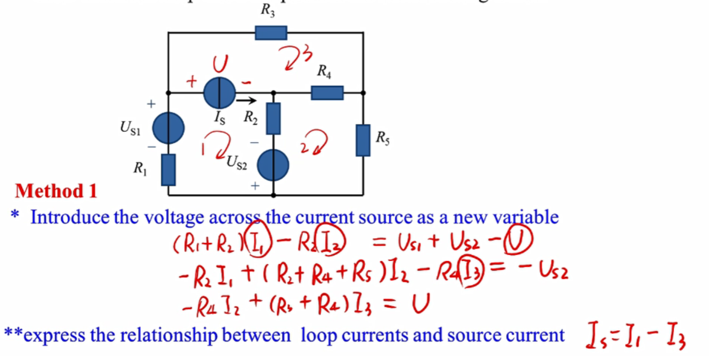

## 系统化方程解法

### 支路电流法（列写B个方程）

**理解**

只需要根据拓扑约束列写 B 个方程，本质上，就是不用列写元件约束的 2B 法

**步骤**

- b=支路数 n=节点数
- 对每个支路电流确定参考方向
- 选择 n-1 个节点列写 KCL 方程
- 选择 b-n+1 个回路列写 KVL 方程
- 解方程，求出各个支路的电流
- 通过元件约束和支路电路求出支路电压
- 

**独立方程的选取**

- **节点**：任选 n-1 个节点列写的 KCL 方程都是独立的
- **网孔**：
  - 对于平面电路，通过网孔列写的 KVL 方程都是独立的
  - 对于所有电路，要求每个新回路，至少包含一条新支路

**案例**

### 节点电压法（列写(N-1)个KCL方程）

**步骤**

- 选择一个节点作为参考点
- 对剩余的 n-1 个独立节点标记节点电压
- 对剩余的 n-1 个独立节点列写 KCL 方程
  - 流出节点电流之和=流入节点电流之和
  - 特别规定：
    - 列写时，
    - 电阻电流写在等号左侧，流出节点为正
    - 电源电流写在等号右侧，流入节点为正

**案例**

**节点电压法方程的标准形式**

**标准形式方程中各物理量的实际含义**

- $G_{11}$ 表示的是节点 1 和 参考点之间 的**自电导**
- $G_{12}$ 表示的是节点 1 和 节点 2 之间的**互电导**
- $i_{sn1}$ 表示的是流入节点 1 的电流源的和
- $G_{21}$ 表示的是节点 2 和 节点 1 之间的**互电导**
- $G_{22}$ 表示的是节点 2 和 参考点之间 的**自电导**
- $i_{sn2}$ 表示的是流入节点 2 的电流源的和

**对一般形式电路的推广：`根据物理含义直接写出方程`**

对于 n 个独立的节点

- $G_{ii}$
  - 是**自电导**
  - 是所有连接在节点 i 上的电阻(包括电压源和电阻串联支路中的电阻)的和，
  - 始终为正
- $G_{ij}$ 、 $G_{ji}$
  - 互电导
  - 其绝对值是所有连接在节点 i 和节点 j 之间的电阻的和
  - 始终为负
  - 如果电路中不含有受控源，则方程的系数矩阵是对称的，即：$G_{ij}==G_{ji}$
- $i_{Sni}$
  - 是流入节点 ni 的电流源(包括等效自电压源和电阻的电流源)的算数和

**特殊情况 1：支路上含有电压源和电阻串联的情况**

电路图  

列方程  

写成标准形式  
可以发现，这就是一个等效的电流源  

结论，直接将其等效为一个电流源和电阻的并联，这将不会影响电路中任何支路量的求解

**特殊情况 2：支路上仅含有电压源的情况**

> 解法 1:

图  

假设电压源所在支路上存在一个电流 I,然后列写方程  

由于出现了四个未知量，所以需要四个方程，  
所以补充一个电压源和节点电压的关系的方程来求解

> 解法 2:（仅针对于这种电压源只有单个的电路）

选取一个合适的参考点  

这样可以直接解出一个节点的电压  

此时，还剩两个节点电压，就只需要再列两个方程  

**特殊情况 3：支路上含有受控源的情况**

处理方法：把受控源当做独立源对待列写方程，并在最后用节点电压来表示这个受控源的控制量。

把受控源当做独立源对待列写方程  

由于出现了三个未知数，所以需要三个方程,  
所以需要用节点电压来表示这个控制量  

### 回路电流法（列写B-(n-1)个KVL方程）

> B-(N-1)就是独立回路的数量

注意

- 回路电流是假想的电流
- 电路的实际电流可以用回路电流表示
- 不在需要KCL方程的原因是回路电流本质是实际支路电流的一个分量，当要求实际电流是，还是要用KCL

步骤

- 选取电路中的B-(N-1)个回路标记回路电流方向
- 列写KVL方程
  - 回路电压降=0 $\sum{U}=0$
  - 回路电压降=回路电压升 $\sum{U_R}=\sum{U_S}$
- 求出回路电流后，实际电流就可以用回路电流表示
- 

例题

化简

标准形式的回路电流方程

标准方程的物理含义

- R_11 = R_1+R_2 = 回路1的电阻总和，称回路1的自电阻
- R_22 = R_2+R_3 = 回路2的电阻总和，称回路2的自电阻
- R_12 = -R_2 = 回路1和回路2的互电阻，由于回路电流1和回路电流2方向相反所以为负
- R_21 = -R_2 = 回路2和回路1的互电阻，同理，为负
- Usl1 = Us1-Us2 = 沿着回路1的电压升
- Usl2 = Us2 = 沿着回路2的电压升

推广到一般形式

- R_kk 是回路自电阻
- R_jk 是回路j和k的互电阻
  - 两回路电流方向相同，R_jk>0
  - 两回路电流方向相反，R_jk<0
  - 两回路没有互电阻，R_jk = 0

网孔电流分析法（特殊的回路电流分析方法）

> 对于平面电路，选择网孔列些回路电流方程，回路电流就成了网孔电流，方程就是网孔电流方程。

#### 特殊情况1：含有独立电流源的支路

问题

> 独立电流源上的电压由外电路决定，无法表示

解决方法1

> 假设其上电压为U，  
> 然后由于多了一个未知量，所以要再找一个方程。

解决方法2

> 在选择回路时，尽量让回路电流直接等于电流源电流  
> 这样还可以少列写一个方程

#### 特殊情况2：含有受控源的情况

解决方法1

> 把受控电压源当成独立电压源列些方程，但要找到其上电压和支路电流的关系方程

### 总结

> 支路电流法、节点电压法、回路电流法所需列写方程个数总结

> 对于非平面电路来说，选择独立回路比较困难，选择独立节点比较简单，所以列写方程时应该采用节点电压法
