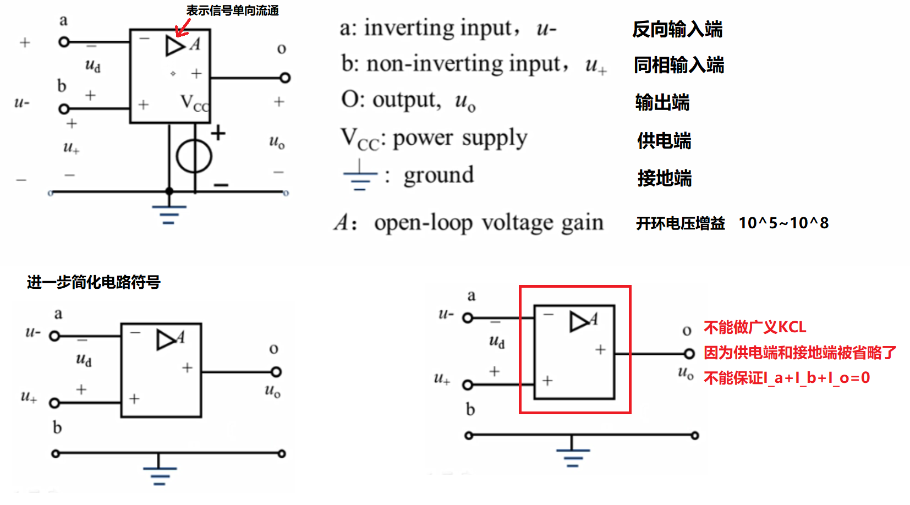
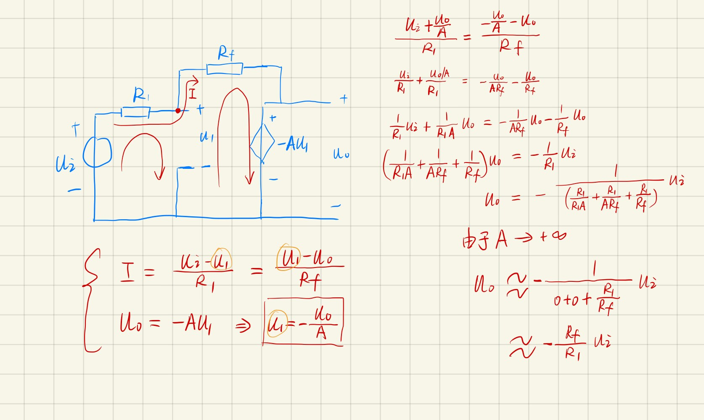
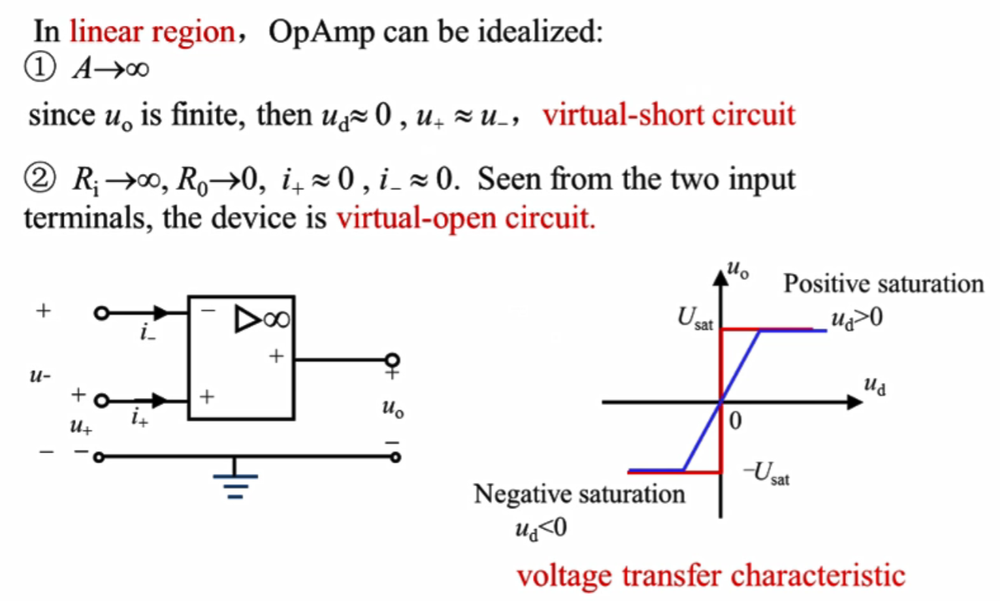
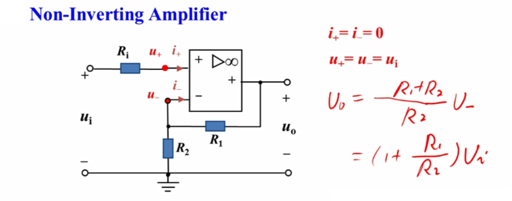
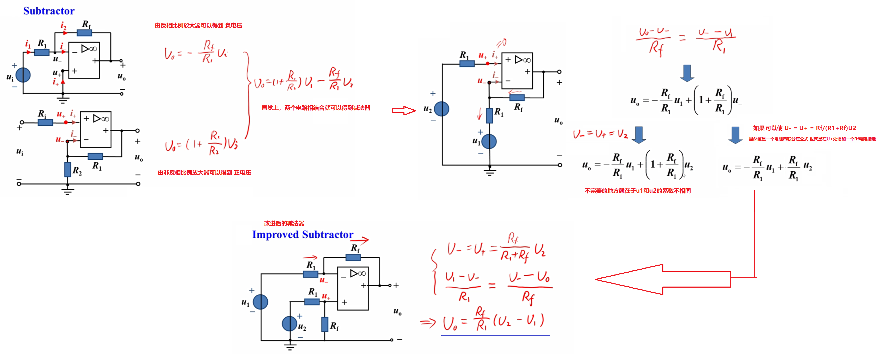
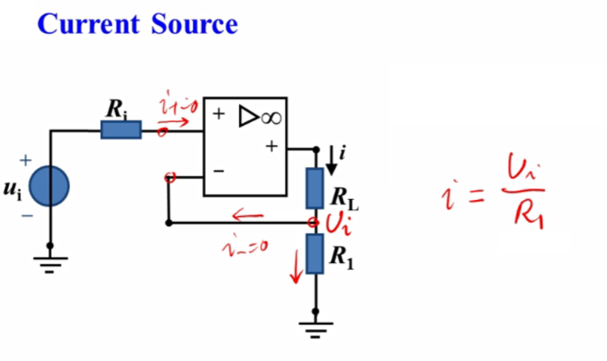
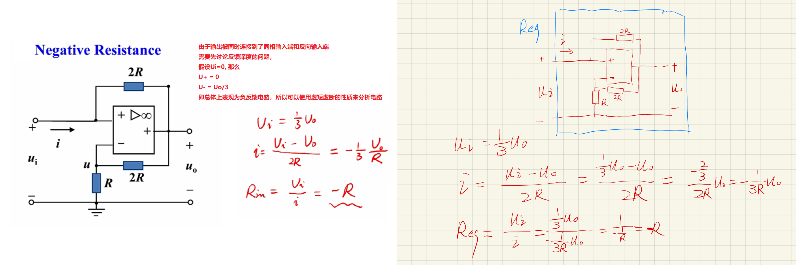

## 运算放大器Op Amps

运算放大器：

- 功能
  - 运算 Operation + - x / 开方 log对数  e指数 D微分 I积分
  - 放大
- 是一种有源、集成、多端元件
- 是早期模拟计算机的重要组成部分

封装  

内部电路  

电路符号  

### 传输特性

> $U_d = U_{sat}/A$

- $|u_d| < U_d$ 时，输出$U_o=AU_d$-------->(线性区间)
- $|u_d| > U_d$ 时，-------------------------->(饱和区间)
  - $u_d > U_d$ 输出$U_o=+U_{sat}$-------->(正饱和区间)
  - $u_d < U_d$ 输出$U_o=-U_{sat}$-------->(负饱和区间)
- 

### 工作在线性区间的运放模型

#### 运算放大器工作在开环电路

存在的问题：

- 1、A非常大，输入信号中非常小的扰动将会造成输出电压的极大变化
- 2、不同型号的运放会有不同的参数A,这使得设计的电路只能和特定参数的运放一起工作
- 3、相同型号的运放的参数A会随工作环境温度的改变而改变

#### 运算放大器工作在闭环负反馈电路

**手算过程**

### 理想运放

#### 理想运放工作在线性区的传输特性

> 注意虚短虚断的特性的适用条件：A足够大、R_i足够大、必须是负反馈电路

负反馈电路的虚短虚断特性

- $A->∞$ 且 $u_0$ 是有限的 因为 $u_0=A(u_d)$，那么 $u_d=\frac{u_0}{A}->0$ ,即 $u_+≈u_-$ 称为 **虚短**
- $R_i->∞$ 那么$i_+≈0 i_-≈0$ 称为**虚断**

### 运放的应用

> 理想运放工作在负反馈电路的分析（工作在线性区）

#### 电压跟随器

> 输出等于输人：$u_o=u_-≈u_+=u_i$

**作用：**

- 因为理想运放输入电阻为无穷大，所以对于信号源来说，负载电阻为无穷大
- 因为理想运放输出电阻为0，把理想运放看成电源的话，这个电源的内阻就是0

**案例**

#### 反相比例放大器

> 反相是指输出电压是负的，
>
> 比例系数的绝对值可以大于1可以小于1

#### 非反相(同相)比例放大器

> 非反相是指输出电压是正的，
>
> 比例系数只能大于1

#### 加法器

> 反相加法器

#### 减法器

#### 电流源

#### 负电阻

