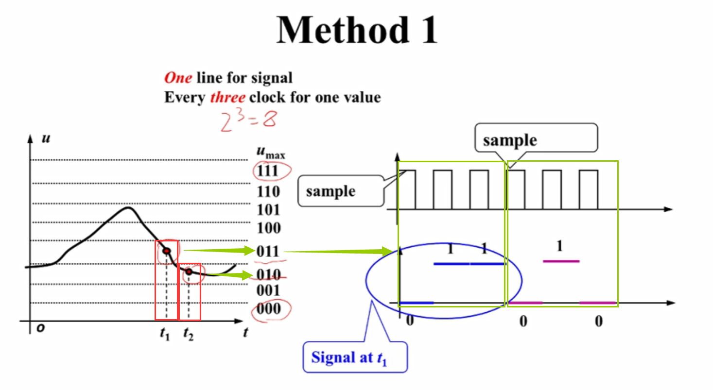
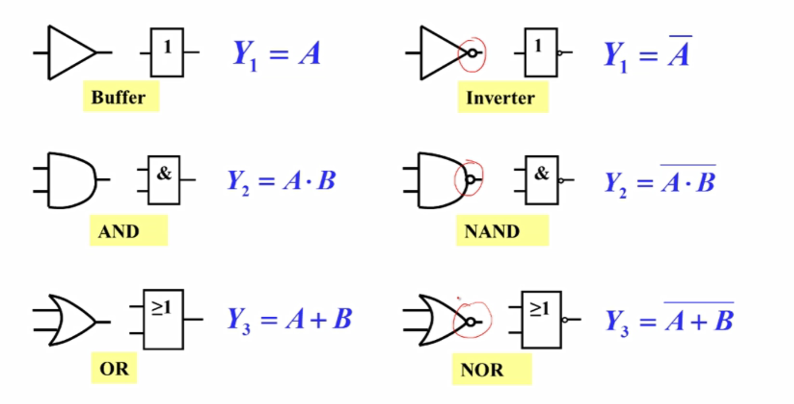
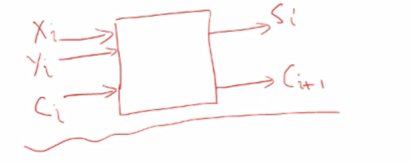

## 数字系统

为什么需要数字系统？

- 模拟电路放大信号时会把噪声也放大
- 数字系统在某种程度上可以抑制的影响
  - （小于0.3V为假 大于4.5V为真）

数字系统中讨论的一些问题

- 组合逻辑电路  
  - 从输入立马知道输出（投票系统）
- 时序逻辑
  - 输入+当前的状态=输出（计数器）
- Analog digital converter(ADC)模数转换 数模转换
- 时钟信号（发送方和接收方在相同的时间发送和读取数据）

### 数模转换

### 逻辑的两种表达方式

#### 逻辑表达式、真值表

#### 如何根据表达式写真值表

#### 如何根据真值表写表达式

### 常见逻辑门

> 三种基本逻辑表达式： 与门 或门 非门  
> 工艺中最方便制造的：反相器、与非门、或非门

缓冲器、反相器、与门、与非门、或门、或非门

### 用逻辑门电路实现逻辑表达式

### 使用真值表或逻辑表达式实现数字运算

半加器

全加器？

4bit加法器？
