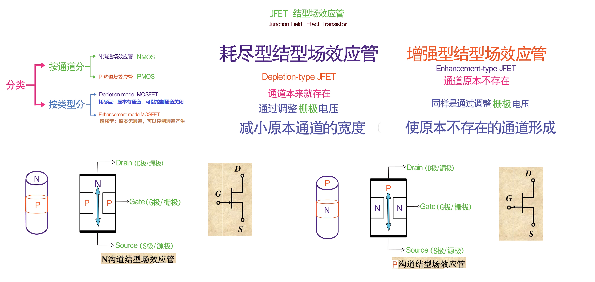
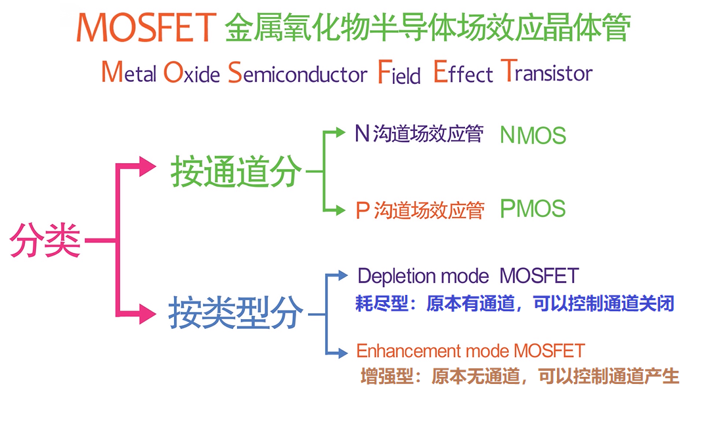
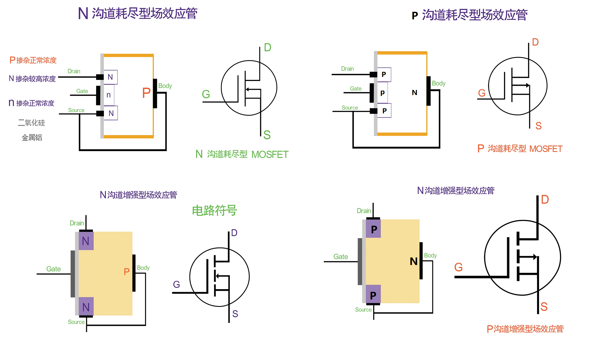
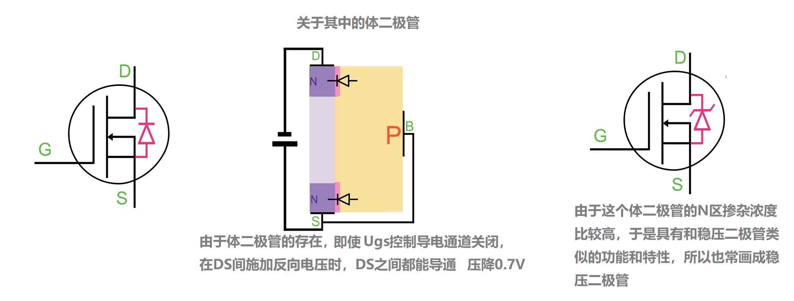
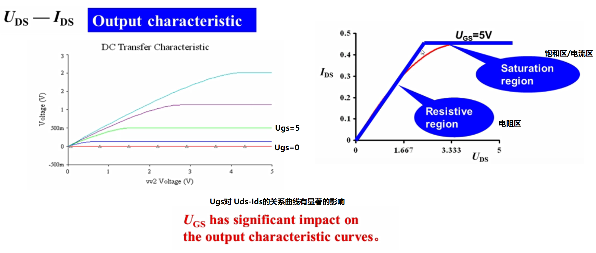
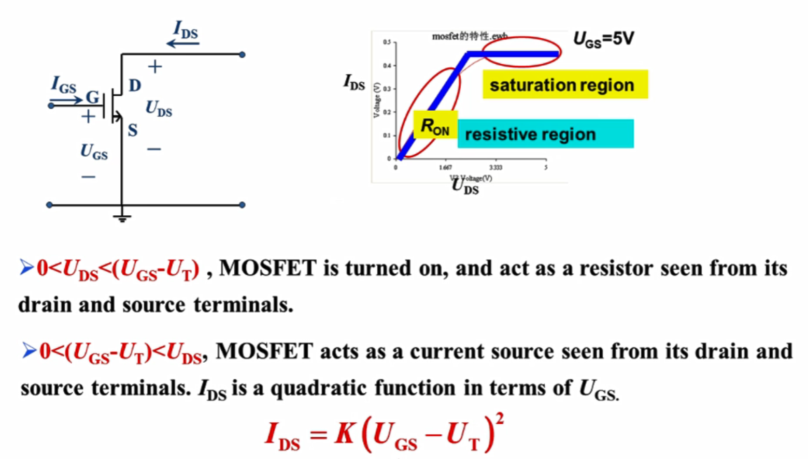
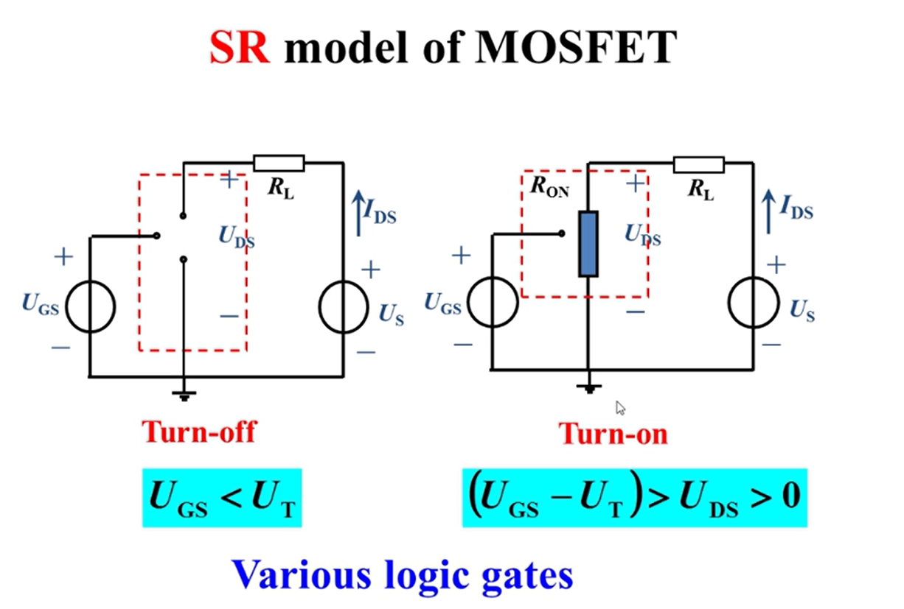
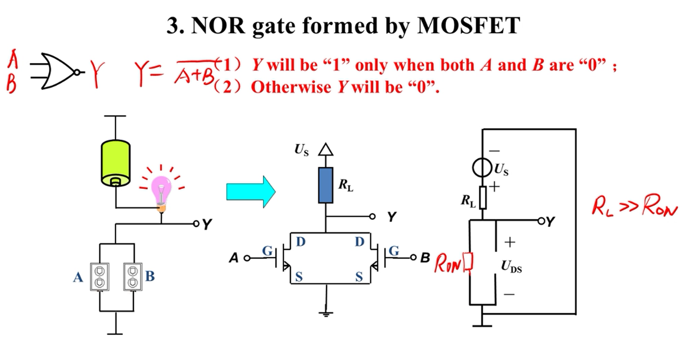

## 场效应管

> 不知道为什么这个视频连三极管都没讲就开始讲运放和场效应管，还讲的不清楚，  
> 害的我得到处搜资料来拼凑出完整的相关知识

### 结型场效应管(JFET)

#### 分类、结构、电路符号

#### 结型场效应管工作原理

### 金属-氧化层半导体场效晶体管(MOSFET)

#### 分类

#### 结构和电路符号

#### 关于体二极管

#### MOSFET工作原理（N沟道耗尽型）

#### MOSFET工作原理（N沟道增强型）

#### 场效应管的应用

场效应管应用在小功率场合时其导电沟道是水平的  

场管应用在电气系统的场合时，其导电沟道是垂直的(目的：提高允许的电压等级)

#### 外特性

> (显然这里及以下讨论的是增强型N沟道MOS管)

> 根据电路模型，存在两个电压，两个电流，也就存在四个关系  
> 但实际上，由于GS之间绝缘不导电，所以不用考虑前两者之间的关系

##### $U_{gs}-I_{ds}$的关系（转移特性曲线）

##### $U_{ds}-I_{ds}$的关系（输出特性曲线）

> 根据$U_{gs}-I_{ds}$的关系曲线可知，Ugs < Ut时，Ids=0,  
> 所以当讨论U_ds-I_ds关系时，Ugs是次要考虑的维度

##### 工作在电阻区和恒流区的条件

> 由于图中所给公式是化简后的，思维太超前了，第一眼看到的时候完全不明所以，所以下面解释一下

**关于Ut**

- 现在看到两种说法
  - 一种是说Ut是在Ugs=0时，就是Uds使得ds导通并且使得Ids到达饱和时也就是沟道因耗尽区扩大而开始夹断时的最小电压Uds,显然这是对于耗尽型场效应管而言的。
  - 另一种是说Ut是在Ugs大到一定程度，使得栅极上的电荷产生的电场足够建立起导电沟道且能够使得DS间导通的最小电压Ugs,显然这是对于增强型场效应管而言的。
- 所以实际上这个Ut是和Ugs与Uds都相关的一个量
- 在耗尽型场效应管中，Ugs上的电压(反向电压)将使得栅极和基座间的电场建立，导电沟道中的电荷被排斥，于是导电沟道变窄，Uds的电压将使得导电沟道因为体二极管反向偏置而变窄，这两个电压将因电场的均匀分布而共同作用于其内的导电沟道，Ut描述了这种平衡关系
- 在增强型场效应管中，Ugs将使沟道变宽，Uds将使沟道变窄，同样，这两个电压将因电场的均匀分布而共同作用于其内的导电沟道，Ut描述了这种平衡关系。

**工作在截止区**

- > Ugs < Ut
- 注意：截止和Uds的电压无关，只有Ugs能控制整个导电沟道的产生与消失

**工作在电阻区的条件**  

- > `0 < Uds < Ugs-Ut`
- 其本质就是：
  - 1
    - `0 < Uds < Ugs-Ut`
    - Ut < Ugs
  - 2
    - `0 < Uds < Ugs-Ut`
    - `Uds-Ugs < -Ut`
    - `Ugs-Uds <  Ut`
    - `Ugs+Usd <  Ut`
    - `Ugd < Ut`
    - 也可以说`Ugs > Uds + Ut`
      - 可以这样理解，（不知道对不对，反正我感觉逻辑自洽了）
      - 注意这里是把Uds和Ut都看成常量，然后关注Ugs一步步升高时，其对导电沟道形状的影响
      - 假设 Uds>0 Ut>0
      - Ugs=0v时，Uds不导通
      - Uds会作用在基座和栅极之间，导致此时栅极和基座间等效电容的上的电压为-Uds
      - Ugs=Uds时GS间的电压作用在栅极和基座间，这个压降刚好抵消掉Uds在基座和栅极间施加的电压。此时栅极和基座上的等效电容的电压为0V
      - 然后Ugs的电压继续升高，Ugs>Uds时，栅极和基座间的等效电容电压>0
      - 当达到Ugs>=Uds+Ut时，栅极和基座间的等效电容电压>=Ut，DS间的导电沟道因电场效应而导致宽度>=0
      - 需要说明的是，Ugs继续升高，将导致等效电容的电压继续升高，从而将导致沟道的宽度的增加，
      - 并且这种宽度的增加是整体的增加，可以理解为在控制一块半导体的粗细，
      - 横截面小了，单位时间内允许通过的电荷也就小了，电流也就小了，
      - 且由于这里的Uds没有改变，所以电阻R=u/i也就小了，实际上也就是在通过Ugs控制DS间的电阻。

工作在横流区的条件

- > `0 < Ugs-Ut < Uds`
- 其本质有两点：
  - 1
    - `0 < Ugs-Ut`
    - `Ut < Ugs`
  - 2
    - `0 < Ugs-Ut < Uds`
    - `-Ut < Uds-Ugs`
    - `Ut < Ugs - Uds`
    - `Ut < Ugs + Usd`
    - `Ut < Ugd`
    - 也可以说 `Ugs < Uds + Ut`
    - 也可以说 `Uds > Ugs - Ut`
      - 如何理解呢？
      - 和上面理解工作在电阻区一样
      - 把Ugs和Ut看做是常量，然后关注Uds升高对导电沟道的影响
      - 先假设其已经工作在受控电阻区了，也就是满足`Ugs > Uds + Ut`，变换一下就是，`Uds < Ugs-Ut`
      - Uds=0时
      - 此时由于假设其工作在电阻区，也就是说栅极和基座间的等效电容上存在着均匀分布的电场和电荷，这个均匀分布的电场的大小为Ugs，且电场强度已经足够产生导电沟道了，而且导电沟道应该是平行的
      - Uds增加
      - 此时，Uds的压降均匀的分布在从D到S导电沟道内，这个电压等级递减的电场作用在原本有着均匀分布电荷的等效电容上，使得原本有着均匀分布电场的不再均匀，也就同样使得导电沟道的宽度不再均匀。导电沟道变的上窄下宽了。
      - Uds增加到Ugs-Ut
      - 此时，Uds的压降依然均匀分布在从D到S导电沟道内，电压等级最高处为Ugs,这就正好把等效电容上方向相反的电场抵消了一部分，使得只剩下Ut，此时导电沟道宽度进一步变窄，称为“夹断”。(因为导电沟道的宽度就是在Ggs-Ut>0时开始从0变宽的)
      - Uds>Ugs-Ut
      - 此时，导电沟道只剩下一条缝了，这条缝小到导致单位时间内只能通过一定数量的电荷。也就是说Uds继续增加，这条缝也还是只能通过那么多的电子，根据电流的定义i=dq/dt,就是说Uds增加，Ids不再增加，就是说此时表现为一个电流源了。
      - 需要说明的是，Uds继续的增加只是在导致导电沟道进一步变得上窄下宽，这种宽度的减少是局部的，
      - 类比于把水管的出水口捏紧，尽管出水口的大小变了，但整个水管的粗细没有改变，水的压力依然非常大，
      - 所以水还是能从缝隙中流出来，但是即便是继续增加水的压力，但是缝隙就那么小，
      - 单位时间内允许通过的水分子个数达到了极限值，水压的增加就不会继续导致水流流速的增加了。
  
工作在横流区的特性

- $I_{ds}=K(U_{gs}-U_t)^2$

##### 工作在不同的区间建立不同的电路模型

##### 开关/电流源模型

##### 开关/电阻模型

### 几种场效应管的比较

## MOSFET在数字电路中的应用

### 反相器

> **注意：** 要使得$U_{ds}$在导通后接近0V,根据串联分压的原理，这里的$R_L$需要远远大于$R_{on}$

> 如何实现缓冲器? 两个反相器串联即可

**存在的问题（最高工作频率）**
> Ugs上电压变化频率不高的话可以正常工作
> 
> 但到输入电压频率很高时，输出信号将产生畸变（原因和GS间等效电容有关，后续会讨论）
> 

### 与非门
>
> 注意：同样的，需要使得$R_l$远远大于$R_{on}$

> 如何实现与门？ 与非门+非门即可

### 或非门

> 注意：同样的，需要使得$R_l$远远大于$R_{on}$

> 如何实现或门？ 或非门+非门

## CMOS互补金属氧化物半导体

### 普通门电路的功耗

### CMOS的原理和结构及优点

## MOSFET在模拟电路中的应用
