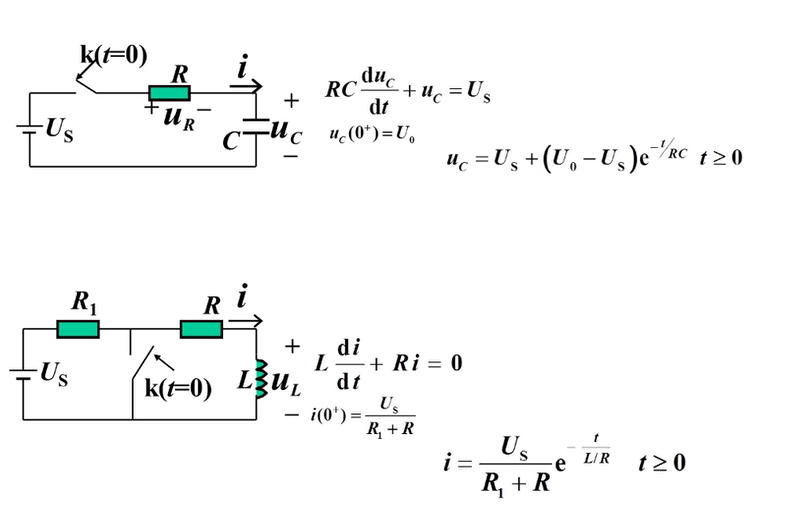
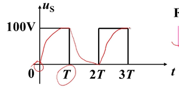
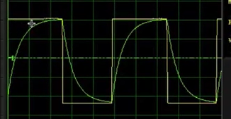
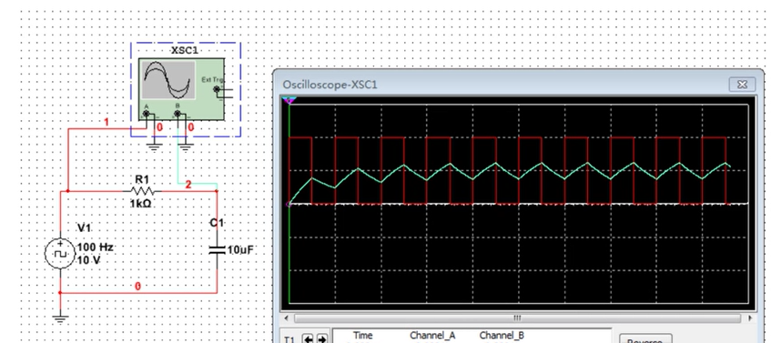

# 一阶电路三要素法

## 直观理解

观察使用一阶电路经典法求解的支路量表达式的形式和参数特点。

**当$R,L,C>0$ 时 $τ>0$时 表达式的指数项:**

$$
\lim\limits_{t \to 0} e^{-\frac{t}{τ}}=1
$$

$$
\lim\limits_{t \to +\infty} e^{-\frac{t}{τ}}=0
$$

**这意味着微分方程的非齐次特解为其稳态解**

$$
\begin{align*}
\text{支路量$(t=+\infty)$} &= \text{稳态解} + A e^{-\frac{t}{τ}} \\
\text{支路量$(t=+\infty)$} &= \text{稳态解} + 0 \\
\end{align*}
$$

**齐次特解的待定系数**

$$
\begin{align*}
\text{支路量($t=0^+$)} &= \text{稳态解} + A e^{-\frac{t}{τ}} \\
\text{支路量($t=0^+$)} &= \text{稳态解} + A \\
A &= \text{稳态解} - \text{支路量($t=0^+$)} \\
A &= \text{稳态解} - \text{初值}
\end{align*}
$$

**所以**

$$
\text{支路量(t)} = \text{稳态解} + (\text{稳态解} - \text{初值}) e^{-\frac{t}{τ}}
$$

## 数学理解

### 激励为常数X

考虑这样一个非齐次微分方程，X为常数。

$$
\frac{du}{dt}+au=X \tag {a>0}
$$

**齐次通解**

设  
$$u'=Ae^{\lambda t}$$  
则  
$$
\begin{align*}
\frac{du}{dt}+au&=0 \\
A\lambda e^{\lambda t}+Aa e^{\lambda t}&=0 \\
\lambda +a&=0 \\
\lambda &=-a
\end{align*}
$$

得  
$$u'=Ae^{-at}$$

**非齐次特解**

由于X为常数，所以设其非齐次特解是常数Y

$$u''=Y$$  

则  
$$
\begin{align*}
    \frac{du}{dt}+au&=X \\
    0 + aY &= X \\
    Y &= \frac{X}{a} \\
\end{align*}
$$

得  
$$u''=Y=\frac{X}{a}$$

微分方程通解

$$
\begin{align*}
    u &= u'' + u' \\
    u &= \frac{X}{a} + Ae^{-at} \\
\end{align*}
$$

由于$a>0$,所以：

$$
\begin{align*}
    \lim\limits_{t \to 0} Ae^{-at}&=1 \\
    \lim\limits_{t \to +\infty} Ae^{-at}&=0
\end{align*}
$$

所以有:

$$
\begin{align*}
    \text{初值} = u(t=0) &= \frac{X}{a} + Ae^{-at} = \frac{X}{a} + A \\
    \text{稳态} = u(t=+\infty) &= \frac{X}{a} + Ae^{-at} = \frac{X}{a}\\
    A &= \text{初值}-\text{稳态}\\
\end{align*}
$$

即

$$
    u(t) = \text{稳态} + (\text{初值}-\text{稳态})e^{-at}
$$

### 激励为变量x(t)

对于
$$
\frac{du}{dt}+au=x(t) \tag {a>0}
$$

同样有

$$
u(t) = \text{稳态(t)} + [\text{初值(t)}-\text{稳态(t)}]e^{-at}
$$

只不过其稳态解和初值都是一个带t的表达式。

## 周期激励下动态电路的稳态解

### 例题1

`T>>τ`意味着电容可以在电压激励的一个周期T之内完成充电或放电的过度过程。

`0~T` 周期：

**三要素**

- $\text{初值}=0$  
- $\text{稳态}=100$  
- $τ=RC$ 
 
$$
\begin{align*}
  u_c&=100+(0-100)e^{-\frac{t}{τ}} \\
  &=100-100e^{-\frac{t}{τ}}
\end{align*}
$$

`T~2T` 周期：

**三要素**
- $\text{初值}=100$  
- $\text{稳态}=0$  
- $τ=RC$  

$$
\begin{align*}
  u_c&=0+(100-0)e^{-\frac{t}{τ}} \\
  &=100e^{-\frac{t}{τ}}
\end{align*}
$$

**结果**

### 例题2

计算$u_c$的稳态电压

`T is close to τ`意味着电容无法在电压激励的一个周期之内完成过度过程

`0~T` 周期：

**三要素**

- $\text{初值}=U_1$  
- $\text{稳态}=100$ (注意不是$U_2$)  
- $τ=RC$ 
 
$$
\begin{align*}
  u_c&=100+(U_1-100)e^{-\frac{t}{τ}} & t∈[0,T]
\end{align*}
$$

`T~2T` 周期：

**三要素**

- $\text{初值}=U_2$  
- $\text{稳态}=0$ (注意不是$U_1$)  
- $τ=RC$ 
 
$$
\begin{align*}
  u_c&=0+(U_2-0)e^{-\frac{t}{τ}} \\
  &=U_2e^{-\frac{t}{τ}} & t∈[0,T] \\
  &=U_2e^{-\frac{t-T}{τ}} & t∈[T,2T]
\end{align*}
$$

联立得

$$
u_c(t) =
\begin{cases}
  100+(U_1-100)e^{-\frac{t}{τ}} & t∈[0,T] \\
  U_2e^{-\frac{t-T}{τ}} & t∈(T,2T]\\
\end{cases}
$$

电路进入稳态后，将有：

$$
\begin{cases}
    U_2 = u_c(1T) = 100+(U_1-100)e^{-\frac{1T}{τ}} \\
    U_1 = u_c(2T) = U_2e^{-\frac{1T}{τ}} \\
\end{cases}
$$

解之得：

$$
\begin{cases}
    U_2  = 100 \cdot \frac{1}{1+e^{-\frac{T}{τ}}}\\
    U_1  = 100 \cdot \frac{e^{-\frac{T}{τ}}}{1+e^{-\frac{T}{τ}}}\\
\end{cases}
$$