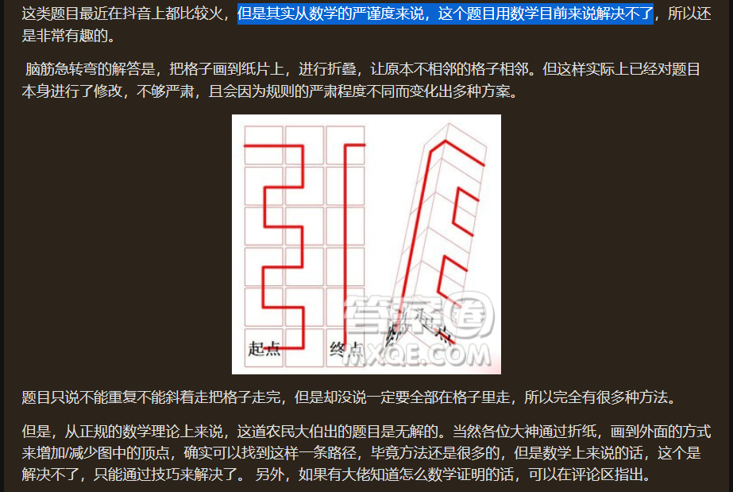

## 递归求解

```java
package 走格子;

import java.util.Arrays;

public class 走格子 {

 static void doSomeThing() {
  process(f, 0, 0, 1);
  System.out.println("当前找到：" + count + "种");
 }

 static String f[][] = new String[3][6];
 static String[] directions = { "↑", "↓", "←", "→" };
 static int count = 0;

 static void process(String f[][], int cur_y, int cur_x, int step) {
  if (cur_y < 0 || cur_y >= 3 || cur_x < 0 || cur_x >= 6) {// 越界
   return;
  } else if (f[cur_y][cur_x] != null) {// 不能走走过的路
   return;
  } else if (
    step == 18
    && cur_y == 2 && cur_x == 5 // 走了18步，到达终点位置
    && f[cur_y][cur_x] == null  //
  ) {
   System.out.println("find:");
   for (int i = 0; i < f.length; i++) {
    System.out.println(Arrays.toString(f[i]));
   }
   count++;
   return;
  }
  for (String direction : directions) {
   f[cur_y][cur_x] = direction;
   switch (direction) {
    case "↑":
     process(f, cur_y - 1, cur_x + 0, step + 1);
     break;
    case "↓":
     process(f, cur_y + 1, cur_x + 0, step + 1);
     break;
    case "←":
     process(f, cur_y + 0, cur_x - 1, step + 1);
     break;
    case "→":
     process(f, cur_y + 0, cur_x + 1, step + 1);
     break;
   }
   f[cur_y][cur_x] = null;
  }
 }

 public static void main(String[] args) {
  long start = System.currentTimeMillis();
  doSomeThing();
  long end = System.currentTimeMillis();
  System.out.println("耗时:" + (end - start) + "毫秒");
 }
}
```

走到[2,5]位置的输出测试

```txt
find:
[↓, →, ↓, →, →, ↓]
[↓, ↑, ↓, ↑, ↓, ←]
[→, ↑, →, ↑, →, null]
find:
[↓, →, ↓, →, →, ↓]
[↓, ↑, ↓, ↑, ←, ↓]
[→, ↑, →, →, ↑, null]
find:
[↓, →, →, ↓, →, ↓]
[↓, ↑, ↓, ←, ↑, ↓]
[→, ↑, →, →, ↑, null]
find:
[↓, →, →, →, →, ↓]
[↓, ↑, ↓, ←, ←, ←]
[→, ↑, →, →, →, null]
find:
[↓, →, →, ↓, →, ↓]
[↓, ↑, ←, ↓, ↑, ↓]
[→, →, ↑, →, ↑, null]
find:
[↓, →, →, →, →, ↓]
[↓, ↑, ←, ↓, ←, ←]
[→, →, ↑, →, →, null]
find:
[↓, →, →, →, →, ↓]
[↓, ↑, ←, ←, ↓, ←]
[→, →, →, ↑, →, null]
find:
[↓, →, →, →, →, ↓]
[↓, ↑, ←, ←, ←, ↓]
[→, →, →, →, ↑, null]
find:
[→, ↓, →, ↓, →, ↓]
[↓, ←, ↑, ↓, ↑, ↓]
[→, →, ↑, →, ↑, null]
find:
[→, ↓, →, →, →, ↓]
[↓, ←, ↑, ↓, ←, ←]
[→, →, ↑, →, →, null]
find:
[→, ↓, →, →, →, ↓]
[↓, ←, ↑, ←, ↓, ←]
[→, →, →, ↑, →, null]
find:
[→, ↓, →, →, →, ↓]
[↓, ←, ↑, ←, ←, ↓]
[→, →, →, →, ↑, null]
find:
[→, →, ↓, →, →, ↓]
[↓, ←, ←, ↑, ↓, ←]
[→, →, →, ↑, →, null]
find:
[→, →, ↓, →, →, ↓]
[↓, ←, ←, ↑, ←, ↓]
[→, →, →, →, ↑, null]
find:
[→, →, →, ↓, →, ↓]
[↓, ←, ←, ←, ↑, ↓]
[→, →, →, →, ↑, null]
find:
[→, →, →, →, →, ↓]
[↓, ←, ←, ←, ←, ←]
[→, →, →, →, →, null]
当前找到：16种
耗时:40毫秒
```

---



走到[0,2]位置的输出测试

```txt
当前找到：0种
耗时:2毫秒
```
