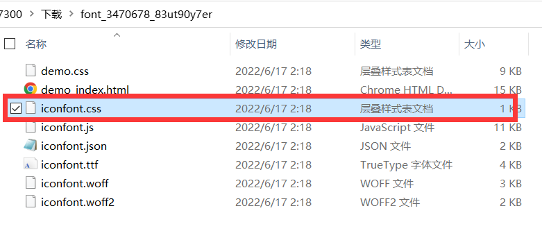
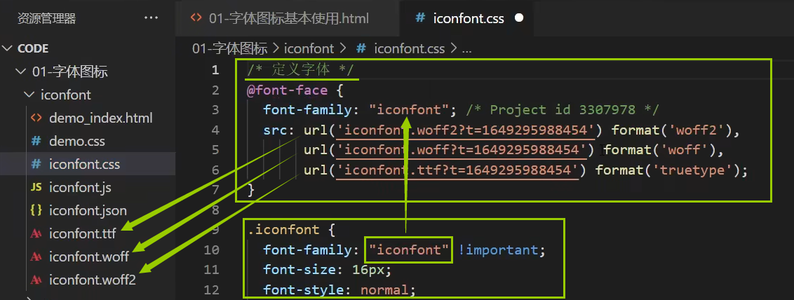
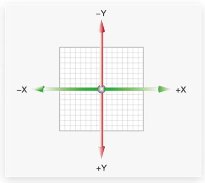
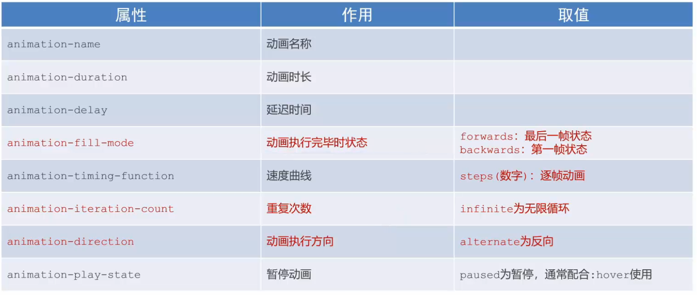

# CSS3进阶笔记

## 目录

- [CSS3进阶笔记](#css3进阶笔记)
  - [目录](#目录)
  - [字体图标](#字体图标)
  - [阿里巴巴矢量字体库iconfont使用步骤](#阿里巴巴矢量字体库iconfont使用步骤)
  - [平面转换](#平面转换)
    - [平面位移](#平面位移)
    - [平面旋转](#平面旋转)
    - [位移旋转缩放的中心点更改](#位移旋转缩放的中心点更改)
    - [多重转换](#多重转换)
    - [平面缩放](#平面缩放)
    - [使用transform的居中和缩放](#使用transform的居中和缩放)
  - [空间转换](#空间转换)
    - [透视](#透视)
    - [空间位移](#空间位移)
    - [空间旋转](#空间旋转)
      - [几种空间旋转效果测试](#几种空间旋转效果测试)
    - [立体呈现](#立体呈现)
      - [尝试实现立方体-正交](#尝试实现立方体-正交)
      - [3d导航条实现](#3d导航条实现)
    - [空间缩放](#空间缩放)
      - [对3d立方体盒子的空间缩放测试](#对3d立方体盒子的空间缩放测试)
  - [动画](#动画)
    - [animation动画属性](#animation动画属性)
    - [立方体动画测试](#立方体动画测试)
    - [制作精灵动画](#制作精灵动画)
    - [无缝走马灯动画](#无缝走马灯动画)
  - [渐变背景](#渐变背景)
    - [使用示例1](#使用示例1)
    - [使用示例2-综合案例实现](#使用示例2-综合案例实现)
  - [绘制三角形](#绘制三角形)
  - [毛玻璃效果](#毛玻璃效果)
  - [背景图片的实现方式](#背景图片的实现方式)

## 字体图标

- 字体图标展示的是图标，实际特性却像是字，可以通过color属性改变颜色

- 字体图标用于处理颜色单一的简单小图（复杂图用精灵图）
- 
- 优点：
  - 灵活，尺寸颜色可用css属性修改
  - 轻量，体积小渲染快降低服务器请求次数
  - 兼容，几乎兼容所有主流浏览器
  - 方便，
    - 下载字体包
    - 使用字体图标
  
## 阿里巴巴矢量字体库iconfont使用步骤

1. `iconfont.cn`下载字体图标
2. 引入的css文件名为iconfont.css 

    ```html
    <link rel="stylesheet" href="./iconfont/iconfont.css">
    ```

3. 调用图标对应的类名，**必须**调用两个类名
    1. `iconfont`类,基本样式，包含字体图标的默认大小和颜色
    2. `icon-xxx`类,图标对应的类名

    ```html
    <span class="iconfont icon-XXX"></span>
    ```

- iconfont具体实现原理
  - `.iconfont`类
  - 
  - `.icon-XXX`类
    

## 平面转换

- 作用：改变盒子在**平面(2D)**的形态(**位移** ， 旋转 ， **缩放** )

- 属性名: **transform**
- 语法格式:
  - `transform: translate(水平向右移动距离,垂直向下移动距离);`
  - `transform: translate(自身宽度的百分比,自身高度的百分比);`
  - `transform: translate(只写一个参数表示X轴移动距离);`
  - `transform: translateX(一个参数);`
  - `transform: translateY(一个参数);`
  -



### 平面位移

- `transform: translate(像素,或自身的百分比);`

- 水平和垂直居中

<div class="father">
    <div class="box">transform: translate(-50%,-50%);</div>
</div>
<style>
    .father{
        position: relative;
        width: 500px;
        height: 300px;
        background: skyblue;
    }
    .father .box{
        position:absolute;
        top: 50%;
        left: 50%;
        transform: translate(-50%,-50%);
        width: 200px;
        height: 100px;
        background-color: green;
        line-height: 100px;
    }
</style>

```html
<div class="father">
    <div class="box">transform: translate(-50%,-50%);</div>
</div>
<style>
    .father{
        position: relative;
        width: 500px;
        height: 300px;
        background: skyblue;
    }
    .father .box{
        position:absolute;
        top: 50%;
        left: 50%;
        transform: translate(-50%,-50%);
        width: 200px;
        height: 100px;
        background-color: green;
        line-height: 100px;
    }
</style>
```

- 天猫

<div class="tianmao-bgi"></div>
<style>
    .tianmao-bgi{
        width: 683px;
        height: 300px;
        background-image: url(./images/CSS3进阶笔记/bg.jpg);
        background-size: contain;
        /*溢出部分隐藏*/
        overflow: hidden;
    }
    .tianmao-bgi::before,
    .tianmao-bgi::after{
        display: inline-block;
        content: "";
        width: 341px;
        height: 300px;
        background-image: url(./images/CSS3进阶笔记/fm.jpg);
        background-size:cover;
        transition: all 0.5s;
    }
    .tianmao-bgi::after{
        background-position:right 0;
    }
    .tianmao-bgi:hover::before{
        transform: translate(-100%);
    }
    .tianmao-bgi:hover::after{
        transform: translate(+100%);
    }
</style>

```html
<div class="tianmao-bgi"></div>
<style>
    .tianmao-bgi{
        width: 683px;
        height: 300px;
        background-image: url(./images/CSS3进阶笔记/bg.jpg);
        background-size: contain;
        /* 溢出部分隐藏 */
        overflow: hidden;
    }
    .tianmao-bgi::before,
    .tianmao-bgi::after{
        display: inline-block;
        content: "";
        width: 341px;
        height: 300px;
        background-image: url(./images/CSS3进阶笔记/fm.jpg);
        background-size:cover;
        transition: all 0.5s;
    }
    .tianmao-bgi::after{
        background-position:right 0;
    }
    .tianmao-bgi:hover::before{
        transform: translate(-100%);
    }
    .tianmao-bgi:hover::after{
        transform: translate(+100%);
    }
</style>
```

### 平面旋转

- 语法 `transform:rotate(角度deg);`

- 角度单位deg
- 旋转一圈为360deg
- 取正为顺时针旋转，取负则相反
- 一定要配合**过渡**属性才能看到动态的效果

<div class="rotate-test" >旋转测试</div>
<style>
    .rotate-test{
        width: 100px;
        height: 100px;
        background-color: #fff;
        text-align: center;
        line-height: 100px;
        /*一定要配合过渡属性才能看到动态的效果*/
        transition: all 1s;
    }
    .rotate-test:hover{
        transform:rotate(360deg);
    }
</style>

### 位移旋转缩放的中心点更改

- 默认原点是盒子的中心点

- 语法: `transform-origin: 水平位置 垂直位置;`
- 取值：**方位名词**、像素、百分比（相对于盒子自身尺寸计算）
- 示例

<div class="origin-test" >旋转测试</div>
<style>
    .origin-test{
        width: 100px;
        height: 100px;
        background-color: #fff;
        text-align: center;
        line-height: 100px;
        transition: all 1s;
        transform-origin: right bottom;
    }
    .origin-test:hover{
        transform:rotate(360deg);
    }
</style>

### 多重转换

- 语法格式,将其当做复合属性：`transform: translate() rotate();`

- 注意
  - 因为旋转会改变坐标轴方向，所以如果要实现平移+旋转效果，需要注意该属性的两个参数的顺序
  - 不能拆成`transform: translate();transform: rotate();`两个写，否则后一个将会覆盖前一个。

<div class="multip" >
    <div>多重转换</div>
</div>
<style>
    .multip{
        width: 313px;
        height: 100px;
        background-color: #fff;
    }
    .multip div{
        position: relative;
        left: -50px;
        height: 100px;
        width: 100px;
        background: green;
        transition: all 2s;
        border-radius: 50%;
        text-align: center;
        line-height: 100px;
    }
    .multip:hover div{
        transform: translate(313px,0) rotate(360deg);
    }
</style>

```html
<div class="multip" >
    <div>多重转换</div>
</div>
<style>
    .multip{
        width: 313px;
        height: 100px;
        background-color: #fff;
    }
    .multip div{
        position: relative;
        left: -50px;
        height: 100px;
        width: 100px;
        background: green;
        transition: all 2s;
        border-radius: 50%;
        text-align: center;
        line-height: 100px;
    }
    .multip:hover div{
        transform: translate(313px,0) rotate(360deg);
    }
</style>
```

### 平面缩放

- 语法：
  - transform:scale(X轴缩放倍数,Y轴缩放倍数);
  - transform:scale(XY等比例缩放倍数);

- 倍数没有单位

<div class="father-scale">
    <div class="box">transform:scale(缩放倍数);</div>
</div>
<style>
    .father-scale{
        width: 500px;
        height: 300px;
        background: skyblue;
        overflow: hidden;
    }
    .father-scale .box{
        width: 100%;
        height: 100%;
        background-color: green;
        transition: transform 1s;
        line-height: 300px;
        text-align: center;
    }
    .father-scale:hover .box{
        transform: scale(1.5);
    }
</style>

### 使用transform的居中和缩放

- 需要把居中和缩放写到一个transform中

- `transform:translate(-50%,-50%) scale(0.5);`

<div class="father-scaleAndMiddle">
    <div class="box">transform:translate(-50%,-50%) scale(0.5);</div>
</div>
<style>
    .father-scaleAndMiddle{
        position: relative;
        width: 500px;
        height: 300px;
        background: skyblue;
        overflow: hidden;
    }
    .father-scaleAndMiddle .box{
        position: absolute;
        top: 50%;
        left: 50%;
        width: 50%;
        height: 50%;
        background-color: green;
        transition: all 1s;
        line-height: 150px;
        font-size: 0.5em;
        text-align: center;
        transform: translate(-50%,-50%) scale(1);
    }
    .father-scaleAndMiddle:hover .box{
        transform: translate(-50%,-50%) scale(1.5);
    }
</style>

```html
<div class="father-scaleAndMiddle">
    <div class="box">transform:translate(-50%,-50%) scale(0.5);</div>
</div>
<style>
    .father-scaleAndMiddle{
        position: relative;
        width: 500px;
        height: 300px;
        background: skyblue;
        overflow: hidden;
    }
    .father-scaleAndMiddle .box{
        position: absolute;
        top: 50%;
        left: 50%;
        width: 50%;
        height: 50%;
        background-color: green;
        transition: transform 1s;
        line-height: 150px;
        text-align: center;
        transform: translate(-50%,-50%) scale(1);
    }
    .father-scaleAndMiddle:hover .box{
        transform: translate(-50%,-50%) scale(1.5);
    }
</style>
```

## 空间转换

- 使用transform属性实现元素在**空间(3D)**内的**位移**，**旋转**，**缩放**等效果

- z轴的正轴方向为从屏幕指向自己


### 透视

浏览器默认应该是正交透视，没有近大远小的透视效果

- 属性名：perspective
- 语法：perspective:透视距离;
- 建议的取值：**800-1200px**
- 使用：添加给盒子的父级，透视中心为父级盒子的中心
- 注意：记得给盒子添加宽高，否则会找到一个错误的中心点
- 透视距离，也称视距，指人眼到屏幕的距离


### 空间位移

- 语法：
  - `transform:translate3d(x,y,z);`
  - `transform:translateX(x);`
  - `transform:translateY(y);`
  - `transform:translateZ(z);`

- 取值：像素，百分比(以自身长宽高为基准)
- **注意**：默认为正交透视，所以在Z轴的位移将看不出近大远小的透视效果

<div class="transZtest1">
    <div></div>
</div>
<style>
    .transZtest1{
        width: 100px;
        height: 100px;
        background-color: #fff;
        /*透视 盒子中心成为透视中心*/
        perspective: 1200px;
    }
    .transZtest1 div
    {
        width: 100px;
        height: 100px;
        background-color: green;
    }
    .transZtest1:hover div{
        transform: translateZ(-1000px);
    }
</style>

### 空间旋转

- 语法：
  - `rotateX()` 绕X轴旋转
  - `rotateY()` 绕Y轴旋转
  - `rotateZ()` 绕Z轴旋转
  - `rotate3d(x,y,z,角度度数)`
    - **指定一个旋转轴，旋转指定的角度**
    - **x,y,z取值为0-1的数字**

- **注意**：默认为正交透视，所以在各轴的位移默认将看不出近大远小的透视效果

#### 几种空间旋转效果测试

<div class="rotateXtestBox1">
    <div class="rotateXtest">rotateX()</div>
</div>
<style>
    .rotateXtestBox1 {
        margin:10px;
        width: 100px;
        height: 100px;
        perspective: 1200px;
    }
    .rotateXtestBox1 .rotateXtest{
        width: 100px;
        height: 100px;
        background-color: #fff;
        transition: all 2s;
    }
    .rotateXtestBox1 .rotateXtest:hover{
        transform: rotateX(60deg);
    }
</style>

<div class="rotateXtestBox2">
    <div class="rotateXtest">rotateY()</div>
</div>
<style>
    .rotateXtestBox2 {
        margin:10px;
        perspective: 1200px;
    }
    .rotateXtestBox2 .rotateXtest{
        width: 100px;
        height: 100px;
        background-color: #fff;
        transition: all 2s;
    }
    .rotateXtestBox2 .rotateXtest:hover{
        transform: rotateY(60deg);
    }
</style>

<div class="rotateXtestBox3">
    <div class="rotateXtest">rotateZ()</div>
</div>
<style>
    .rotateXtestBox3 {
        margin:10px;
        perspective: 1200px;
    }
    .rotateXtestBox3 .rotateXtest{
        width: 100px;
        height: 100px;
        background-color: #fff;
        transition: all 2s;
    }
    .rotateXtestBox3 .rotateXtest:hover{
        transform: rotateZ(60deg);
    }
</style>

### 立体呈现

- 用法：`transform-style:preserve-3d`
  - 默认值：`flat`，表示处于平面空间

- 作用：使子元素处于3d空间

#### 尝试实现立方体-正交

- 结合transform-style、transition、rotate等属性的综合案例

<div class="threedbox">
    <div class="font"></div>
    <div class="back"></div>
    <div class="left"></div>
    <div class="right"></div>
    <div class="top"></div>
    <div class="bottom"></div>
</div>
<style>
    .threedbox{
        position: relative;
        width: 200px;
        height: 200px;
        /*background-color: #fff; */
        /* perspective: 1500px; */
        transform-style: preserve-3d;
        transition: all 5s;
    }
    .threedbox .font,
    .threedbox .back,
    .threedbox .left,
    .threedbox .right,
    .threedbox .top,
    .threedbox .bottom
    {
        position: absolute;
        left: 0;
        top: 0;
        width: 200px;
        height: 200px;
    }
    .threedbox .font{
        background-color: rgba(0, 255, 0, 0.5);
        transform: translateZ(-100px);
    }
    .threedbox .back{
        background-color: rgba(255, 0, 0, 0.5);
        transform: translateZ(+100px);
    }
    .threedbox .left{
        background-color: rgba(0, 0, 255, 0.5);
        transform: translateX(-100px) rotateY(90deg);
    }
    .threedbox .right{
        background-color: rgba(0, 255, 255, 0.5);
        transform: translateX(+100px) rotateY(90deg);
    }
    .threedbox .top{
        background-color: rgba(255, 255, 0, 0.5);
        transform: translateY(+100px) rotateX(90deg);
    }
    .threedbox .bottom{
        background-color: rgba(255, 0, 255, 0.5);
        transform: translateY(-100px) rotateX(90deg);
    }
    .threedbox:hover{
        /* transform: rotateY(365deg);*/
        transform: rotate3d(1,1,1,360deg);
    }
</style>

代码：

```html
<div class="threedbox">
    <div class="font"></div>
    <div class="back"></div>
    <div class="left"></div>
    <div class="right"></div>
    <div class="top"></div>
    <div class="bottom"></div>
</div>
<style>
    .threedbox{
        position: relative;
        width: 200px;
        height: 200px;
        /* background-color: #fff; */
        /* perspective: 1200px; */
        transform-style: preserve-3d;
        transition: all 5s;
    }
    .threedbox .font,
    .threedbox .back,
    .threedbox .left,
    .threedbox .right,
    .threedbox .top,
    .threedbox .bottom
    {
        position: absolute;
        left: 0;
        top: 0;
        width: 200px;
        height: 200px;
    }
    .threedbox .font{
        background-color: rgba(0, 255, 0, 0.5);
        transform: translateZ(-100px);
    }
    .threedbox .back{
        background-color: rgba(255, 0, 0, 0.5);
        transform: translateZ(+100px);
    }
    .threedbox .left{
        background-color: rgba(0, 0, 255, 0.5);
        transform: translateX(-100px) rotateY(90deg);
    }
    .threedbox .right{
        background-color: rgba(0, 255, 255, 0.5);
        transform: translateX(+100px) rotateY(90deg);
    }
    .threedbox .top{
        background-color: rgba(255, 255, 0, 0.5);
        transform: translateY(+100px) rotateX(90deg);
    }
    .threedbox .bottom{
        background-color: rgba(255, 0, 255, 0.5);
        transform: translateY(-100px) rotateX(90deg);
    }
    
    .threedbox:hover{
        /* transform: rotateY(365deg); */
        transform: rotate3d(1,1,1,360deg);
    }
</style>
```

#### 3d导航条实现

<div class="nav-demo clearall">
    <ul>
        <li><a class="clearfix" href="#"><span>首页</span><span>index</span></a></li>
        <li><a class="clearfix" href="#"><span>中文</span><span>Chinese</span></a></li>
    </ul>
</div>
<style>
    .clearfix::after{
        content:'';
        display:block;
        clear:both;
    }
    .nav-demo ul{
        list-style: none;
        height: 30px;
    }
    .nav-demo ul li{
        float: left;
        height: 30px;
        line-height: 30px;
        /*background-color: #fff; */
    }
    .nav-demo ul li a{
        position: relative;
        display: inline-block;
        height: 30px;
        width: 80px;
        line-height: 30px;
        perspective: 1200px;
        transform-style: preserve-3d;
        text-align: center;
        transition: all 1s;
        color: white;
    }
    .nav-demo ul li a span{
        position:absolute;
        left: 0px;
        top: 0px;
        display: inline-block;
        height: 30px;
        width: 100%;
        background-color: green;
    }
    .nav-demo ul li span:nth-child(1){
        transform: translateZ(15px);
    }
    .nav-demo ul li span:nth-child(2){
        background-color: orange;
        transform: translateY(-15px) rotateX(90deg) ;
    }
    .nav-demo ul li:hover a{
        /* transform: rotate3d(1,1,1,90deg);*/
        transform: rotate3d(1,0,0,-90deg);
    }
</style>

```html
<div class="nav-demo">
    <ul>
        <li><a class="clearfix" href="#"><span>首页</span><span>index</span></a></li>
        <li><a class="clearfix" href="#"><span>中文</span><span>Chinese</span></a></li>
    </ul>
</div>
<style>
    .clearfix::after{
        content:'';
        display:block;
        clear:both;
    }
    .nav-demo ul{
        list-style: none;
        height: 30px;
    }
    .nav-demo ul li{
        float: left;
        height: 30px;
        line-height: 30px;
        /* background-color: #fff; */
    }
    .nav-demo ul li a{
        position: relative;
        display: inline-block;
        height: 30px;
        width: 80px;
        line-height: 30px;
        perspective: 1200px;
        transform-style: preserve-3d;
        text-align: center;
        transition: all 1s;
        color: white;
    }
    .nav-demo ul li a span{
        position:absolute;
        left: 0px;
        top: 0px;
        display: inline-block;
        height: 30px;
        width: 100%;
        background-color: green;
    }
    .nav-demo ul li span:nth-child(1){
        transform: translateZ(15px);
    }
    .nav-demo ul li span:nth-child(2){
        background-color: orange;
        transform: translateY(-15px) rotateX(90deg) ;
    }
    .nav-demo ul li:hover a{
        /* transform: rotate3d(1,1,1,90deg); */
        transform: rotate3d(1,0,0,-90deg);
    }
</style>
```

### 空间缩放

- 语法：
  - `transform:scaleX(倍数);` 将模型拉宽，效果参考平面缩放
  - `transform:scaleY(倍数);` 将模型拉高，效果参考平面缩放
  - `transform:scaleZ(倍数);` 将模型拉长，效果相当于模型有了厚度
  - `transform:scale3d(倍数,倍数,倍数);`

- 注意书写书写，一般应该先位移，后旋转，再缩放

#### 对3d立方体盒子的空间缩放测试

<div id="threedbox-2">
    <div class="font"></div>
    <div class="back"></div>
    <div class="left"></div>
    <div class="right"></div>
    <div class="top"></div>
    <div class="bottom"></div>
</div>
<style>
    #threedbox-2{
        position: relative;
        width: 200px;
        height: 200px;
        /*background-color: #fff; */
        perspective: 1500px;
        transform-style: preserve-3d;
        transition: all 3s;
        transform:  rotate3d(1,1,1,30deg) ;
    }
    #threedbox-2 .font,
    #threedbox-2 .back,
    #threedbox-2 .left,
    #threedbox-2 .right,
    #threedbox-2 .top,
    #threedbox-2 .bottom
    {
        position: absolute;
        left: 0;
        top: 0;
        width: 200px;
        height: 200px;
    }
    #threedbox-2 .font{
        background-color: rgba(0, 255, 0, 0.5);
        transform: translateZ(-100px);
    }
    #threedbox-2 .back{
        background-color: rgba(255, 0, 0, 0.5);
        transform: translateZ(+100px);
    }
    #threedbox-2 .left{
        background-color: rgba(0, 0, 255, 0.5);
        transform: translateX(-100px) rotateY(90deg);
    }
    #threedbox-2 .right{
        background-color: rgba(0, 255, 255, 0.5);
        transform: translateX(+100px) rotateY(90deg);
    }
    #threedbox-2 .top{
        background-color: rgba(255, 255, 0, 0.5);
        transform: translateY(+100px) rotateX(90deg);
    }
    #threedbox-2 .bottom{
        background-color: rgba(255, 0, 255, 0.5);
        transform: translateY(-100px) rotateX(90deg);
    }
    #threedbox-2:hover{
        /* scale3d测试*/
        transform:  rotate3d(1,1,1,30deg) scale3d(0.5,1.5,2);
    }
</style>

```html
<div id="threedbox-2">
    <div class="font"></div>
    <div class="back"></div>
    <div class="left"></div>
    <div class="right"></div>
    <div class="top"></div>
    <div class="bottom"></div>
</div>
<style>
    #threedbox-2{
        position: relative;
        width: 200px;
        height: 200px;
        /* background-color: #fff; */
        perspective: 1500px;
        transform-style: preserve-3d;
        transition: all 3s;
        transform:  rotate3d(1,1,1,30deg) ;
    }
    #threedbox-2 .font,
    #threedbox-2 .back,
    #threedbox-2 .left,
    #threedbox-2 .right,
    #threedbox-2 .top,
    #threedbox-2 .bottom
    {
        position: absolute;
        left: 0;
        top: 0;
        width: 200px;
        height: 200px;
    }
    #threedbox-2 .font{
        background-color: rgba(0, 255, 0, 0.5);
        transform: translateZ(-100px);
    }
    #threedbox-2 .back{
        background-color: rgba(255, 0, 0, 0.5);
        transform: translateZ(+100px);
    }
    #threedbox-2 .left{
        background-color: rgba(0, 0, 255, 0.5);
        transform: translateX(-100px) rotateY(90deg);
    }
    #threedbox-2 .right{
        background-color: rgba(0, 255, 255, 0.5);
        transform: translateX(+100px) rotateY(90deg);
    }
    #threedbox-2 .top{
        background-color: rgba(255, 255, 0, 0.5);
        transform: translateY(+100px) rotateX(90deg);
    }
    #threedbox-2 .bottom{
        background-color: rgba(255, 0, 255, 0.5);
        transform: translateY(-100px) rotateX(90deg);
    }
    #threedbox-2:hover{
        /* scale3d测试 */
        transform:  rotate3d(1,1,1,30deg) scale3d(0.5,1.5,2);
    }
</style>
```

## 动画

- 构成动画的最小单位是帧或动画帧

- 动画和过渡的区别：
  - 过渡是两个状态间的变化过程
  - 动画是多个状态间的变化过程

- 实现步骤
    1. 定义动画
        - 方法1 两个状态间的动画

            ```css
            @keyframes 动画名称{
                from{}
                to{}
            }
            ```

        - 方法2 多个状态间的动画

            ```css
            @keyframes 动画名称{
                <!-- 百分比指的是占用时间的百分比 -->
                0%{}
                10%{}
                20%{}
                50%{}
                100%{}
            }
            ```

    2. 使用动画

        ```css
            animation:动画名称 动画花费时长;
        ```

- 测试

<div id="testframe1">
    动画将在刷新浏览器后立即播放
</div>
<style>
    #testframe1{
        width: 100px;
        height: 100px;
        background-color: green;
        animation: changeWidth 10s;
    }
    @keyframes changeWidth {
        from{
            width: 100px;
        }
        to{
            width: 200px;
        }
    }
</style>
<br>
<div id="testframe2">
    动画将在刷新浏览器后立即播放
</div>
<style>
    #testframe2{
        width: 100px;
        height: 100px;
        background-color: green;
        /*总共10秒 */
        animation: changeWidth2 10s;
    }
    @keyframes changeWidth2 {
        0%{width: 0px;}
        /* 0-200px用了1秒钟 */
        10%{width: 200px;}
        50%{width: 300px;}
        /* 300-1000px用了最后五秒钟*/
        100%{width: 1000px;}
    }
</style>

```html
<div id="testframe1">
    动画将在刷新浏览器后立即播放
</div>
<style>
    #testframe1{
        width: 100px;
        height: 100px;
        background-color: green;
        animation: changeWidth 10s;
    }
    @keyframes changeWidth {
        from{
            width: 100px;
        }
        to{
            width: 200px;
        }
    }
</style>
<br>
<div id="testframe2">
    动画将在刷新浏览器后立即播放
</div>
<style>
    #testframe2{
        width: 100px;
        height: 100px;
        background-color: green;
        /* 总共10秒 */
        animation: changeWidth2 10s;
    }
    @keyframes changeWidth2 {
        0%{width: 0px;}
        /* 0-200px用了1秒钟 */
        10%{width: 200px;}
        50%{width: 300px;}
        /* 300-1000px用了最后五秒钟 */
        100%{width: 1000px;}
    }
</style>
```

### animation动画属性

- 完整语法格式: `animation: name1 duration1,name2 duration2;`

- 完整语法格式: `animation: name duration timing-function delay iteration-count direction fill-mode;`
- 完整语法格式: `animation: 动画名称 动画时长 速度曲线 延迟时间 重复次数 动画方向 执行完毕时状态;`
- 注意：
  - **动画名称和时长为必填值**
  - **取值不分先后顺序**
  - 如有两个数值，第一个表示动画时长，第二个表示延迟时间

- **速度曲线**取值: 默认为补间动画，流畅
  - `liner` 线性
  - `steps(x)` 逐帧动画，分成x等份播放的动画

- **延迟时间** ：单位s 延迟多少秒播放动画
-
- **重复次数** ： 默认只播放一次，设置后将播放指定次数
  - **取纯数字** 指定播放次数
  - **取关键字**
    - `infinite` 无限次
    - 等...

- **动画方向**：默认按关键帧的顺序播放
  - `alternative` 按关键帧的顺序播放后再反着倒放动画
  - 等...

- **执行完毕时状态**:
  - `backwards` 默认值 动画停留在初始状态
  - `forwards` 动画停留在最终状态
  - 注意:该属性值会和 `infinite` 、`alternative` 冲突

- 拆分写法


### 立方体动画测试

<div id="threedbox-animation1">
    <div class="font"></div>
    <div class="back"></div>
    <div class="left"></div>
    <div class="right"></div>
    <div class="top"></div>
    <div class="bottom"></div>
</div>
<style>
    #threedbox-animation1{
        position: relative;
        width: 200px;
        height: 200px;
        /*background-color: #fff; */
        /* perspective: 1200px; */
        transform-style: preserve-3d;
        transform: rotate3d(1,1,1,45deg);
        /* 无限播放的动画 */
        animation: threedboxFrames1 3s infinite;
    }
    #threedbox-animation1 .font,
    #threedbox-animation1 .back,
    #threedbox-animation1 .left,
    #threedbox-animation1 .right,
    #threedbox-animation1 .top,
    #threedbox-animation1 .bottom
    {
        position: absolute;
        left: 0;
        top: 0;
        width: 200px;
        height: 200px;
    }
    #threedbox-animation1 .font{
        background-color: rgba(0, 255, 0, 0.5);
        transform: translateZ(-100px);
    }
    #threedbox-animation1 .back{
        background-color: rgba(255, 0, 0, 0.5);
        transform: translateZ(+100px);
    }
    #threedbox-animation1 .left{
        background-color: rgba(0, 0, 255, 0.5);
        transform: translateX(-100px) rotateY(90deg);
    }
    #threedbox-animation1 .right{
        background-color: rgba(0, 255, 255, 0.5);
        transform: translateX(+100px) rotateY(90deg);
    }
    #threedbox-animation1 .top{
        background-color: rgba(255, 255, 0, 0.5);
        transform: translateY(+100px) rotateX(90deg);
    }
    #threedbox-animation1 .bottom{
        background-color: rgba(255, 0, 255, 0.5);
        transform: translateY(-100px) rotateX(90deg);
    }
    /* 定义动画 */
    @keyframes threedboxFrames1 {
        from{transform: rotate3d(1,1,1,45deg) rotate3d(0,1,0,0deg);}
        to{transform:  rotate3d(1,1,1,45deg) rotate3d(0,1,0,360deg);}
    }
    #threedbox-animation1:hover{
        /* 鼠标控制暂停的效果*/
       animation-play-state: paused;
    }
</style>

```html
<div id="threedbox-animation1">
    <div class="font"></div>
    <div class="back"></div>
    <div class="left"></div>
    <div class="right"></div>
    <div class="top"></div>
    <div class="bottom"></div>
</div>
<style>
    #threedbox-animation1{
        position: relative;
        width: 200px;
        height: 200px;
        /* background-color: #fff; */
        /* perspective: 1200px; */
        transform-style: preserve-3d;
        transform: rotate3d(1,1,1,45deg);
        /* 无限播放的动画 */
        animation: threedboxFrames1 3s infinite;
    }
    #threedbox-animation1 .font,
    #threedbox-animation1 .back,
    #threedbox-animation1 .left,
    #threedbox-animation1 .right,
    #threedbox-animation1 .top,
    #threedbox-animation1 .bottom
    {
        position: absolute;
        left: 0;
        top: 0;
        width: 200px;
        height: 200px;
    }
    #threedbox-animation1 .font{
        background-color: rgba(0, 255, 0, 0.5);
        transform: translateZ(-100px);
    }
    #threedbox-animation1 .back{
        background-color: rgba(255, 0, 0, 0.5);
        transform: translateZ(+100px);
    }
    #threedbox-animation1 .left{
        background-color: rgba(0, 0, 255, 0.5);
        transform: translateX(-100px) rotateY(90deg);
    }
    #threedbox-animation1 .right{
        background-color: rgba(0, 255, 255, 0.5);
        transform: translateX(+100px) rotateY(90deg);
    }
    #threedbox-animation1 .top{
        background-color: rgba(255, 255, 0, 0.5);
        transform: translateY(+100px) rotateX(90deg);
    }
    #threedbox-animation1 .bottom{
        background-color: rgba(255, 0, 255, 0.5);
        transform: translateY(-100px) rotateX(90deg);
    }
    /* 定义动画 */
    @keyframes threedboxFrames1 {
        from{transform: rotate3d(1,1,1,45deg) rotate3d(0,1,0,0deg);}
        to{transform:  rotate3d(1,1,1,45deg) rotate3d(0,1,0,360deg);}
    }
    #threedbox-animation1:hover{
        /* 鼠标控制暂停的效果     */
       animation-play-state: paused;
    }
</style>
```

### 制作精灵动画

- 步骤
  - 准备显示区域 尺寸为精灵图小图尺寸
  - 定义动画 改变图片位置
  - 使用动画
    - 添加速度曲线`steps(N)` N为小图数，
    - 添加无限重复效果 `infinite`

- 精灵图：


<div id="spbox1"></div>
<style>
    #spbox1{
        width: 140px;
        height: 140px;
        /*background-color: #fff; */
        border: 1px solid #fff;
        background-image: url(./images/CSS3进阶笔记/bg2.png);
        animation:
            run1 1s infinite steps(12),
            move1 10s infinite forwards;
    }
    @keyframes run1 {
        /* from、0% 的初值是0 则这句可以省略 */
        /* 0%{background-position: 0 0;} */
        /*  */
        /* 从第一张到第12张移动了-11*140px */
        /* 从第一张到第一张移动了-12*140px */
        /* 所以取值-1680px就好 */
        100%{background-position: -1680px 0;}
    }
    @keyframes move1 {
        /* from{transform:translateX(0px)}*/
        to{transform:translateX(300px)}
    }
</style>

### 无缝走马灯动画

- 实现无缝的关键在于，要把最开头几张图复制到最后


## 渐变背景

- 语法
  - `linear-gradient(颜色1,颜色2);`
  - `background-image: linear-gradient(transparent,颜色2);`
  - `background-image: linear-gradient(颜色1,颜色2,颜色3);`

- 图片遮罩：可以一个盒子背景为某张图片，嵌套一个类名为mask的相同大小的渐变背景图，定位在父级上

### 使用示例1

<div id="linear-1"></div>
<style>
    #linear-1{
        width: 100px;
        height: 100px;
        background-image: linear-gradient(red,green);
    }
</style>

```html
<div id="linear-1"></div>
<style>
    #linear-1{
        width: 100px;
        height: 100px;
        background-image: linear-gradient(red,green);
    }
</style>
```

### 使用示例2-综合案例实现

<div id="linearTest2Box">
    
    <div class="mask"></div>
    <div class="text">
        <h2>产品说明标题</h2>
        <p>任意字数产品说明文字任意字数产品说明文字任意字数产品说明文字任意字数产品说明文字</p>
    </div>
</div>
<style>
    #linearTest2Box{
        position: relative;
        width: 384px;
        height: 271px;
        overflow: hidden;
    }
    #linearTest2Box img{
        position: absolute;
        left: 0;
        top: 0;
        width: 384px;
        height: 271px;
        transition: all 0.5s;
        z-index: 1;
    }
    #linearTest2Box .mask{
        position: absolute;
        left: 0;
        top: 0;
        width: 384px;
        height: 271px;
        background-image: linear-gradient(transparent,rgba(0,0,0,0.5));
        opacity: 0;
        transition: all 0.5s;
        z-index: 2;
    }
    #linearTest2Box .text {
        position: absolute;
        left: 0px;
        bottom: 0px;
        padding: 0 10px;
        z-index: 3;
        /*h2的行高为50px*/
        transform: translate(0,100%) translate(0,-50px);
        transition: all 0.5s;
    }
    #linearTest2Box .text h2{
        height: 50px;
        font-size: 2em;
        color: #fff;
    }
    #linearTest2Box .text p{
        font-size: 1em;
        color: #fff;
        overflow: hidden;
    }
    #linearTest2Box:hover img{
        transform: scale(1.05);
    }
    #linearTest2Box:hover .mask{
        opacity: 1;
    }
    #linearTest2Box:hover .text{
        transform: translate(0,0);
    }
</style>

代码：

```html
<div id="linearTest2Box">
    
    <div class="mask"></div>
    <div class="text">
        <h2>产品说明标题</h2>
        <p>任意字数产品说明文字任意字数产品说明文字任意字数产品说明文字任意字数产品说明文字</p>
    </div>
</div>
<style>
    #linearTest2Box{
        position: relative;
        width: 384px;
        height: 271px;
        overflow: hidden;
    }
    #linearTest2Box img{
        position: absolute;
        left: 0;
        top: 0;
        width: 384px;
        height: 271px;
        transition: all 0.5s;
        z-index: 1;
    }
    #linearTest2Box .mask{
        position: absolute;
        left: 0;
        top: 0;
        width: 384px;
        height: 271px;
        background-image: linear-gradient(transparent,rgba(0,0,0,0.5));
        opacity: 0;
        transition: all 0.5s;
        z-index: 2;
    }
    #linearTest2Box .text {
        position: absolute;
        left: 0px;
        bottom: 0px;
        padding: 0 10px;
        z-index: 3;
        /* h2的行高为50px */
        transform: translate(0,100%) translate(0,-50px);
        transition: all 0.5s;
    }
    #linearTest2Box .text h2{
        height: 50px;
        font-size: 2em;
        color: #fff;
    }
    #linearTest2Box .text p{
        font-size: 1em;
        color: #fff;
        overflow: hidden;
    }
    #linearTest2Box:hover img{
        transform: scale(1.05);
    }
    #linearTest2Box:hover .mask{
        opacity: 1;
    }
    #linearTest2Box:hover .text{
        transform: translate(0,0);
    }
</style>
```

## 绘制三角形

**利用边框拐角处的45度角绘制三角形**

<div id="demoNOH895">利用边框拐角处的45度角绘制三角形</div>
<style>
    #demoNOH895{
    box-sizing: border-box;
    width: 200px;
    height: 200px;
    border-top: 50px solid black;
    border-right: 50px solid red;
    border-bottom: 50px solid green;
    border-left: 50px solid blue;
}
</style>

```html
<div id="demoNOH895">利用边框拐角处的45度角绘制三角形</div>
<style>
    #demoNOH895{
    box-sizing: border-box;
    width: 200px;
    height: 200px;
    border-top: 50px solid black;
    border-right: 50px solid red;
    border-bottom: 50px solid green;
    border-left: 50px solid blue;
}
</style>
```

**宽高不定，各边框50px，效果：**

<div id="demojowej09"></div>
<style>
    #demojowej09{
    box-sizing: border-box;
    width: 0px;
    height: 0px;
    border-top: 50px solid black;
    border-right: 50px solid red;
    border-bottom: 50px solid green;
    border-left: 50px solid blue;
}
</style>

```html
<div id="demojowej09"></div>
<style>
    #demojowej09{
    box-sizing: border-box;
    width: 0px;
    height: 0px;
    border-top: 50px solid black;
    border-right: 50px solid red;
    border-bottom: 50px solid green;
    border-left: 50px solid blue;
}
</style>
```

**宽高不定，上边框50px，其他边框透明，效果：**

<div id="demojowewdeio"></div>
<style>
    #demojowewdeio{
    box-sizing: border-box;
    width: 0px;
    height: 0px;
    border-top: 50px solid green;
    border-right: 50px solid transparent;
    border-bottom: 50px solid transparent;
    border-left: 50px solid transparent;
}
</style>

```html
<div id="demojowewdeio"></div>
<style>
    #demojowewdeio{
    box-sizing: border-box;
    width: 0px;
    height: 0px;
    border-top: 50px solid green;
    border-right: 50px solid transparent;
    border-bottom: 50px solid transparent;
    border-left: 50px solid transparent;
}
</style>
```

可以实现的其他效果：


## 毛玻璃效果

- 语法: `背景幕布-过滤器 : 模糊(像素)`
- 案例: `backdrop-filter: blur(8px);`
- 和filter的区别:
  - filter ：模糊内容 作用于当前元素本身，并且它的后代元素也会继承这个属性
  - backdrop-filter : 作用于当前元素背后的所有元素

- 饱和度: `saturate(150%) <100%变暗，>100%变亮` 防止透过遮罩层内容过暗
- 对比度: `contrast(50%) 100%为原图，0%为全灰色图像` 防止透过遮罩层内容色彩过杂

示例

```css
div{

    /* chrome浏览器 */
    backdrop-filter:saturate(150%) contrast(50%) blur(8px);

    /* ios浏览器 */
    -webkit-backdrop-filter:saturate(150%) contrast(50%) blur(8px);
}
```

## 背景图片的实现方式

```html
<div class="bg_img" style="background-image: url(/src/components/BackGround/images/2.png);"></div>

<style>
.bg_img{
  z-index: -1;//保证其在最低层
  position: fixed;//相对于视口布局
  top: 0;
  left: 0;
  width: 100vh;//宽度为100%视口宽度
  height: 100vh;//高度为100%视口宽度
  background-size: cover;//关键属性
  background-color: white; //默认背景白色
  background-position: bottom center;//背景图片 水平 和 垂直 方向的对齐方式
  /* filter: */
}
</style>
```
