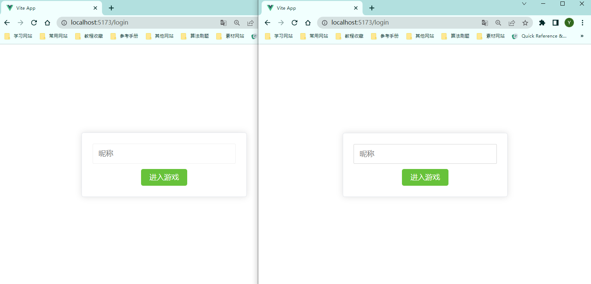
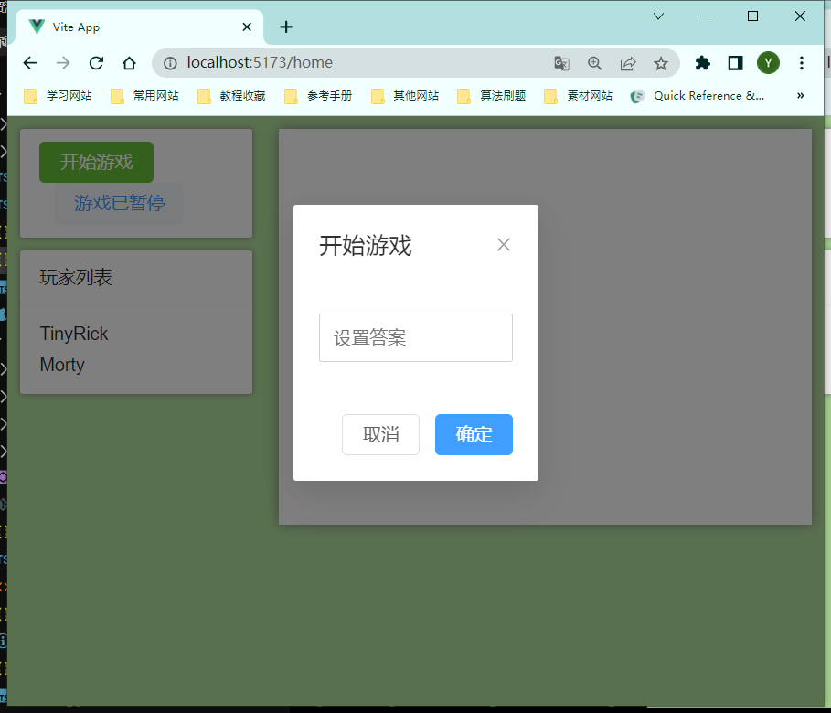

# 你画我猜简易版实现


## 目录

- [你画我猜简易版实现](#你画我猜简易版实现)
  - [目录](#目录)
  - [实现效果记录](#实现效果记录)
  - [服务端可复用代码](#服务端可复用代码)
  - [客户端部分代码实现](#客户端部分代码实现)
  - [画板的实现](#画板的实现)

## 实现效果记录







## 服务端可复用代码

```js
import path from "path";
import createExpress, { static as _static } from "express";
import http from "http";
import { Server } from "socket.io";
import { GameServer } from "./GameServer.js";

const express = createExpress();
const httpServer = http.createServer(express);
const socketServer = new Server(httpServer);
const gameServer = new GameServer(socketServer); //游戏服务器,接收一个socket服务器

express.use(_static(path.resolve(__dirname, "../dist/"))); // 静态页面
gameServer.run(); // 游戏服务器

httpServer.listen(3000, () => {
 console.log("listening on *:3000");
});
```

## 客户端部分代码实现

```js
import { Whiteboard } from "@/Whiteboard";
import type { Socket } from "socket.io-client";

export class GameClient implements Observable {
  connect = false;
  username = "";
  usernames: Array<string> = [];
  isRunning: boolean = false;
  lines: any[] = [];
  line_buffer: any;
  master: string | undefined;
  isMaster: boolean;
  whiteboard: Whiteboard = new Whiteboard();
  constructor(private socket: Socket) {
    this.socket = socket;
  }

  async update() {
    this.usernames = await this.reqGetUserList();
    this.isRunning = await this.reqGetGameState();
    this.lines = await this.reqGetLines();
    this.master = await this.reqGetMaster();
    if (this.username == this.master) this.isMaster = true;
    else this.isMaster = false;
    this.whiteboard.afterUpdate = () => {
      if (this.isRunning && this.isMaster) {
        this.lines = this.whiteboard.lines;
        this.line_buffer = this.whiteboard.lineBuffer;
        this.updateLines([...this.lines, this.line_buffer]);
      } else {
        this.whiteboard.lines = this.lines;
      }
    };
  }

  async becomeMaster() {
    return await this.reqBecomeMaster();
  }
  async startGame(answer: string) {
    return await this.reqStartGame(answer);
  }
  async updateLines(lines: any[]) {
    return await this.reqUpdateLines(lines);
  }
  async guessAnswer(answer: string) {
    return await this.reqGuessAnswer(answer);
  }

  public async login(username: string): Promise<boolean> {
    if (await this.reqLogin(username)) {
      this.username = username;
      this.Notify();
      return true;
    }
    return false;
  }
  public async logout(): Promise<boolean> {
    if (await this.reqLogout()) {
      this.username = "";
      this.Notify();
      return true;
    }
    return false;
  }
  public async isLogin(): Promise<boolean> {
    if (await this.reqIsLogin()) {
      return true;
    }
    return false;
  }

  // 更新数据
  private async reqGetUserList(): Promise<typeof this.usernames> {
    return new Promise((resolve) => {
      this.socket.emit("getUserList", (result: Array<string>) => {
        resolve(result);
      });
    });
  }
  private async reqGetGameState(): Promise<boolean> {
    return new Promise((resolve) => {
      this.socket.emit("getGameState", (result: boolean) => {
        resolve(result);
      });
    });
  }
  private async reqGetLines(): Promise<Array<any>> {
    return new Promise((resolve) => {
      this.socket.emit("getLines", (result: Array<any>) => {
        resolve(result);
      });
    });
  }
  private async reqGetMaster(): Promise<string> {
    return new Promise((resolve) => {
      this.socket.emit("getMaster", (result: string) => {
        resolve(result);
      });
    });
  }
  private async reqBecomeMaster() {
    return new Promise((resolve) => {
      this.socket.emit("becomeMaster", (result: boolean) => {
        resolve(result);
      });
    });
  }
  private async reqStartGame(answer: string) {
    return new Promise((resolve) => {
      this.socket.emit("startGame", answer, (result: string) => {
        resolve(result);
      });
    });
  }
  private async reqUpdateLines(lines: any[]) {
    return new Promise((resolve) => {
      this.socket.emit("updateLines", lines, (result: string) => {
        resolve(result);
      });
    });
  }
  private async reqGuessAnswer(answer: string) {
    return new Promise((resolve) => {
      this.socket.emit("guessAnswer", answer, (result: string) => {
        resolve(result);
      });
    });
  }

  private async reqLogin(username: string): Promise<boolean> {
    return new Promise((resolve) => {
      this.socket.emit("login", username, (result: boolean) => {
        resolve(result);
      });
    });
  }
  private async reqLogout(): Promise<boolean> {
    return new Promise((resolve) => {
      this.socket.emit("logout", (result: boolean) => {
        resolve(result);
      });
    });
  }
  private async reqIsLogin(): Promise<boolean> {
    return new Promise((resolve) => {
      this.socket.emit("isLogin", (result: boolean) => {
        resolve(result);
      });
    });
  }

  isConnect() {
    return this.connect;
  }
  setConnect(newVal: boolean) {
    this.connect = newVal;
    this.Notify();
  }
  run() {
    this.socket.on("connect", () => {
      console.log("game:connect");
      this.setConnect(true);
    });
    this.socket.on("disconnect", () => {
      this.setConnect(false);
    });
    this.socket.on("update", () => {
      this.update();
    });
  }
  observers: Observer[] = [];
  Attach(observer: Observer): void {
    if (this.observers.includes(observer)) return;
    this.observers.push(observer);
  }
  Detach(observer: Observer): void {
    if (this.observers.includes(observer)) {
      this.observers.splice(this.observers.indexOf(observer), 1);
    }
  }
  Notify(): void {
    this.observers.forEach((item) => item.update());
  }
}

// 设计模式观察者模式
// 观察者
interface Observer {
  update(): void;
}
// 可观察对象
interface Observable {
  observers: Array<Observer>; // 观察者
  Attach(observer: Observer): void; // 附加观察者
  Detach(observer: Observer): void; // 分离观察者
  Notify(): void; // 通知观察者
}
```

## 画板的实现

```js
type LineInfo = {
  strokeStyle: string;
  lineWidth: number;
  points: Array<number>;
};
export class Whiteboard {
  fillStyle = "black";
  pencilSize = 10;
  canvas!: HTMLCanvasElement;
  ctx!: CanvasRenderingContext2D;
  CANVAS_W = 1024;
  CANVAS_H = 760;
  lines: LineInfo[] = [];
  lineBuffer: LineInfo = {
    strokeStyle: "",
    lineWidth: 0,
    points: [],
  };
  afterUpdate = () => {};
  mouseInput!: InputListener;
  constructor(canvasId?: string) {
    if (canvasId) this.init(canvasId);
  }
  init(canvasId: string) {
    this.canvas = document.getElementById(canvasId) as HTMLCanvasElement;
    this.ctx = this.canvas.getContext("2d") as CanvasRenderingContext2D;
    this.canvas.width = this.CANVAS_W;
    this.canvas.height = this.CANVAS_H;
    this.mouseInput = new InputListener(canvasId);
    return this;
  }
  update() {
    while (this.mouseInput.inputs.length != 0) {
      this.lines.push(this.mouseInput.inputs.shift());
    }
    this.lineBuffer = Object.assign({}, this.mouseInput.input_buffer);
    this.afterUpdate();
  }
  drawLines(graphs: LineInfo[]) {
    graphs.forEach((graph) => {
      if (graph.points.length <= 2) return;
      this.ctx.beginPath();
      this.ctx.moveTo(graph.points[0], graph.points[1]);
      for (let index = 2; index < graph.points.length; ) {
        const pointX = graph.points[index++];
        const pointY = graph.points[index++];
        this.ctx.lineTo(pointX, pointY);
      }
      this.ctx.lineWidth = graph.lineWidth;
      this.ctx.strokeStyle = graph.strokeStyle;
      this.ctx.stroke();
    });
  }
  draw(interval: number) {
    this.ctx.clearRect(0, 0, this.CANVAS_W, this.CANVAS_H);
    this.drawLines(this.lines);
    this.drawLines([this.lineBuffer]);
  }
  refresh(interval: number) {
    this.update();
    this.draw(interval);
  }
  start() {
    let last = 0;
    let animate = (current: number) => {
      this.refresh(current - last);
      last = current;
      requestAnimationFrame(animate);
    };
    animate(0);
  }
}
class InputListener {
  inputs: LineInfo[] = [];
  input_buffer: LineInfo = {
    strokeStyle: "black",
    lineWidth: 5,
    points: [],
  };
  target: HTMLElement;
  constructor(targetId: string) {
    this.target = document.getElementById(targetId) as HTMLElement;
    this.listening_pc();
    // this.listening_mobile()
  }
  listening_pc() {
    let mousedown = false;
    this.target.addEventListener("mousedown", () => {
      mousedown = true;
    });
    this.target.addEventListener("mousemove", (e) => {
      if (!mousedown) return;
      this.input_buffer.points.push(e.offsetX);
      this.input_buffer.points.push(e.offsetY);
    });
    this.target.addEventListener("mouseup", () => {
      mousedown = false;
      this.inputs.push(Object.assign({}, this.input_buffer));
      this.input_buffer.points = [];
    });
  }
  // listening_mobile() {
  //  let touched = false;
  //  this.target.addEventListener("touchstart", () => {
  //   touched = true;
  //  })
  //  this.target.addEventListener("touchmove", (e) => {
  //   if (!touched) return
  //   this.inputs.push({ x: e.targetTouches[0].clientX, y: e.targetTouches[0].clientY })
  //  })
  //  this.target.addEventListener("touchend", () => {
  //   touched = false;
  //  })
  // }
}
```

<style>
    gold{
        color:black;
        background-color:gold;
    }
    green{
        color:white;
        background-color:green;
    }
    warn{
        color:white;
        background-color:red;
    }
</style>
