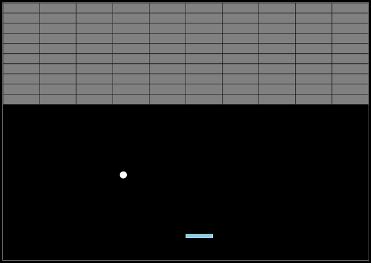

## 打砖块小游戏 Demo 实现记录



[Demo地址](./demo_jdfowefjwi/index.html)

## 目录

- [打砖块小游戏 Demo 实现记录](#打砖块小游戏-demo-实现记录)
- [目录](#目录)
- [index.ts](#indexts)
- [Game.ts](#gamets)
- [InputListener.ts](#inputlistenerts)
- [utils.ts](#utilsts)
- [Ball.ts](#ballts)
- [Wall.ts](#wallts)

## index.ts

```ts
import { Game } from "./Game.js";

document.addEventListener("DOMContentLoaded", () => {
 var canvas = document.getElementById("canvas") as HTMLCanvasElement;
 var context = canvas.getContext("2d") as CanvasRenderingContext2D;
 new Game(canvas, context).start();
});
```

## Game.ts

```ts
import { Ball } from "./Ball.js";
import { Wall } from "./Wall.js";
import { Processor } from "./Processor.js";
import { InputListener } from "./InputListener.js";
import { Player } from "./Player.js";

export class Game {
 GAME_WIDTH = 1080;
 GAME_HEIGHT = 760;
 ball: Ball;
 wall: Wall;
 player: Player;
 inputListener = new InputListener();
 processor = new Processor();
 constructor(private canvas: HTMLCanvasElement, private context: CanvasRenderingContext2D) {
  this.canvas = canvas;
  this.context = context;
  this.canvas.width = this.GAME_WIDTH;
  this.canvas.height = this.GAME_HEIGHT;
  this.wall = new Wall(10, 10, this.GAME_WIDTH, 300, this.GAME_WIDTH, this.GAME_HEIGHT);
  this.ball = new Ball(this.GAME_WIDTH / 2, this.GAME_HEIGHT * 0.9, this.GAME_WIDTH, this.GAME_HEIGHT);
  this.player = new Player(this.GAME_WIDTH / 2, this.GAME_HEIGHT * 0.9, this.GAME_WIDTH, this.GAME_HEIGHT);
 }
 update(timeInterval: number) {
  this.ball.update(timeInterval);
  this.player.update(timeInterval);
  this.processor.process(this);
  this.processor.inputHandler(this, this.inputListener.inputs);
 }
 draw(context: CanvasRenderingContext2D) {
  context.clearRect(0, 0, this.GAME_WIDTH, this.GAME_HEIGHT);
  this.ball.draw(context);
  this.wall.draw(context);
  this.player.draw(context);
 }
 refresh(timeInterval: number, context: CanvasRenderingContext2D) {
  this.update(timeInterval);
  this.draw(context);
 }
 start() {
  let self = this;
  let last = 0;
  function animate(current: number) {
   self.refresh(current - last, self.context);
   last = current;
   requestAnimationFrame(animate);
  }
  animate(0);
 }
}
```

## InputListener.ts

```ts
import { ValueOf } from "./utils.js";

export type KeyMapValue = ValueOf<typeof InputListener.KeyMap>;
export type TypeInputs = Array<KeyMapValue>;
export class InputListener {
 static KeyMap = {
  PressRight: "ArrowRight",
  PressLeft: "ArrowLeft",
  PressUp: "ArrowUp",
  PressDown: "ArrowDown",
  PressSpace: " ",
  Enter: "Enter",
  Escape: "Escape"
 } as const; // const 可以保证ValueOf能起作用
 inputs: TypeInputs = [];
 constructor() {
  this.listening();
 }
 listening() {
  window.addEventListener("keydown", event => {
   let key = event.key as KeyMapValue;
   if (Object.values(InputListener.KeyMap).includes(key) && !this.inputs.includes(key)) {
    this.inputs.unshift(key); // 放到开头，表示先按下的键优先级高
   }
  });
  window.addEventListener("keyup", event => {
   let key = event.key as KeyMapValue;
   if (this.inputs.includes(key)) {
    this.inputs.splice(this.inputs.indexOf(key), 1);
   }
  });
 }
}
```

## utils.ts

```ts
export function RandomRange(from: number, to: number) {
 return Math.random() * (to - from) + from;
}
export type ValueOf<T> = T[keyof T];

export type Rect = { posX: number; posY: number; width: number; height: number };
export type Point = { posX: number; posY: number };
export type Circle = { posX: number; posY: number; radius: number };
// 碰撞检测,判断一个坐标是否在一个矩形内
function collision_Rect_Point(rect: Rect, point: Point) {
 return rect.posX < point.posX && point.posX < rect.posX + rect.width && rect.posY < point.posY && point.posY < rect.posY + rect.height;
}
// 碰撞检测，判断一个圆和一个矩形是否碰撞
export function collision_Rect_Circle(rect: Rect, circle: Circle) {
 // 只需要判断这个圆的中心坐标是否在一个大矩形之内，这个大矩形就是将原矩形上下左右的边长拓宽圆的一倍半径
 return collision_Rect_Point(
  {
   posX: rect.posX - circle.radius,
   posY: rect.posY - circle.radius,
   width: rect.width + 2 * circle.radius,
   height: rect.height + 2 * circle.radius
  },
  { ...circle }
 );
}
```

## Ball.ts

```ts
import { RandomRange, Rect } from "./utils.js";
export class Ball {
 radius: number = 10;
 fillStyle: string = "white";
 strokeStyle: string = "whitesmoke";
 speedX: number = Math.sign(RandomRange(-1, 1)) * RandomRange(0.4, 0.5);
 speedY: number = Math.sign(RandomRange(-1, 1)) * RandomRange(0.4, 0.5);
 constructor(public posX: number, public posY: number, public GAME_WIDTH: number, public GAME_HEIGHT: number) {
  this.posX = posX;
  this.posY = posY;
  this.GAME_HEIGHT = GAME_HEIGHT;
  this.GAME_WIDTH = GAME_WIDTH;
 }
 reverseSpeedX() {
  this.speedX = -this.speedX;
 }
 reverseSpeedY() {
  this.speedY = -this.speedY;
 }
 move(timeInterval: number) {
  this.posX += this.speedX * timeInterval;
  this.posY += this.speedY * timeInterval;
 }
 _update(timeInterval: number) {
  this.move(timeInterval);
 }
 update(timeInterval: number) {
  let step = 1; // 按1ms模拟
  do {
   this._update(step);
   timeInterval -= step;
  } while (timeInterval > 0);
 }
 draw(context: CanvasRenderingContext2D) {
  context.save();
  context.beginPath();
  context.arc(this.posX, this.posY, this.radius, 0, Math.PI * 2);
  context.closePath();
  context.strokeStyle = this.strokeStyle;
  context.stroke();
  context.fillStyle = this.fillStyle;
  context.fill();
  context.restore();
 }
}
```

## Wall.ts

```ts
export class Block {
 constructor(
  public posX: number,
  public posY: number,
  public width: number,
  public height: number,
  public fillStyle: string,
  public strokeStyle: string
 ) {
  this.posX = posX;
  this.posY = posY;
  this.width = width;
  this.height = height;
  this.fillStyle = fillStyle;
  this.strokeStyle = strokeStyle;
 }
 update(timeInterval: number) {}
 draw(context: CanvasRenderingContext2D) {
  context.save();
  context.fillStyle = this.fillStyle;
  context.fillRect(this.posX, this.posY, this.width, this.height);
  context.strokeStyle = this.strokeStyle;
  context.strokeRect(this.posX, this.posY, this.width, this.height);
  context.restore();
 }
}
export class Wall {
 blocks: Array<Block> = [];
 constructor(
  public width: number,
  public height: number,
  public WALL_MAX_WIDTH: number,
  public WALL_MAX_HEIGHT: number,
  public GAME_WIDTH: number,
  public GAME_HEIGHT: number
 ) {
  this.width = width;
  this.height = height;
  this.WALL_MAX_WIDTH = WALL_MAX_WIDTH;
  this.WALL_MAX_HEIGHT = WALL_MAX_HEIGHT;
  this.GAME_WIDTH = GAME_WIDTH;
  this.GAME_HEIGHT = GAME_HEIGHT;

  let BLOCK_WIDTH = this.WALL_MAX_WIDTH / this.width;
  let BLOCK_HEIGHT = this.WALL_MAX_HEIGHT / this.height;
  for (var i = 0; i < this.width; i++) {
   for (var j = 0; j < this.height; j++) {
    this.blocks.push(new Block(i * BLOCK_WIDTH, j * BLOCK_HEIGHT, BLOCK_WIDTH, BLOCK_HEIGHT, "gray", "black"));
   }
  }
 }
 update(){
  
 }
 draw(context: CanvasRenderingContext2D) {
  this.blocks.forEach(item => item.draw(context));
 }
}
```

<style>
    gold{
        color:black;
        background-color:gold;
    }
    green{
        color:white;
        background-color:green;
    }
    warn{
        color:white;
        background-color:red;
    }
</style>
